# 1.1 机器人发展历史与背景

**作者**：霍海杰 | **联系方式**：howe12@126.com

---

> **前置说明**：本章是整个ROS2机器人仿真课程的奠基篇。在正式学习ROS2工具和编程方法之前，我们有必要先了解机器人技术的来龙去脉——它从哪里来？现在在哪里？将要到哪里去？只有理解了这些背景知识，你才能更好地理解为什么ROS2要这样设计，以及为什么掌握机器人仿真技能在当今时代如此重要。

---

## 1. 机器人起源

### 1.1 从神话到机械——人类对"人造生命"的千年追求

人类创造机器人的梦想，可以追溯到几千年前的神话传说。

在希腊神话中，赫菲斯托斯（Hephaestus）——希腊神话中的火神与工匠之神——据说他用黄金打造了能够帮助他锻造金属的机械女仆。这是人类最早关于"人造劳动者"的想象。中国古代同样有类似的传说，东汉科学家张衡发明的"木牛流马"被认为是最早的"自动机械"之一，虽然其真实原理至今仍有争议，但反映出古人对于能够自动运输货物的机械装置的渴望。

进入中世纪，欧洲的能工巧匠们开始将神话变为现实。1738年，法国发明家雅克·德·沃康松（Jacques de Vaucanson）制作了一只能够活动翅膀、吃东西、排泄的"机械鸭"，这只机械鸭虽然只是精巧的玩具，但它展示了机械传动原理在模仿生物运动方面的可能性。随后，瑞士的制表大师们更是制作出能够写字、绘画、弹奏乐器的"自动人偶"，这些装置被收藏在欧洲各大宫廷中，成为当时科技与艺术完美结合的象征。

### 1.2 "Robot"一词的诞生

1920年，一个注定被载入史册的新词汇诞生了。

捷克作家卡雷尔·恰佩克（Karel Čapek）在他的科幻剧作《罗梭的万能工人》（Rossum's Universal Robots，简称R.U.R.）中，首次创造了"Robot"这个词。在捷克语中，"robota"意为"强制劳动"或"苦工"，恰佩克用它来描述一种能够不知疲倦地为人类工作的"人造工人"。这部戏剧讲述了一个人造机器人反叛并消灭人类的故事，是最早对人工智能可能带来的风险进行深刻思考的文艺作品之一。

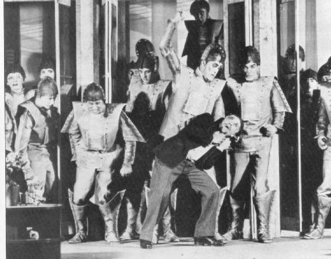
*图注：1920年首演的《罗梭的万能工人》海报，卡雷尔·恰佩克创造了"Robot"一词*

从那时起，"Robot"这个词汇迅速传播到全世界，成为所有类型机器的统称。而"robotics"（机器人学）这个学科名称，则是由科幻大师艾萨克·阿西莫夫（Isaac Asimov）在1942年首次提出。

---

## 2. 发展阶段

### 2.1 三次浪潮——机器人技术如何走到今天

回顾机器人技术的发展历程，可以清晰地看到三个重要阶段，每一次技术突破都伴随着产业的爆发式增长。

**第一代：示教再现型机器人（1960s-1970s）**

1961年，一个载入工业史册的年份。美国通用汽车公司在其新泽西工厂中，安装了世界上第一台工业机器人——**尤尼梅特（Unimate）**。这台由工程师约瑟夫·恩格尔伯格（Joseph Engelberger）发明的庞然大物，重达两吨，靠液压驱动，能够精确地完成焊接操作。在此之前，汽车焊接完全依赖工人手持焊枪，不仅效率低下，还会对工人的健康造成严重损害。尤尼梅特的诞生，标志着机器人正式进入工业生产领域。

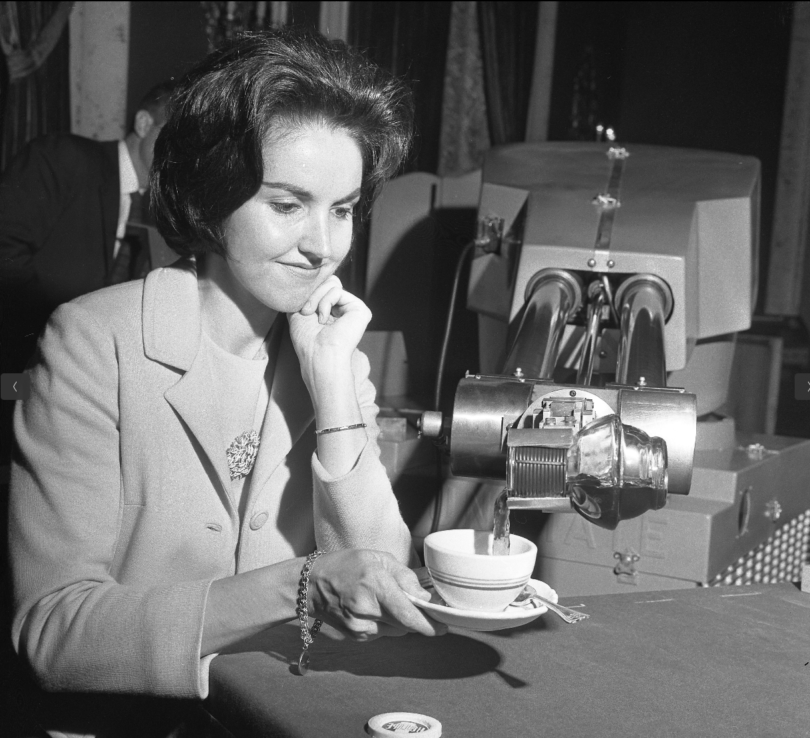
*图注：1961年安装在通用汽车工厂的世界上第一台工业机器人尤尼梅特*

这一代机器人的核心特征是"示教再现"——工人需要先手动操作机器人完成一遍任务，机器人会记住整个动作轨迹，然后可以无限次地重复执行。这种方式虽然开启了工业自动化的序幕，但缺点也很明显：无法应对复杂多变的环境，一旦产品型号变化，就需要重新示教。

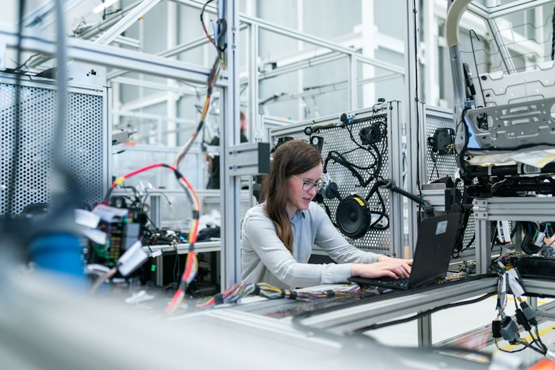
*图注：现代工业机器人广泛应用于汽车制造、电子装配等领域*

**第二代：感知型机器人（1980s-1990s）**

1980年代，随着传感器技术的进步，机器人开始拥有"感知"世界的能力。这一代机器人配备了力觉传感器、触觉传感器甚至视觉传感器，能够根据环境变化调整自己的行为。

日本在这个时期成为全球最大的工业机器人生产国。发那科（Fanuc）、安川（Yaskawa）、松下（松下）等日本企业迅速崛起，成为工业机器人领域的巨头。1980年，也因此被业界称为"机器人元年"。

**第三代：智能机器人（2000s-至今）**

进入21世纪，人工智能技术的突破让机器人真正变得"智能"起来。2000年，日本本田公司展示了能够像人类一样行走、跑步、上下楼梯的**阿西莫（ASIMO）**机器人，这是世界上最早具备双足运动能力的人形机器人之一。2013年，波士顿动力公司（Boston Dynamics）的**Atlas**双足机器人首次公开亮相，它能够完成跳跃、翻滚、后空翻等高难度动作，刷新了人们对机器人运动能力的认知。

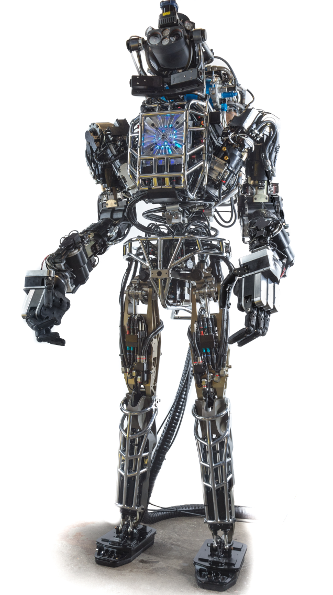
*图注：波士顿动力Atlas是智能机器人的代表，能够完成复杂动作*

### 2.2 中国人形机器人崛起

近年来，中国在人形机器人领域取得了显著进展，涌现出一批具有国际竞争力的企业和技术成果。

**宇树科技（Unitree）** 是中国领先的足式机器人公司，其发布的Unitree H1是目前国内最先进的人形机器人之一。H1身高约1.8米，体重47kg，最高奔跑速度可达3.3m/s，刷新了同类产品的纪录。宇树科技采用自主研发的电机驱动系统，实现了高性能运动控制。

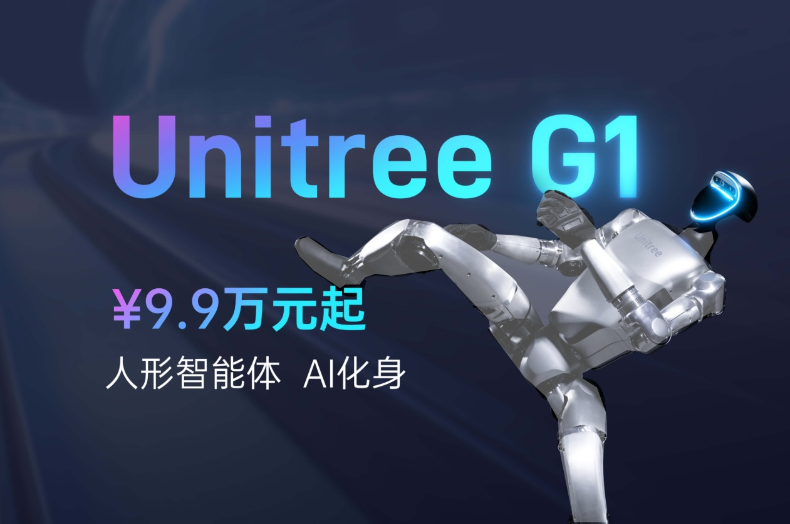
*图注：宇树科技Unitree H1人形机器人*

**智元机器人（AGIBOT）** 成立于2023年，由华为前高管创立，专注于通用人形机器人的研发。智元机器人致力于打造具有高度智能化的人形机器人平台，应用于工业制造、商业服务和家庭场景。

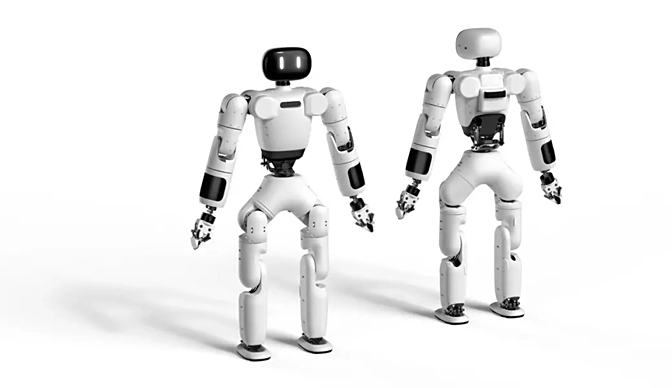
*图注：智元机器人通用人形机器人*

**逐际动力（LimX Dynamics）** 是中国领先的足式机器人公司，在双足和多足机器人领域拥有深厚的技术积累。逐际动力发布的P系列双足机器人具备稳定的行走和奔跑能力，在复杂地形适应方面表现突出。

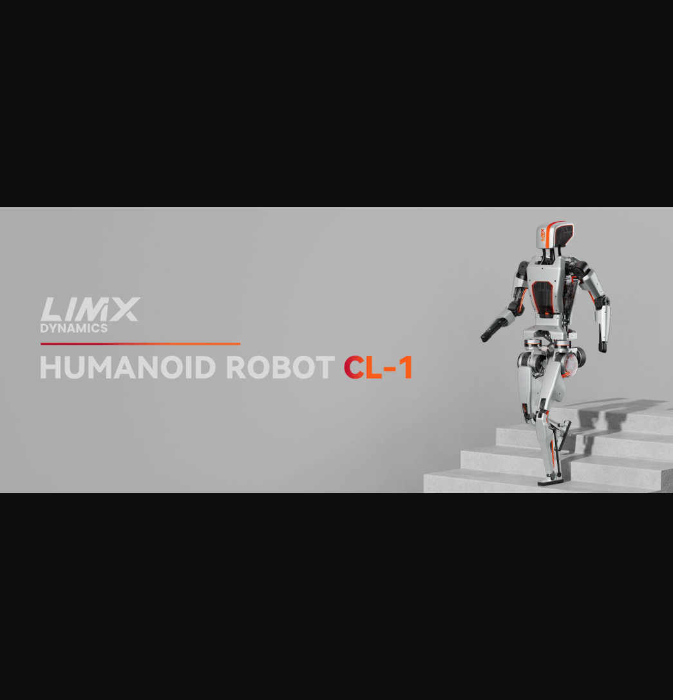
*图注：逐际动力双足机器人*

**国产机器人与Atlas的对比**：

| 维度 | 波士顿动力Atlas | 中国人形机器人 |
|------|-----------------|-----------------|
| 驱动方式 | 液压驱动 | 电机驱动 |
| 运动能力 | 跑酷、后空翻 | 行走、奔跑 |
| 成本 | 百万级 | 十万级 |
| 应用场景 | 研究为主 | 商业化探索 |
| 产业链 | 美国 | 中国制造 |

总体来看，中国人形机器人在**商业化落地**和**成本控制**方面具有优势。

---

## 3. 行业应用背景

### 3.1 机器人已经改变了哪些行业？

机器人技术的价值，最终体现在它能够解决实际问题、创造经济价值。今天，机器人已经渗透到几乎所有行业的各个角落。

**工业制造——汽车行业的革命性变革**

要说机器人应用最成熟的领域，工业制造当之无愧。汽车制造是工业机器人最大的应用市场。一辆普通汽车的制造过程中，需要用到上百台不同类型的工业机器人，包括焊接机器人、喷涂机器人、装配机器人、搬运机器人等。

以焊接为例，传统手工焊接需要工人长时间保持同一姿势，不仅劳动强度大，而且焊接质量难以保证。现代汽车工厂中，焊接工作几乎全部由机器人完成，焊缝均匀美观，生产效率是人工的数倍。

**物流仓储——电商时代的幕后英雄**

当你网上购物时，可能从未想过那些包裹是如何快速准确地被分拣、装车的。在亚马逊的仓库中，数以万计的Kiva机器人（现为Amazon Robotics）在地上忙碌地穿梭，它们驮着货架在仓库中移动，把需要的商品送到分拣员面前。这种"货到人"的模式，让仓库分拣效率提升了5倍以上。

*图注：亚马逊仓库中的Kiva机器人大幅提升物流效率*

**医疗健康——生命的守护者**

在手术室里，达芬奇手术机器人（Da Vinci Surgical System）已经成为外科医生的得力助手。它不是真的"自主"做手术，而是通过医生远程操控，辅助完成精细的微创手术。医生坐在操作台前，像玩游戏手柄一样控制机械臂，机械臂能够消除人手部颤动的影响，让手术更加精准。

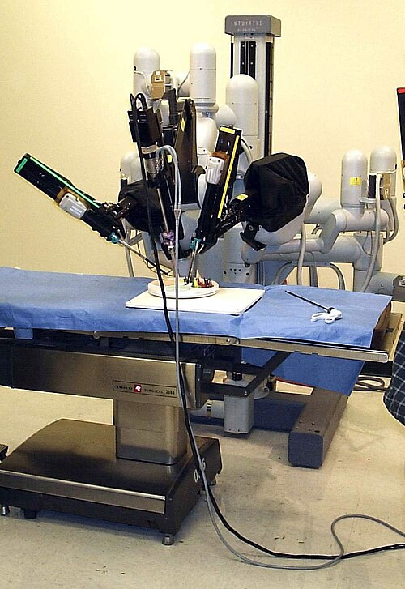
*图注：达芬奇手术机器人辅助医生完成微创手术*

---

## 4. 机器人技术发展趋势

### 4.1 未来已来——这些趋势正在重塑机器人产业

站在今天的时间节点上，我们能够清晰地看到机器人技术正在朝着几个重要方向演进。

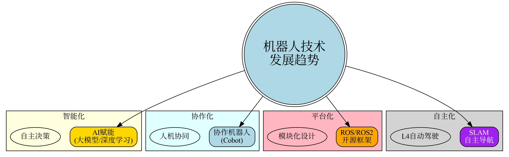
*图注：机器人技术四大发展趋势：智能化、协作化、平台化、自主化*

**趋势一：智能化——从"自动化"到"自主化"**

传统机器人需要人类预先设定所有动作，而新一代智能机器人能够自己"思考"。随着深度学习、强化学习等人工智能技术的发展，机器人开始具备自主学习、推理决策的能力。

**趋势二：协作化——人与机器共舞**

传统工业机器人需要安装在安全围栏里，因为它们力量太大、速度太快，靠近会很危险。但新一代协作机器人（Collaborative Robot，简称Cobot）能够与人类安全地近距离协同工作。

**趋势三：平台化——降低开发门槛**

开源机器人操作系统ROS（Robot Operating System）的出现，是机器人软件领域的一次革命。它提供了一套标准化的通信框架和工具库，让开发者可以专注于核心算法，而不是底层硬件驱动。

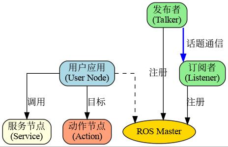
*图注：ROS采用分布式节点架构，通过话题、服务、动作进行通信*

---

## 5. 具身智能

### 5.1 为什么"具身智能"是AI的下一个前沿？

如果你关注人工智能领域的最新动态，一定听说过"具身智能"（Embodied AI）这个词。为什么它如此重要？

**什么是具身智能？**

传统的人工智能——比如你手机里的语音助手、ChatGPT——它们主要处理的是**符号数据**：文字、图像、声音。这些AI没有"身体"，无法与物理世界直接交互。

而具身智能则强调AI需要"具身"——拥有一个物理载体（机器人、无人机、智能设备等），通过传感器感知世界，通过执行器改变世界，在与环境的交互中学习和进化。

**为什么具身智能重要？**

著名AI研究者李飞飞教授曾提出一个观点："AI的下一个重大进步将是'赋予AI身体'。"

这是因为，我们人类的所有智能——语言、推理、学习——都与我们的身体体验密切相关。我们知道"热"是什么，因为被烫过；我们知道"重"是什么，因为搬过重物。纯粹的语言模型可以写出关于"疼痛"的优美句子，但它从未真正"痛"过。

具身智能要让AI真正理解物理世界，就必须让它们有body（身体），有experience（体验）。

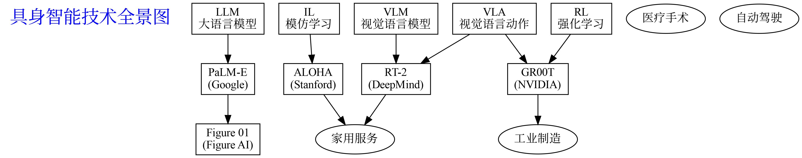
*图注：具身智能核心技术包括LLM、VLM、VLA、强化学习、模仿学习，代表项目有PaLM-E、RT-2、GR00T等*

### 5.2 大语言模型在机器人中的应用

大语言模型（Large Language Model，简称LLM）的出现，为机器人理解自然语言指令带来了革命性突破。传统机器人控制系统需要将人类指令精确转换为低层动作指令，这一过程往往需要专业工程师进行繁琐的编程设计。而大语言模型能够理解模糊、复杂的自然语言描述，并将其转化为可执行的动作序列，极大地降低了人机交互的门槛。

谷歌于2023年发布的**PaLM-E**模型是这一领域的里程碑式工作。该模型将PaLM大语言模型与机器人视觉感知系统相融合，能够直接理解"把抽屉里的芯片拿出来放到盒子里"这样的复杂指令，并自主规划完整的动作序列来完成指令（Dadkhahi et al., 2023）。PaLM-E展示了LLM在机器人任务规划中的巨大潜力。

**SayCan**（Ahn et al., 2022）则采用了一种更实用的方法，将LLM作为"大脑"与可学习的技能库相结合。LLM负责理解任务并选择合适的技能，而每个技能则由强化学习训练的子策略执行。这种模块化架构既保留了语言理解的灵活性，又保证了动作执行的可靠性。

**Code as Policies**（Liang et al., 2023）更进一步，提出用代码作为机器人的通用表示形式。LLM可以直接生成Python代码来控制机器人，这些代码能够调用感知API、执行器控制函数，甚至包含反馈循环来实现复杂行为。

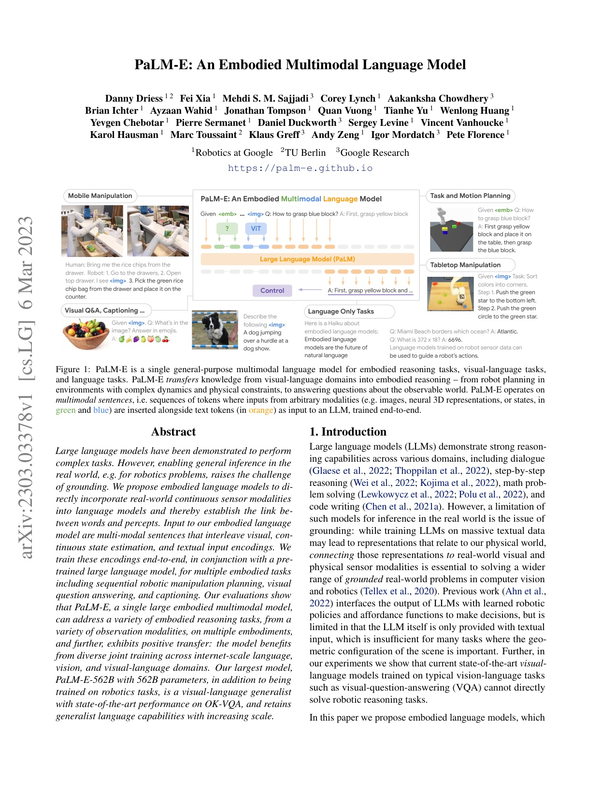
*图注：PaLM-E模型理解自然语言指令并控制机器人执行任务*

### 5.3 视觉语言模型在机器人中的应用

如果说大语言模型赋予了机器人"语言理解"的能力，那么视觉语言模型（Vision-Language Model，简称VLM）则让机器人拥有了"眼睛"。VLM能够同时理解图像和文本信息，实现跨模态的推理和理解，这在机器人感知环境中发挥着至关重要的作用。

**RT-2**（Robotics Transformer 2）是DeepMind在2023年发布的重要工作，它是第一个能够直接从互联网规模的视觉-语言数据中学习泛化能力的机器人操作模型（Brohan et al., 2023）。RT-2将视觉输入和语言指令同时编码，通过Transformer架构直接输出机器人动作。

**OK-Robot**（Liu et al., 2024）专注于开放词汇物体抓取任务。该工作提出了一个简洁而有效的框架，能够在从未见过的环境中抓取任意物体。

**Manipulate Anything**（Song et al., 2024）则探索了在没有人类演示的情况下，如何让机器人通过视觉语言模型泛化操作技能。

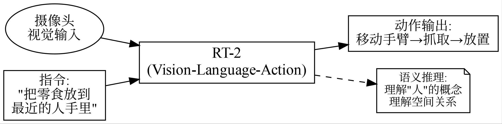
*图注：视觉语言模型使机器人能够泛化操作技能到新物体和新场景*

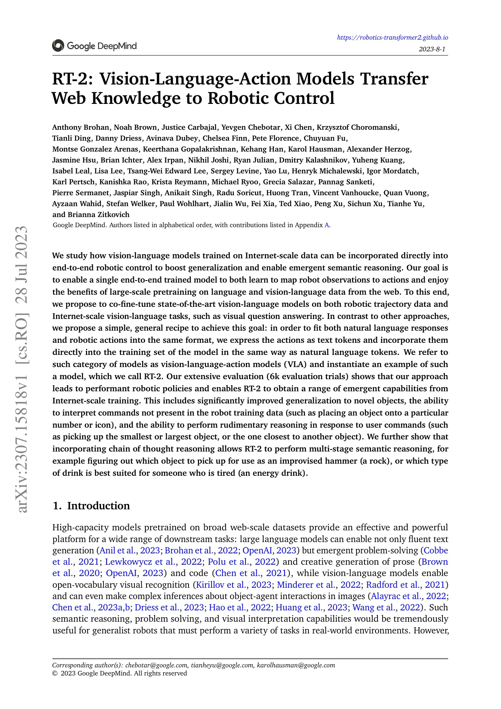
*图注：RT-2能够理解语义指令，如"把零食放到最近的人手里"*

### 5.4 视觉语言动作模型

视觉语言动作模型（Vision-Language-Action Model，简称VLA）是具身智能领域最前沿的研究方向之一。与VLM不同，VLA直接建立从视觉观察到动作输出的映射，实现端到端的学习和推理。

在RT-1的基础上，**RT-2**进一步引入了互联网规模的视觉语言预训练，使得模型具备了推理和泛化的能力（Brohan et al., 2023）。RT-2能够执行"把零食放到最近的人手里"这样的语义推理任务，展现了VLA在理解抽象概念方面的潜力。

VLA的核心优势在于其"端到端"特性：从感知到决策再到执行，整个过程在一个统一的神经网络中完成。这不仅简化了系统架构，更重要的是实现了全局优化。

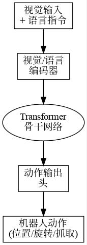
*图注：RT-2是典型的VLA模型，直接输出机器人动作*

### 5.5 强化学习在机器人控制中的应用

强化学习（Reinforcement Learning，简称RL）是让机器人通过与环境交互、自我试错来学习最优策略的方法。与传统的基于规则的编程不同，强化学习能够让机器人在未知环境中自主发现有效的行为模式。

2013年，DeepMind展示了Deep Q-Network（DQN）能够学习玩Atari游戏（Mnih et al., 2013），这一突破证明了深度强化学习在处理高维感知输入方面的潜力。

在连续控制领域，**深度确定性策略梯度（DDPG）**（Lillicrap et al., 2016）及其后续改进算法（如TD3、SAC）成为机器人运动控制的主流方法。

强化学习的核心挑战在于**样本效率**——机器人需要在真实环境中进行大量试错才能学到有效策略。为了解决这一问题，研究者们发展出了**模拟到真实（Sim-to-Real）迁移**技术。

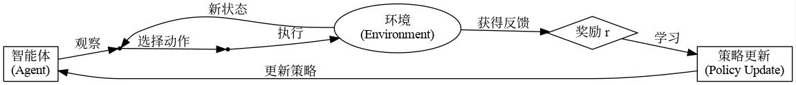
*图注：智能体通过与环境交互，试错学习最优策略*

### 5.6 模仿学习在机器人技能习得中的应用

模仿学习（Imitation Learning）是让机器人从人类演示中学习技能的方法。与强化学习相比，模仿学习更加直观——人类直接展示如何完成任务，机器人通过观察学习执行相同的行为。

**行为克隆（Behavior Clone，BC）**是最基础的模仿学习方法。机器人直接监督学习的方式，从演示数据中学习从状态到动作的映射。

为了解决分布偏移问题，**DAgger**（Ross et al., 2011）提出了迭代式的训练方法。该方法让机器人在执行过程中不断收集人类纠正数据，然后用这些数据重新训练策略。

斯坦福大学的**ALOHA**（Zhao et al., 2024）框架则将模仿学习推向了新的高度。ALOHA使用低成本的可穿戴设备记录人类操作的高精度演示数据，然后通过行为克隆训练机器人执行相同任务。

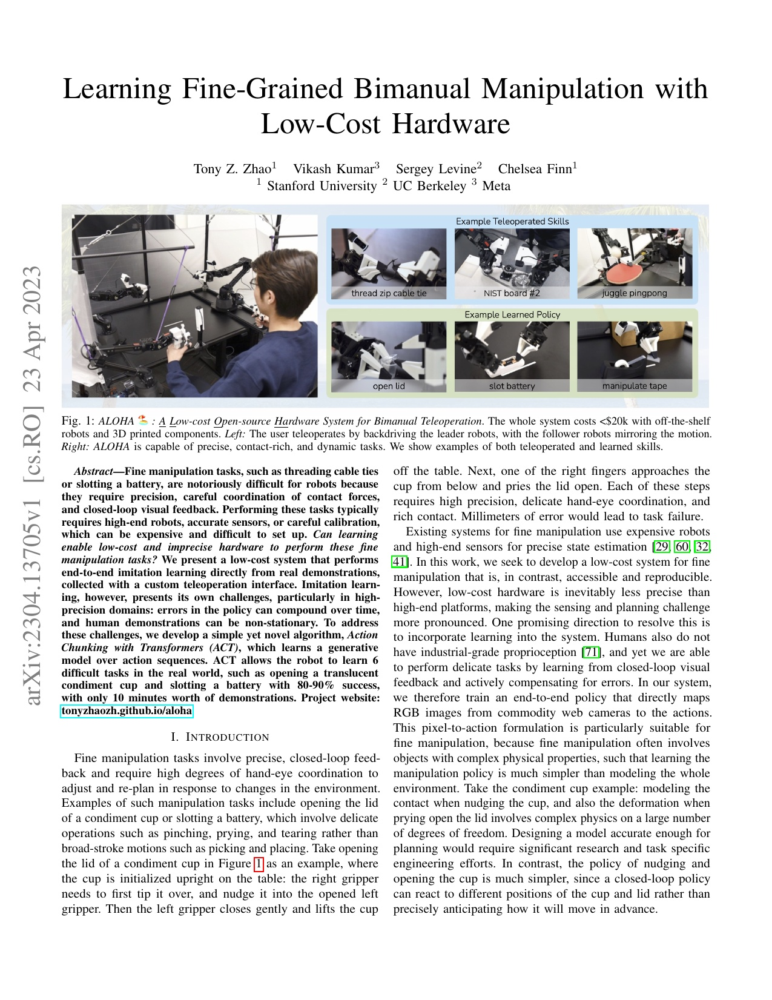
*图注：ALOHA通过人类演示数据训练机器人掌握精细操作技能*

### 5.7 空间智能与3D理解

空间智能是指机器人理解3D空间关系的能力。这是实现通用具身智能的关键技术之一。

**PointNet**（Qi et al., 2017）是3D深度学习的里程碑工作，它能够直接处理点云数据，实现3D物体的分类和分割。

**NVIDIA GR00T**是2024年发布的通用机器人基础模型，旨在让机器人具备理解3D空间、执行复杂任务的能力。

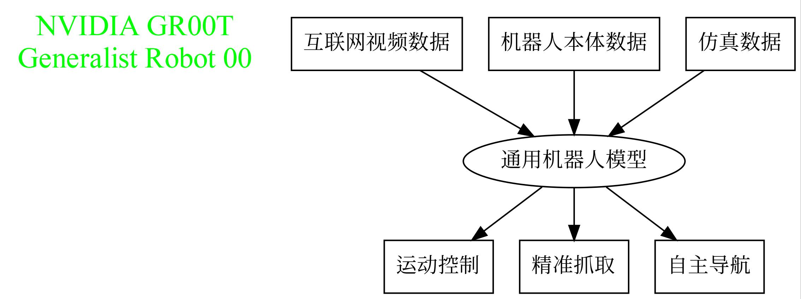
*图注：NVIDIA GR00T是通用机器人基础模型，支持多种机器人任务*

#### 李飞飞与杨立昆的空间智能观点

**李飞飞（Fei-Fei Li）** 是斯坦福大学教授、斯坦福AI Lab主任，她近年来大力推动"空间智能（Spatial Intelligence）"概念。2024年，李飞飞在多个场合强调：真正的智能不仅仅是语言理解，更重要的是理解3D空间。她领导的团队正在研究如何让AI系统像人类一样理解空间关系、进行物理推理。李飞飞认为，"看"是智能的基础，视觉理解是通往通用智能的关键路径。她的研究涵盖3D场景理解、神经渲染、具身智能等领域。

**杨立昆（Yann LeCun）** 是图灵奖得主、Meta前AI首席科学家。2025年，杨立昆创立了新公司Advanced Machine Intelligence (AMI)，筹集了超过10亿美元用于开发"世界模型"（World Models）。与当前的大语言模型不同，杨立昆认为真正的AI需要理解物理世界，需要具备常识和推理能力。他提出的JEPA（联合嵌入预测架构）是实现这一目标的关键路径。杨立昆多次公开表示："现有的LLM无法实现通用人工智能，我们需要能够理解和预测物理世界的AI系统。"

**两者的共识**：尽管方法不同，李飞飞和杨立昆都认为**空间理解**是通往更高级智能的关键。李飞飞从视觉角度出发，杨立昆从世界模型角度出发，两者共同推动具身智能的发展。

---

## 本章小结

本章我们一起回顾了机器人技术的发展历程。从古代的自动机械，到科幻作品中虚构的"人造工人"，再到今天能够自主行走、与人协作的智能机器人，人类对机器人的想象与追求从未停止。

**核心要点回顾：**

1. **机器人起源**：从古代自动机到"Robot"一词的诞生
2. **发展阶段**：经历了示教再现→感知型→智能机器人三次重要演进
3. **行业应用**：工业制造、物流仓储、医疗健康、服务行业等领域广泛应用
4. **发展趋势**：智能化、协作化、平台化是三大核心方向
5. **具身智能**：LLM、VLM、VLA、强化学习、模仿学习、空间智能是核心技术

---

## 思考与练习

1. **想一想**：在你生活的周围，有哪些地方已经或将要使用机器人？它们属于哪一类机器人？
2. **查一查**：你最感兴趣的机器人公司或产品是什么？它们使用了哪些核心技术？
3. **议一议**：具身智能的发展可能带来哪些伦理问题？人类应该如何应对？

---

## 参考资料

### 机器人历史

1. 《机器人学导论》（Introduction to Robotics: Mechanics and Control） - John J. Craig
2. IEEE Robotics and Automation Magazine
3. 《罗梭的万能工人》（R.U.R.） - 卡雷尔·恰佩克 1920年

### 具身智能与大型模型

4. Dadkhahi, H., et al. (2023). PaLM-E: An Embodied Multimodal Language Model. *arXiv:2303.03378*.
5. Ahn, M., et al. (2022). Do As I Can, Not As I Say: Grounding Language in Robotic Affordances. *arXiv:2204.01691*.
6. Liang, J., et al. (2023). Code as Policies: Language Model Programs for Embodied Control. *arXiv:2209.07753*.
7. Brohan, A., et al. (2022). RT-1: Robotics Transformer for Real-World Control at Scale. *arXiv:2212.06817*.
8. Brohan, A., et al. (2023). RT-2: Vision-Language-Action Models Transfer Web Knowledge to Robotic Control. *arXiv:2307.15818*.
9. Liu, H., et al. (2024). OK-Robot: Open Vocabulary Mobile Manipulation. *arXiv:2401.01995*.
10. Song, S., et al. (2024). Manipulate Anything: Automating Robotic Manipulation in the Real World. *arXiv:2404.03528*.

### 强化学习与模仿学习

11. Mnih, V., et al. (2013). Playing Atari with Deep Reinforcement Learning. *NIPS 2013*.
12. Lillicrap, T. P., et al. (2016). Continuous Control with Deep Reinforcement Learning. *ICLR 2016*.
13. Ross, S., et al. (2011). A Reduction of Imitation Learning to No-Regret Online Learning. *AISTATS 2011*.
14. Bojarski, M., et al. (2016). End to End Learning for Self-Driving Cars. *arXiv:1604.07316*.
15. Zhao, T. Z., et al. (2024). ALOHA: Learning to Do by Learning from Observation. *CoRL 2024*.

### 空间智能与3D理解

16. Qi, C. R., et al. (2017). PointNet: Deep Learning on Point Sets for 3D Classification and Segmentation. *CVPR 2017*.
17. NVIDIA (2024). GR00T: Generalist Robot 00 Foundation Model. *NVIDIA GTC 2024*.

---

*下一节我们将学习"1.2 机器人系统组成与分类"，了解机器人由哪些部分组成，以及不同类型机器人的特点。*
