# 1.2 机器人系统组成与分类

**作者**：霍海杰 | **联系方式**：howe12@126.com

---

> **前置说明**：上一节我们讲述了机器人的起源和发展历程。从古代的自动机械到今天的智能机器人，人类用了数千年时间让"人造工人"从幻想走进现实。然而，你有没有想过一个问题——一个真正的机器人，到底由哪些部分组成？就像人体的结构一样，机器人也有"骨骼"、"肌肉"、"感官"、"大脑"和"灵魂"。只有了解了这些组成部分，我们才能真正理解机器人是如何工作的。接下来的这一节，我们将系统性地认识机器人的"身体"。

---

## 1. 机器人为什么需要这些部分？

### 1.1 像人一样——从人体结构类比机器人

想象一下你想要完成一个简单动作——伸手拿起桌上的水杯。

这个看似简单的行为，其实涉及了人体的多个系统协同工作：首先，你的眼睛看到水杯的位置（感知系统）；然后，你的大脑计算出手伸多长、角度多少（控制系统）；接着，神经系统将指令传递给肌肉（驱动系统）；最后，肌肉收缩带动骨骼移动（机械结构），手伸向目标。整个过程在瞬间完成，丝滑流畅。

机器人完成任何任务，同样需要这四个系统的紧密配合。

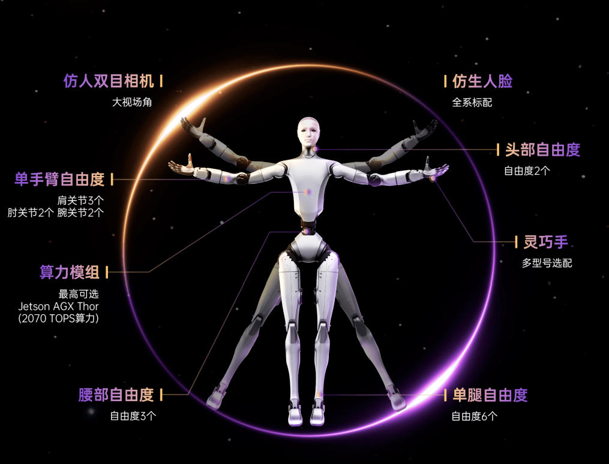
*图注：机器人系统与人体结构的类比——机械结构对应骨骼，驱动系统对应肌肉，感知系统对应感官，控制系统对应大脑，软件系统对应灵魂*

**一个都不能少**——如果把机器人比作一个人，那么：

- **机械结构**是骨骼，决定了身体的基础形态
- **驱动系统**是肌肉，提供运动的动力
- **感知系统**是眼睛、耳朵、皮肤，让我们知道周围发生了什么
- **控制系统**是大脑，思考并做出决策

这四个部分缺一不可，共同构成了完整的机器人系统。

### 1.2 四大系统介绍

一个完整的机器人系统，通常由以下四大核心部分组成：

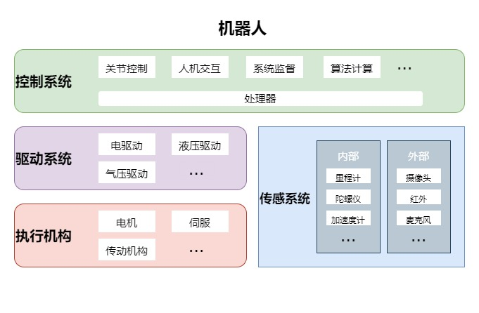

| 系统 | 类比人体 | 功能描述 | 核心组件 |
|------|---------|----------|----------|
| 机械结构 | 骨骼 | 提供支撑和运动基础 | 关节、连杆、末端执行器 |
| 驱动系统 | 肌肉 | 提供动力源 | 电机、液压缸、气缸 |
| 传感系统 | 感官 | 获取内外部信息 | 传感器、信号处理 |
| 控制系统 | 大脑 | 处理信息、发出指令 | 控制器、算法 |

这四个系统并非孤立存在，而是通过精密的通讯和数据交换形成一个有机整体。传感器获取环境信息，传输给控制系统；控制系统经过计算做出决策，驱动系统执行动作；软件系统协调整个过程，让机器人能够自主完成复杂任务。

---

## 2. 机械结构——机器人的身体

### 2.1 关节与自由度

机械结构是机器人的"身体"，它决定了机器人长什么样、能做什么动作。

走进任何一座汽车工厂，你都会看到各种形状的机器人手臂在忙碌地工作。它们有的粗壮有力，负责搬运沉重的钢材；有的纤细灵巧，能够精准地点焊每一处焊缝。这些形态各异的机械臂，都遵循着相同的基本原理——**关节**和**连杆**的组合。

**什么是关节？**

关节是机器人机械结构中连接两个部件的可动部件。想象一下你的手臂——肩关节、肘关节、腕关节，每一个都能转动。机器人关节的工作方式与此类似。

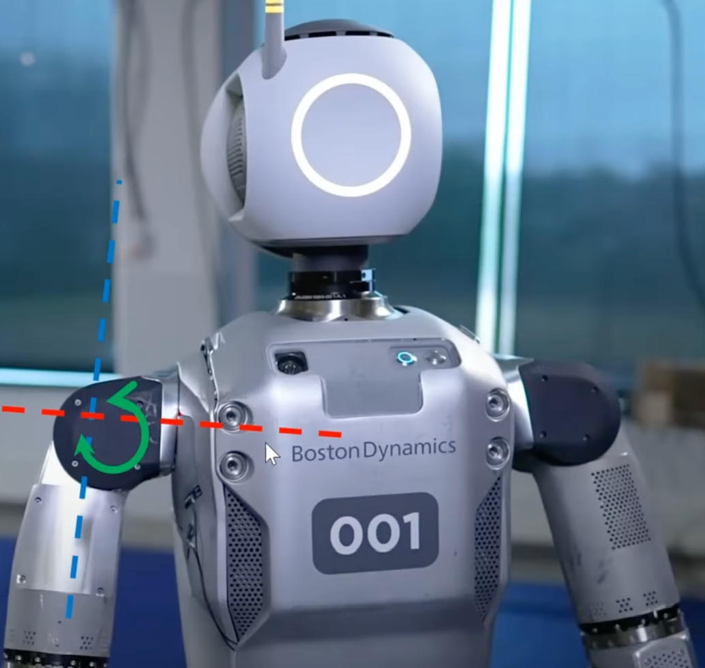
*图注：波士顿动力 Atlas 的肩关节，三个方向的转动自由度：屈曲/伸展（前后摆）、外展/内收（像拍翅膀)、绕上臂轴旋转*

机器人关节主要分为两种类型：

- **旋转关节（R Joint）**：像门轴一样，围绕一个轴心旋转。这是机械臂最常用的关节类型。
- **移动关节（P Joint）**：像抽屉一样，沿直线方向平移。这种关节相对少见，但在某些场景下不可或缺。

**自由度——机器人有多灵活？**

在机器人学中，**自由度（Degree of Freedom，简称DOF）**是一个核心概念。它指的是机器人独立运动的能力数量。简单来说，一个机器人有多少个能够独立运动的关节，就有多少个自由度。

一个普通的六轴工业机械臂，有6个关节，意味着6个自由度。它能够在三维空间中到达任意位置（需要3个自由度），并保持任意姿态（又需要3个自由度）。

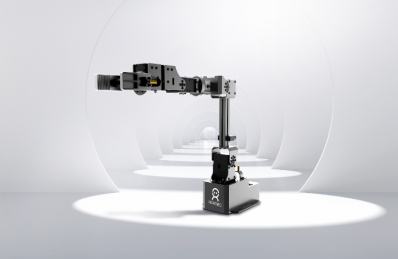
*图注：六轴机械臂的六个关节分别实现不同的运动功能*

**末端执行器——机器人的"手"**

关节和连杆组成了机械臂的"手臂"，而末端执行器就是这只手上的"手掌"或工具。根据任务不同，末端执行器可以是：

- **夹爪**：抓取物体
- **吸盘**：吸取平整表面
- **焊枪**：进行焊接作业
- **喷涂头**：均匀喷涂
- **钻头**：钻孔加工

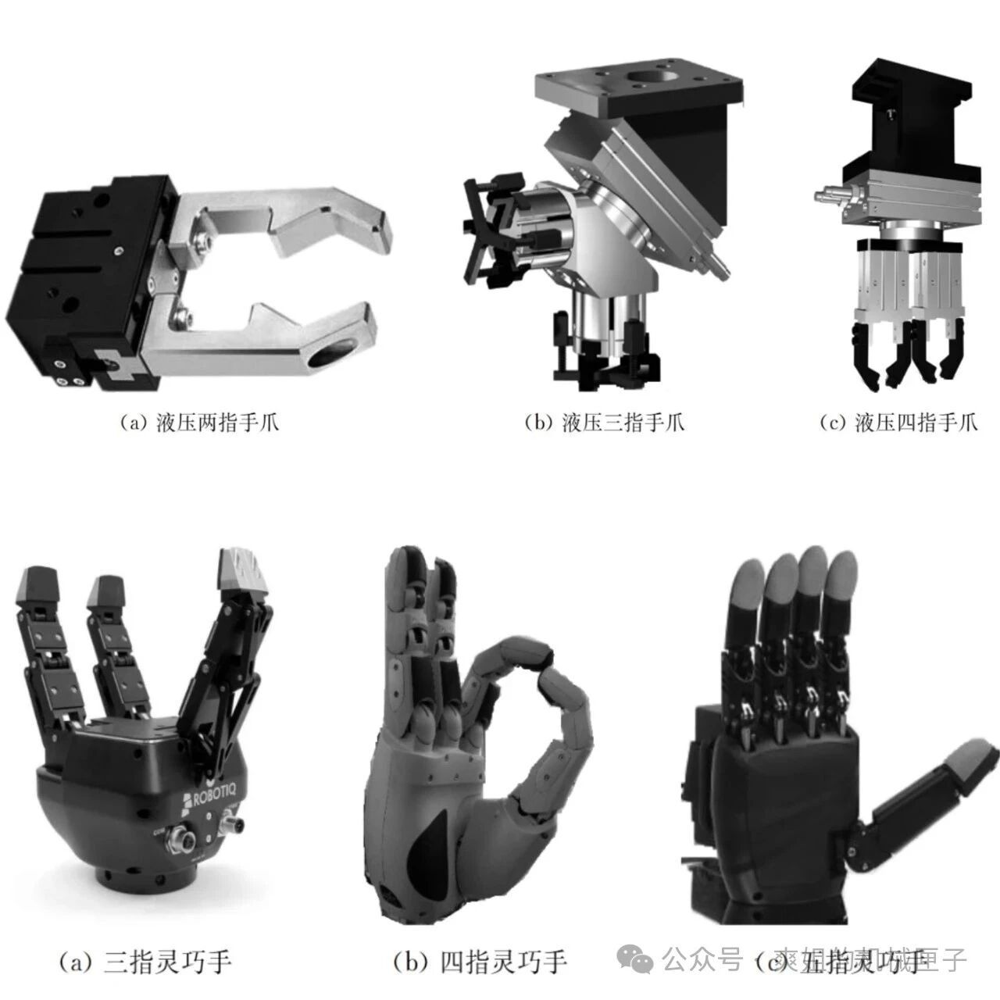
*图注：液压手爪/多指灵巧手——不同的末端执行器对应不同的工作任务*

---

## 3. 驱动系统——机器人的肌肉

### 3.1 电机驱动

如果说机械结构是骨骼，那么驱动系统就是肌肉——它为机器人提供动力，让关节能够运动。

走进一家电子制造工厂，你会听到电机运转的嗡嗡声。小小的伺服电机安装在每个关节内部，精确地驱动着机械臂的每一个动作。这种驱动方式，就是**电机驱动**——目前应用最广泛的机器人驱动方式。

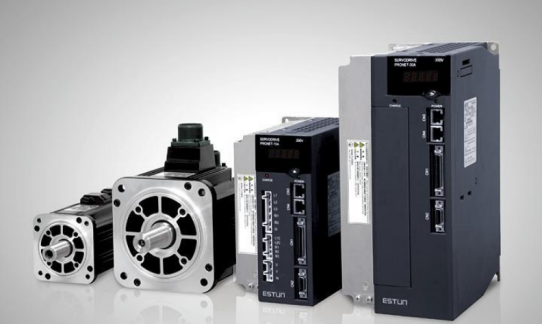
*图注：工业机械臂中常见的伺服电机驱动系统，电机与减速器集成在一起*

电机驱动为什么如此受欢迎？

- **控制精度高**：通过精确控制电流，可以实现非常精准的位置和速度控制
- **响应速度快**：电机的启停响应时间以毫秒计
- **效率高**：电能转换为机械能的效率可达90%以上
- **清洁环保**：不像液压系统，没有漏油风险

常见的机器人驱动电机包括：

- **伺服电机**：工业机器人最常用的选择，能够精确控制位置、速度和力矩
- **直流无刷电机**：效率高、寿命长，常用于移动机器人和小型机械臂
- **步进电机**：控制简单、成本较低，适用于开环控制系统

### 3.2 液压驱动与气动驱动

电机驱动固然优秀，但在某些场景下，其他驱动方式更能发挥优势。

**液压驱动——大力士的选择**

如果你见过大型挖掘机工作，一定对它的力量印象深刻。挖掘机采用**液压驱动**，利用液体压力传递能量，能够输出巨大的力矩。

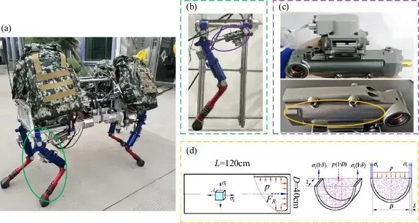
*图注：液压四足机器人HDU壳体示意图。(a)液压四足机器人图；(b)液压四足机器人单腿；(c) HDU及其外壳；(d) HDU壳体应力分布示意图*

液压驱动的特点：

- **输出力矩大**：同等体积下，液压驱动输出的力量是电机的数倍
- **刚度高**：负载变化对运动影响小
- **但**——系统复杂、需要维护、存在漏油风险

这就是为什么你会在大型特种机器人、重型工业设备中看到液压驱动的身影。

**气动驱动——速度之王**

在食品包装生产线上，机械手以惊人的速度抓取、放置产品——这就是**气动驱动**的应用。

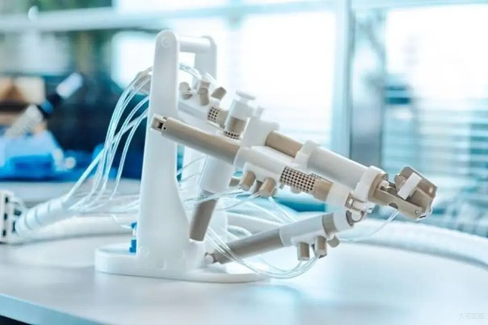
*图注：气动驱动的前列腺穿刺机器人，气动驱动以压缩空气为工作介质，响应速度极快*

气动驱动的特点：

- **速度快**：压缩空气释放速度极快，适合高速往复运动
- **结构简单**：系统组成简单，成本低廉
- **但**——控制精度较差，能耗较高

气动机器人常见于食品包装、药品分拣等轻量化、高速化的应用场景。

---

## 4. 感知系统——机器人的感官

### 4.1 外部感知

一个机器人如果只能按照预设程序运动，那它只是一个 automated machine（自动机器）。真正的 robot（机器人），需要能够感知周围的世界。

**视觉——机器人最重要的感官**

人类获取的信息中，超过80%来自视觉。机器人同样如此。

摄像头是最常见的视觉传感器。现代机器人通常配备**深度相机**——它不仅能"看见"物体，还能"感知"物体的距离，就像人眼睛的立体视觉一样。

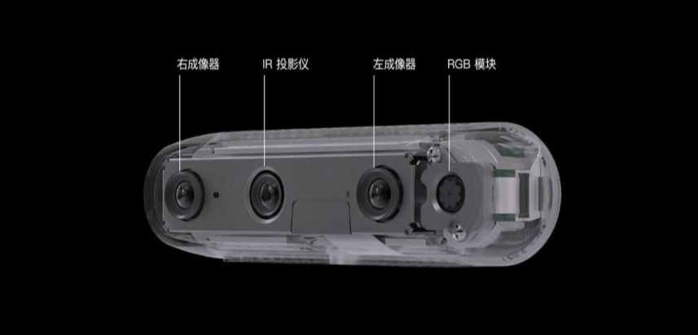
*图注：深度相机能够获取场景的三维信息，为机器人提供空间感知能力*

**激光雷达——精确测距的利器**

在自动驾驶汽车和高端机器人身上，你经常会看到一个不断旋转的"小帽子"——这就是**激光雷达（LiDAR）**。

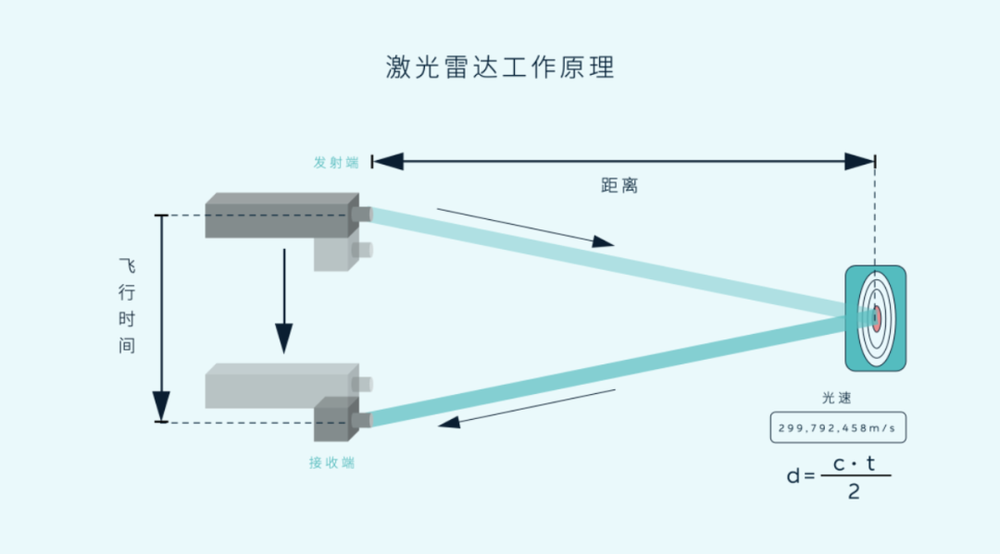
*图注：激光雷达发射激光束，通过测量反射时间计算距离，具有极高的测距精度*

激光雷达的特点：

- **测距精度高**：可达厘米级
- **角度分辨率好**：能够精确感知周围环境的形状
- **不受光线影响**：白天黑夜都能正常工作

这就是为什么自动驾驶汽车和仓储AGV几乎都标配激光雷达。

**其他外部感知传感器**

除了视觉，机器人还有许多其他"感官"：

- **超声波传感器**：发射超声波探测障碍物，成本低、结构简单
- **红外传感器**：检测热源或短距离障碍物
- **触觉传感器**：感知接触力和压力分布

### 4.2 内部感知——知道自己在哪里

机器人不仅需要知道外部环境，还需要知道自己"在哪里"、"做了什么动作"。

**编码器——关节的"位置计"**

每个电机几乎都配有**编码器**，它能精确测量电机转子转了多少角度。通过这些数据，控制系统就能计算出每个关节当前的角度——这就是机器人"知道"自己姿态的方式。

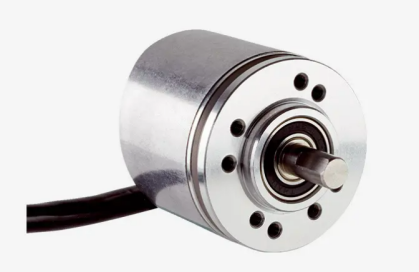
*图注：电机编码器安装在电机尾部，精确测量转子位置和转速*

**IMU——机器人的"前庭系统"**

当你闭上眼睛走路时，你仍然知道自己是向前还是向后、倾斜还是直立——这是因为内耳的前庭系统在感知你的运动和姿态。

机器人的**惯性测量单元（IMU）**功能类似，它由加速度计和陀螺仪组成，能够测量机器人的加速度和角速度，帮助机器人感知自己的运动状态。

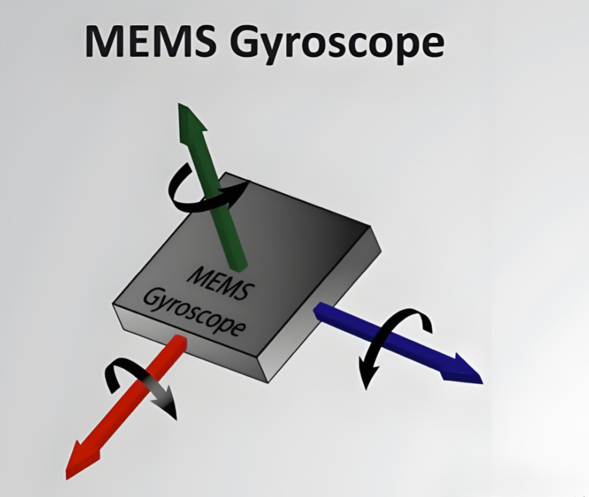
*图注：IMU传感器集成加速度计和陀螺仪，感知机器人运动状态*

**力矩传感器——感知力量的大小**

高端机械臂通常在关节处安装**力矩传感器"，它能感知关节输出的力矩大小。

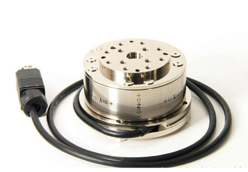
*图注：关节力矩传感器能够检测机器人与环境交互时的受力情况*

这有什么用处？当你希望机器人"轻柔"地拿起一个鸡蛋时，力矩传感器能让机器人感知到多大的力合适——既不会把鸡蛋捏碎，也不会让鸡蛋滑落。

---

## 5. 控制系统——机器人的大脑

### 5.1 控制器硬件

如果说感知系统是"眼睛和耳朵"，那么控制系统就是"大脑"——它接收信息、处理信息、做出决策、发出指令。

机器人的"大脑"是**控制器（Controller）」。走进机器人控制柜，你会看到一台工业计算机——它就是整个控制系统的核心。

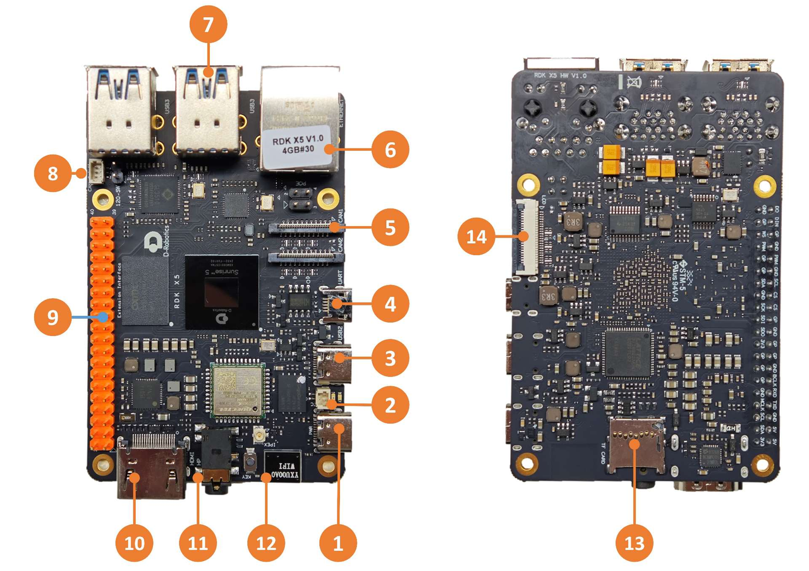
*图注：小型机器人控制器通常采用高性能嵌入式控制器，负责运行控制算法和调度任务*

控制器的工作：

- 接收传感器数据
- 运行运动控制算法
- 发送指令给驱动器
- 与其他系统通讯

常见的控制器类型：

- **工业PC**：性能强大，功能灵活
- **PLC（可编程逻辑控制器）**：稳定可靠，适合工业环境
- **嵌入式控制器**：体积小巧，功耗低

### 5.2 运动控制原理

控制器的核心任务是让机器人按预期方式运动。这涉及两个基本问题：

**正向运动学——已知关节角度，求末端位置**

当你知道每个关节的角度时，末端执行器在哪里？这就是正向运动学要解决的问题。

**逆向运动学——已知末端位置，求关节角度**

你想让末端到达某个位置，每个关节应该转动多少？这就是逆向运动学——这也是机器人控制中最核心、最复杂的问题之一。

这两个问题的解决，为机器人的精确控制奠定了数学基础。

---

## 6. 软件系统——机器人的灵魂

### 6.1 机器人操作系统

如果说硬件是机器人的"身体"，那么软件就是"灵魂"——它赋予了机器人智能、灵活性和学习能力。

想象一下，如果没有软件，一个精密的机械结构不过是一堆废铁。软件让冰冷的硬件"活"了起来。

**ROS2——机器人软件的核心框架**

在机器人软件领域，**ROS2**（Robot Operating System 2）是目前最流行的开发框架。

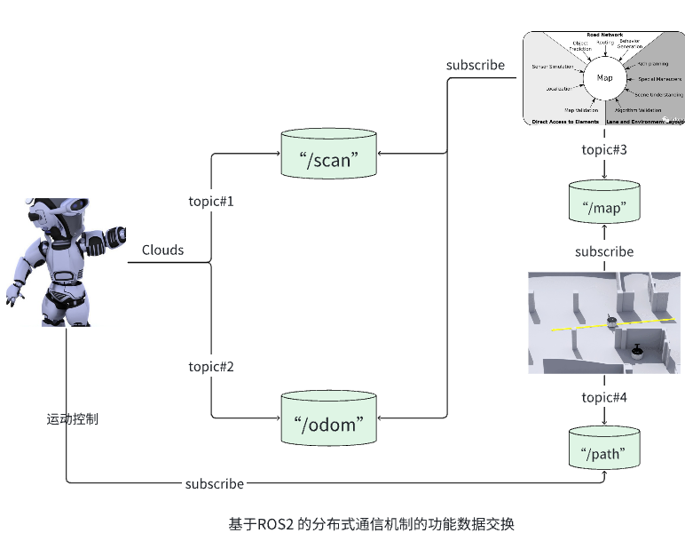
*图注：ROS2采用分布式节点架构，通过话题、服务、动作进行通讯*

ROS2的核心概念：

- **节点（Node）**：每个功能模块是一个独立的程序
- **话题（Topic）**：节点之间"广播"和"订阅"数据
- **服务（Service）**：节点之间的"请求-响应"通讯
- **动作（Action）**：长时间任务的"反馈式"通讯

这种分布式架构让机器人软件模块化、易维护——你可以单独开发、测试每个功能模块，然后像搭积木一样组合起来。

### 6.2 应用软件层

在ROS2这样的基础框架之上，是各种应用软件：

- **感知算法**：处理摄像头、激光雷达数据，识别物体、检测障碍
- **定位与建图**：SLAM算法让机器人在未知环境中知道"自己在哪"
- **路径规划**：计算从当前位置到目标位置的安全路径
- **运动控制**：精确控制每个关节的运动

近年来，**人工智能**技术的快速发展，让机器人软件系统越来越"聪明"。深度学习让机器人能够识别图像、理解语言、做出决策。强化学习让机器人能够通过试错学会新技能。

---

## 7. 机器人分类

### 按用途分：工业、服务、特种

机器人广泛应用于不同领域，根据用途可分为三大类：

**工业机器人——制造业的中坚力量**

工业机器人是机器人领域的"老大哥」，从1961年第一台工业机器人诞生至今，已在制造业中服役超过60年。

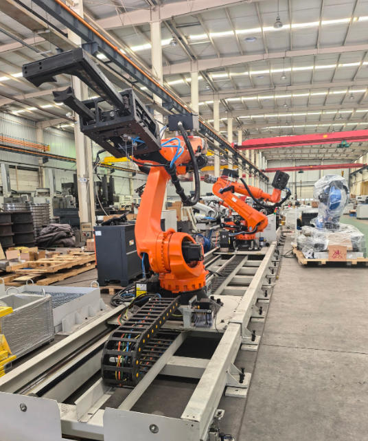
*图注：工业机器人广泛应用于汽车制造、电子装配等领域*

工业机器人的特点：

- **高精度**：重复定位精度可达0.02mm
- **高速度**：运动速度可达2m/s以上
- **高负载**：最大负载可达数吨
- **高刚性**：刚度高，运动稳定

典型应用：焊接、喷涂、搬运、装配、码垛……

**服务机器人——走进日常生活的伙伴**

从扫地机器人到餐厅送餐员，服务机器人正在走进千家万户。

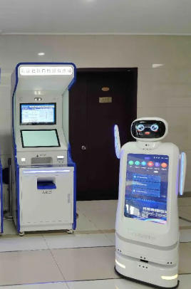
*图注：服务机器人涵盖清洁、配送、陪伴等多种应用*

服务机器人的特点：

- **交互性强**：需要与人自然交流
- **安全性高**：与人近距离接触，必须确保安全
- **适应性强**：面对非结构化环境，需要灵活应对

典型应用：扫地机器人、送餐机器人、酒店服务、银行大堂机器人……

**特种机器人——极端环境的探索者**

有些地方人类难以到达——火场深处、海底、灾区废墟、太空……这些地方是特种机器人的主场。

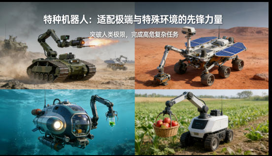
*图注：特种机器人用于军事、救援、水下、空中等特殊环境*

典型应用：军用侦察机器人、救援机器人、水下探测机器人、无人机排雷……

---

## 8. 典型案例

### 8.1 AGV——仓库里的"快递员"

如果你在网上买过东西，很可能已经和AGV打过照——只是你没有注意到它。

在亚马逊、阿里巴巴、京东的物流仓库里，数以千计的**AGV（自动导引车）**正在忙碌地工作。它们驮着货架在仓库中穿梭，把你需要商品送到分拣员面前。

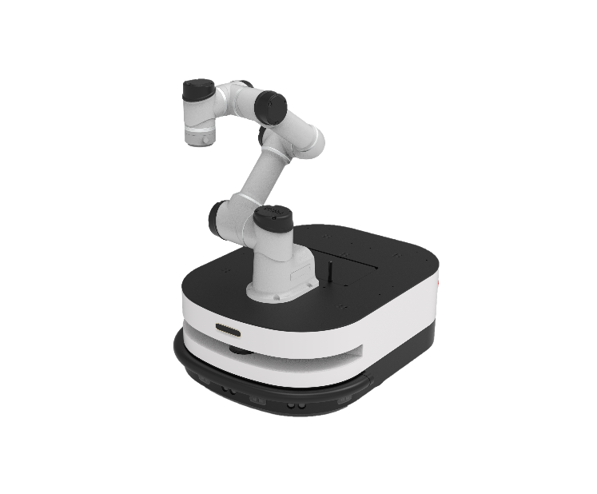
*图注：深圳创想未来的LEO AGV机器人大幅提升物流效率*

**AGV是如何工作的？**

1. **导航**：早期的AGV依赖地面磁条或色带；新一代AGV采用激光导航或视觉SLAM，真正实现自主定位
2. **避障**：配备激光雷达和超声波传感器，检测前方障碍物
3. **通讯**：通过WiFi与上位系统通讯，接收任务指令、汇报状态
4. **充电**：低电量时自动返回充电桩充电，24小时不间断工作

**为什么AGV如此重要？**

传统人工仓库，工人每天要在偌大的仓库里走几万步搬运货物——效率低、累、还容易出错。

有了AGV，"货到人"的模式让效率提升了5倍以上。工人只需站在工位上，等待AGV把货架送到面前。这不仅大幅降低了劳动强度，还减少了错误率。

### 8.2 协作机械臂——人的工作伙伴

传统工业机器人虽然效率高，但有一个缺点——太"危险"。它们力量大、速度快，必须安装在安全围栏里，与人隔离操作。

**协作机器人**的出现改变了这一切。

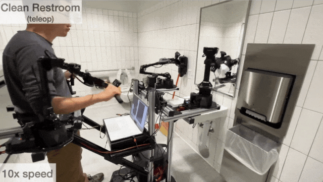
*图注：协作机器人能够与人在同一空间安全共处*

**协作机器人的"安全秘诀"**

- **力矩限制**：当检测到碰撞时，立即停止运动，避免伤害
- **轻量化设计**：整体重量远低于传统机器人
- **碰撞检测**：内置力矩传感器，感知异常接触
- **视觉感知**：配备安全级别摄像头，检测人员靠近

*图注：协作机器人配备力矩传感器和视觉传感器，确保人机安全*

**拖拽示教——人人都会用**

协作机器人最大的特点是**易用性」。传统工业机器人需要专业工程师编程调试；协作机器人支持"拖拽示教"——你只需用手拖动机械臂到目标位置，机器人自动记录轨迹。

*图注：用户可以直接拖动协作机械臂进行示教*

这意味着，即使没有编程基础的操作工人，也能轻松让机器人完成新任务。正因如此，协作机器人深受中小企业青睐——他们也能享受自动化的红利了。

### 8.3 家庭服务机器人——生活小助手

清晨，你还在睡梦中，扫地机器人已经默默地把房间打扫干净——这是很多家庭日常的场景。

**家庭服务机器人**是机器人技术走进千家万户的先驱。

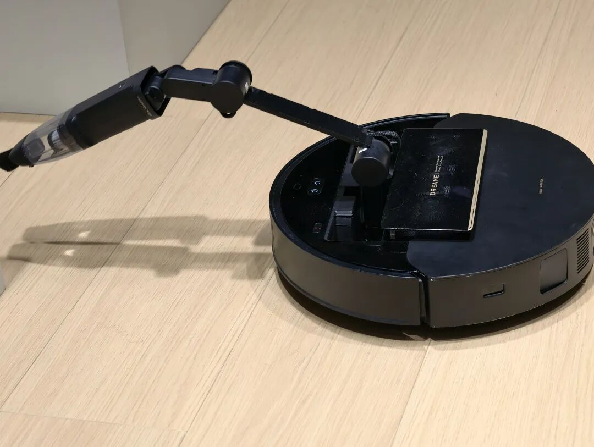
*图注：扫地机器人已成为最普及的家庭服务机器人*

**扫地机器人有多"聪明"？**

现代扫地机器人集成了多种智能技术：

- **激光测距/深度相机**：感知周围环境，构建地图
- **SLAM算法**：同步定位与建图知道自己"在哪"
- **路径规划算法**：智能规划清扫路线，不遗漏不重复
- **防跌落传感器**：检测台阶，避免掉落
- **自动回充**：低电量自动返回充电座

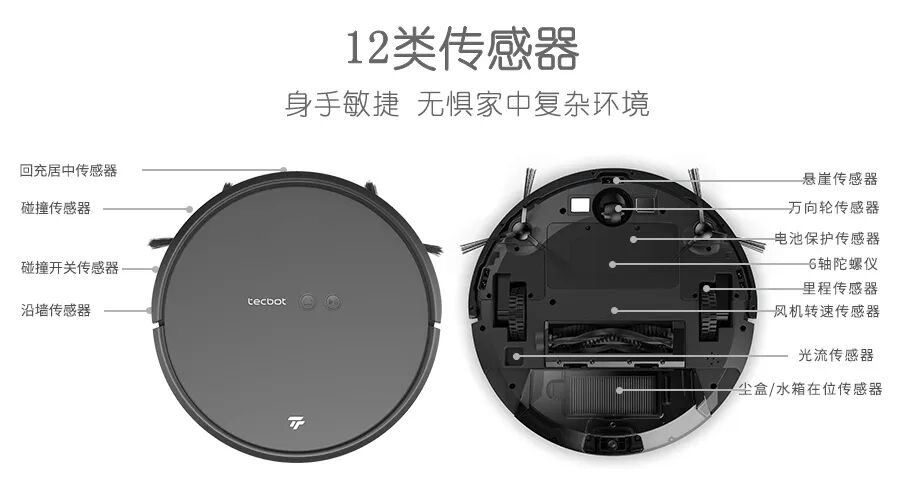
*图注：扫地机器人配备激光雷达、轮速计、碰撞传感器等多种感知设备*

**不仅仅是扫地**

家庭服务机器人的品类越来越丰富：

- **擦窗机器人**：吸附在玻璃上，自动擦拭
- **空气净化机器人**：移动的空气净化器
- **陪伴机器人**：具备语音交互功能，能与老人儿童对话
- **智能音箱**：虽然是"静态"的，但也是家庭服务机器人的一种形态

随着人工智能技术的发展，家庭服务机器人将变得越来越"聪明"，成为智能家居生态的核心入口。

---

## 本章小结

本章我们一起探索了机器人的"身体"——系统组成与分类。

**核心要点回顾：**

1. **五大系统**：机器人由机械结构、驱动系统、感知系统、控制系统、软件系统组成，各司其职、协同工作
2. **机械结构**：关节和自由度决定了机器人的运动能力，末端执行器是机器人的"手"
3. **驱动系统**：电机驱动最常见，液压驱动适合大功率场景，气动驱动适合高速轻量应用
4. **感知系统**：外部感知了解环境，内部感知了解自身状态，多传感器融合是趋势
5. **控制系统**：控制器是机器人的"大脑"，运动控制涉及正向和逆向运动学
6. **软件系统**：ROS2是主流框架，人工智能让机器人越来越"聪明"
7. **分类维度**：按用途分为工业、服务、特种；按运动形式分为移动、机械臂、复合型
8. **典型案例**：AGV、协作机械臂、家庭服务机器人——不同场景，不同解决方案

---

## 思考与练习

1. **想一想**：你家中有哪些机器人？它们属于哪一类？由哪些系统组成？
2. **查一查**：你最感兴趣的一种机器人类型，它的核心技术是什么？
3. **议一议**：机器人与人类的关系未来会如何发展？是替代还是协作？

---

## 参考资料

### 机器人系统基础

1. 《机器人学导论》（Introduction to Robotics: Mechanics and Control） - John J. Craig
2. 《机器人技术基础》 - 熊有伦
3. IEEE Transactions on Robotics

### ROS2与软件系统

4. 《ROS2机器人编程实践》
5. ROS2官方文档：https://docs.ros.org/en/rolling/

### 机器人分类与应用

6. 《中国机器人产业发展报告》
7. International Federation of Robotics (IFR)

---

*到这里，第一章的全部内容就结束了。从下一章开始，我们将正式进入ROS2的学习——先从安装和环境配置开始，然后逐步深入机器人模型的构建、仿真和控制。准备好了吗？让我们一起开启ROS2之旅吧！*