# 6.1 Hand-Eye Calibration

- [6.1 Hand-Eye Calibration](#61-hand-eye-calibration)
  - [6.1.1 手眼标定的定义](#611-手眼标定的定义)
  - [6.1.2 手眼标定的数学模型](#612-手眼标定的数学模型)
    - [6.1.2.1 Eye In Hand](#6121-eye-in-hand)
    - [6.1.2.2 Eye To Hand](#6122-eye-to-hand)
  - [6.1.3 求解 `AH = HB`](#613-求解-ah--hb)
    - [6.1.3.1 Park方法求解旋转](#6131-park方法求解旋转)
    - [6.1.3.2 Park方法求解平移](#6132-park方法求解平移)
  - [6.1.4 OpenCV中的手眼标定方法及标定注意事项](#614-opencv中的手眼标定方法及标定注意事项)
    - [6.1.4.1 OpenCV中的手眼标定接口](#6141-opencv中的手眼标定接口)
    - [6.1.4.2 标定注意事项](#6142-标定注意事项)
  - [6.1.5 评价手眼标定效果](#615-评价手眼标定效果)
  - [参考](#参考)

## 6.1.1 手眼标定的定义

手眼标定（Hand-Eye Calibration）是机器人视觉应用中的一个基础且关键的问题，主要用于统一视觉系统与机器人的坐标系，具体来说，就是确定摄像头与机器人的相对姿态关系。

> 当我们希望使用视觉引导机器人去抓取物体时，需要知道三个相对位置关系，即
> 
> 1. 末端执行器与机器人底座之间相对位置关系
> 2. 摄像头与末端执行器之间相对位置关系
> 3. 物体与摄像头之间的相对位置和方向
> 
> 手眼标定主要解决其中第二个问题，即确定“手”与安装在其上“眼”之间的空间变换关系，即求解相机坐标系和机器人坐标系之间的变换矩阵。  这里的机器人末端执行器称为手，摄像头称为眼。

根据摄像头安装方式的不同，手眼标定分为两种形式：1.摄像头安装在机械手末端，称之为眼在手上（Eye in hand） 2.摄像头安装在机械臂外的机器人底座上，则称之为眼在手外（Eye to hand）

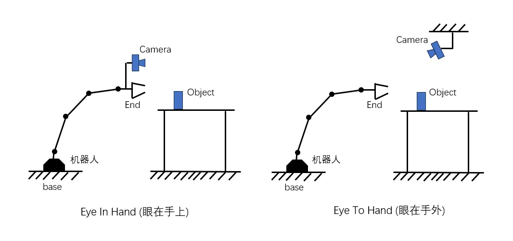

## 6.1.2 手眼标定的数学模型

不管是眼在手上还是眼在手外，它们求解的数学方程是一样的，都为 $AH = HB$ ，首先定义如下坐标系：

$F_b$: **基座坐标系**(Base Frame),固定在机械臂的底座上，是机械臂运动的全局参考坐标系。

$F_e$: **末端执行器坐标系**(End-Effector Frame)固定在机械臂末端执行器（例如夹爪或工具）上。

$F_c$: **相机坐标系**（Camera Frame）,固定在相机光心的位置，是视觉感知的参考系。

$F_t$: **标定目标坐标系**（Calibration Target Frame）：固定在标定目标（如棋盘格、圆点板）上。

坐标系之间的关系通常用齐次变换矩阵（刚体变换）T表示：

```math
T^i_j = \begin{bmatrix} R^i_j & t^i_j \\ 0 & 1 \end{bmatrix}
```

其中`R ∈ SO(3)`（旋转矩阵，特殊正交群）, `t ∈ R³`（三维平移向量）,分别对应旋转变换与平移变换。T的上下标表示变换是对于哪两个坐标系，例如:

$T^e_c$:将相机坐标系转换到末端执行器坐标系的变换，也表示相机在末端执行器坐标系下的位姿，在眼在手上这种情形下，就是我们要求的目标矩阵。

### 6.1.2.1 Eye In Hand

当相机固定在机械臂末端时，相机与末端执行器之间的变换是固定的，此时称为眼在手上，进行该类手眼标定时，会将标定板固定在一处，然后控制机械臂移动到不同位置，使用机械臂上固定的相机，在不同位置对标定板拍照，拍摄多组不同位置下标定板的照片。

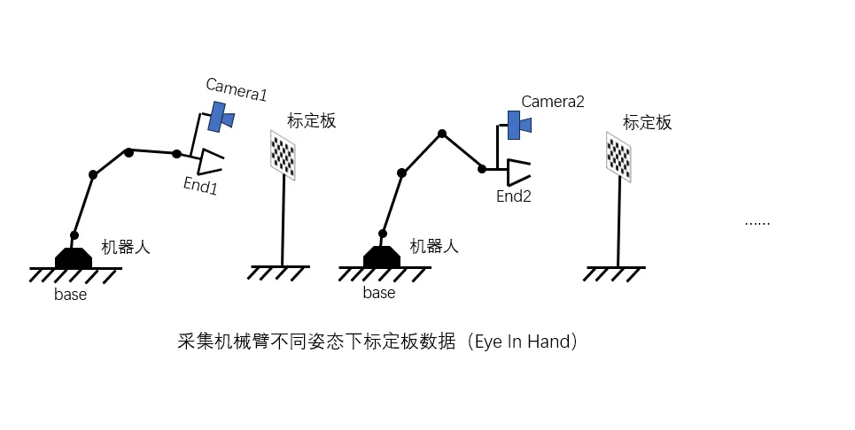

由于标定板与机器人底座是固定的，二者之间相对位姿关系不变，则有：
```math
T^b_t = T^b_{e1}\ T^{e1}_{c1}\ T^{c1}_{t} = T^b_{e2}\ T^{e2}_{c2}\ T^{c2}_{t}
```
对上述等式进行变换

```math
(T^b_{e2})^{-1}T^b_{e1}T^{e1}_{c1}T^{c1}_{t} = T^{e2}_{c2}T^{c2}_{t}
```

```math
(T^b_{e2})^{-1}T^b_{e1}T^{e1}_{c1} = T^{e2}_{c2}T^{c2}_{t}(T^{c1}_{t})^{-1}
```

```math
T^{e2}_{e1}T^{e1}_{c1} = T^{e2}_{c2}T^{c2}_{c1}
```

```math
T^{e2}_{e1}T^{e}_{c} = T^{e}_{c}T^{c2}_{c1}
```

```math
AH = HB
```

其中`T^e_c`就是最终需要求解的`H`。

### 6.1.2.2 Eye To Hand

当相机固定在机械臂以外时，相机与末端执行器的相对位置会随着机械臂的运动而改变，此时称为眼在手外。进行该类手眼标定时，会将标定板固定在机械臂末端，然后控制机械臂拿着标定板，围绕着固定的相机拍照。为了求解的准确性，一般需要拍摄多于10组的照片。

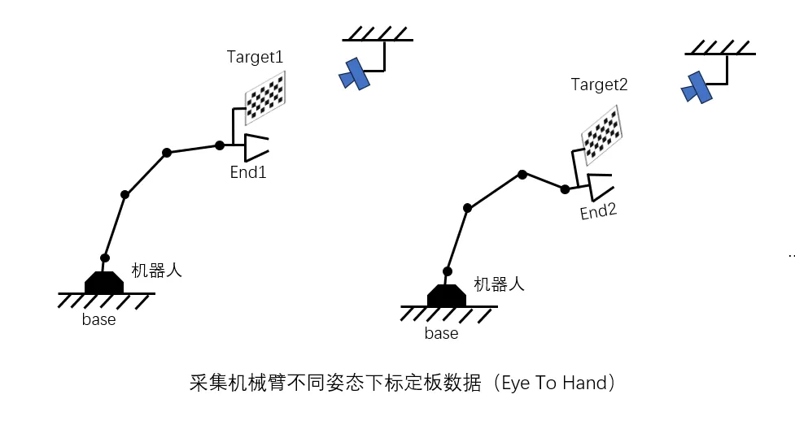

由于此时标定板是固定在机械臂末端的，二者相对位置在拍摄不同照片时值不变，所以有：

```math
T^e_t = T^{e1}_bT^{b}_{c}T^{c}_{t1} = T^{e2}_bT^{b}_{c}T^{c}_{t2}
```
对上述等式进行变换：
```math
T^{e1}_bT^{b}_{c}T^{c}_{t1} = T^{e2}_bT^{b}_{c}T^{c}_{t2} 
```

```math
(T^{e2}_b)^{-1}T^{e1}_bT^{b}_{c}T^{c}_{t1} = T^{b}_{c}T^{c}_{t2} 
```

```math
(T^{e2}_b)^{-1}T^{e1}_bT^{b}_{c} = T^{b}_{c}T^{c}_{t2}(T^{c}_{t1})^{-1} 
```

```math
(T^b_{e2}T^{e1}_b)T^{b}_{c} = T^{b}_{c}(T^{c}_{t2}T^{t1}_c) 
```

```math
AH = HB
```

## 6.1.3 求解 `AH = HB`

作为机器人学的重要内容，从上世纪80年代起学术界就对手眼标定进行了大量研究，产生了许多`AH = HB`求解方法，目前比较常用的是分步解法，即将方程组进行分解，然后利用旋转矩阵的性质，先求解出旋转，然后将旋转的解代入平移求解中，再求出平移部分。

常见的两步经典算法有将旋转矩阵转为旋转向量求解的Tsai-Lenz方法，基于旋转矩阵李群性质（李群的伴随性质）进行求解的Park方法等，接下来介绍Park方法。

### 6.1.3.1 Park方法求解旋转</h3>

原方程三个变量均为齐次变换矩阵（homogeneous transformation：将旋转和平移变换写在一个4x4的矩阵中），表示两个坐标系之间的变换，其基本结构为：

```math
H = \left[\begin{array}{cc} R & t \\ 0 & 1 \end{array}\right]
```

其中`R ∈ SO(3)`（旋转矩阵，特殊正交群）, `t ∈ R³`（三维平移向量）,分别对应旋转变换与平移变换。

原方程进行变换：

$$
\begin{array}{l}
AH = HB \\
\left[\begin{array}{cc}
\theta_{A} & b_{A} \\
0 & 1
\end{array}\right]\left[\begin{array}{cc}
\theta_{X} & b_{X} \\
0 & 1
\end{array}\right] = \left[\begin{array}{cc}
\theta_{X} & b_{X} \\
0 & 1
\end{array}\right]\left[\begin{array}{cc}
\theta_{B} & b_{B} \\
0 & 1
\end{array}\right]
\end{array}
$$

所以有（乘积结果旋转与平移部分对应位置相等）：

$$
\begin{aligned}
\theta_{A} \theta_{X} & =\theta_{X} \theta_{B} \\
\theta_{A} b_{X}+b_{A} & =\theta_{X} b_{B}+b_{X}
\end{aligned}
$$

首先求解第一个只包含旋转矩阵的方程。

$$
\begin{aligned}
\theta_{A} \theta_{X} &=\theta_{X} \theta_{B} \\
\theta_{A} &=\theta_{X} \theta_{B} \theta_{X}^T 
\end{aligned}
$$

旋转矩阵为SO3群，SO3群为李群，每一个李群都有对应的李代数，其李代数处于低维的欧式空间（线性空间），是李群局部开域的切空间表示，李群与李代数可以通过指数映射与对数映射相互转换：

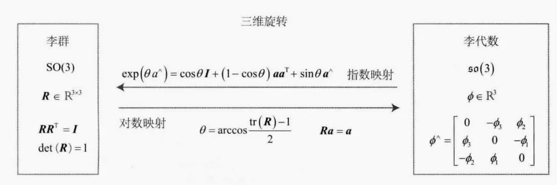 
对于旋转矩阵R，与对应的李代数`Φ`变换关系可以如下表示：

$$
R = \exp(\Phi^{\wedge}) = \exp [\Phi]
$$

其中[ ]符号表示^操作，及转为反对称矩阵，或者说叉积。

对于SO(3)，其伴随性质为：

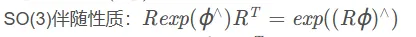

$$
\begin{aligned}
\theta_{A} & =\theta_{X} \theta_{B} \theta_{X}^T \\
\exp [\alpha] & = \theta_{X}\exp [\beta]\theta_{X}^T \\
\exp [\alpha] & = \exp [\theta_{X}\beta] \\
\alpha &= \theta_{X}\beta
\end{aligned}
$$

当存在多组观测时，上述问题可以转化为如下最小二乘问题：

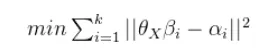 

α与β为对应旋转的李代数，它们都是三维向量，可以看作一个三维点，那么上述问题等同于一个点云配准问题：  
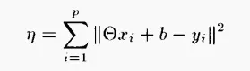 

该问题有最小二乘解为：  
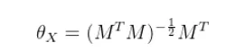 

其中：  
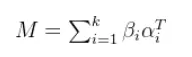 

### 6.1.3.2 Park方法求解平移

    在求解得到旋转矩阵后，将旋转矩阵值代入第二个方程：

$$
\begin{aligned}
\theta_{A} b_{X}+b_{A} & =\theta_{X} b_{B}+b_{X} \\
\theta_{A} b_{X} - b_{X} & =\theta_{X} b_{B}- b_{A} \\
(\theta_{A} - I)b_{X} & =\theta_{X} b_{B}- b_{A} \\
Cb_{X} &= D
\end{aligned}
$$

其中`C`与`D`均为已知值，由于`C`不一定可逆，原方程做如下变换：  
```math
\begin{aligned}
Cb_{X} &= D \\
C^TCb_{X} &= C^TD \\
b_{X} &= (C^TC)^{-1}C^TD
\end{aligned}
```

即可求得平移部分。

当有多组观测值时  
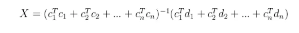 

最终的解为：  
```math
\begin{aligned}
H = \left[\begin{array}{cc}
\theta_{X} & b_{X} \\
0 & 1
\end{array}\right]
\end{aligned}
```

## 6.1.4 OpenCV中的手眼标定方法及标定注意事项

手眼标定算法按照实现原理可以将所有方法分为三类：独立闭式解，同时闭式解，迭代方法 

> a.独立闭式解 **（seperable closed-form solutions）**: 与位移分量分开求解旋转分量。
> 
> 缺点: 旋转分量Rx的计算误差会被带入位移分量tx的计算中。
> 
> b.同时闭式解 **（simultaneous closed-form solutions）**： 同时求解位移分量和旋转分量
> 
> 缺点: 由于噪声的影响，旋转分量Rx的求解可能不一定是正交矩阵。因此，必须对旋转分量采取正交化步骤。然而，相应的位移分量没有被重新计算，这会导致求解错误。
> 
> c.迭代方法 **（iterative solutions）**： 使用优化技术迭代求解旋转分量和平移分量。
> 
> 缺点: 这种方式计算量可能很大，因为这些方法通常包含复杂的优化程序。此外，随着方程数量(n)变大，迭代解与封闭式解之间的差异通常会变小。因此，使用此方法前必须决定迭代解决方案的准确性是否值得计算成本。

### 6.1.4.1 OpenCV中的手眼标定接口</h3>

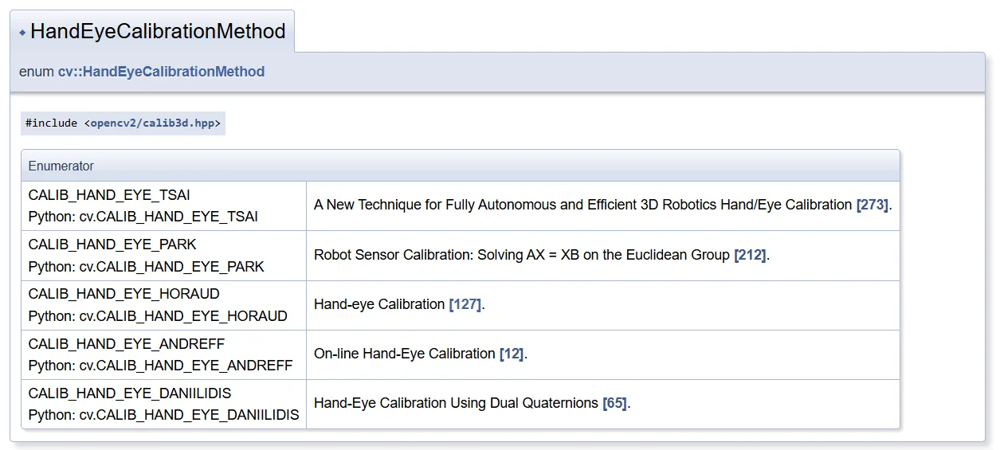 

OpenCV主要实现了前两类方法，其中默认方法为TSAI。PARK，HORAUD也是独立解方法。ANDREFF，DANIILIDIS是同时闭式解，（从同一组数据实验中得到结论，认为独立解中TSAI方法求得解的误差较大）。

采集多组标定数据，传入相应的机械臂数据与摄像头标定板定位数据，就可以获得标定结果。

### 6.1.4.2 标定注意事项

当新手进行第一次标定时，需要注意如下事项：

一：用calibrateCamera求标定板到相机的R,t，跟抓取用的内参不同，造成误差

二：标定板角点方向反了。默认从左到右，有时会出现从右到左，导致不在统一坐标系。

三：标定板面积过小，而且只在中心移动。会导致边缘不准。

四：标定时要旋转

五：图片太少。要10张以上

六。某些相机有问题，rgbd的变换矩阵要注意

## 6.1.5 评价手眼标定效果

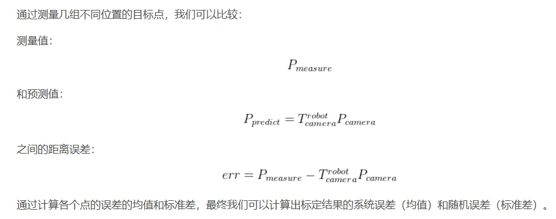 

## 参考

[1.手眼标定算法---Sai-Lenz(A New Technique for Fully Autonomous and Efficient 3D Robotics Hand/Eye Calibrati)](https://blog.csdn.net/u010368556/article/details/81585385)

[2.机器人手眼标定使用指南](https://docs.mech-mind.net/1.5/zh-CN/SoftwareSuite/MechVision/CalibrationGuide/CalibrationGuide.html)

[3.标定学习笔记（四）-- 手眼标定详解](https://blog.csdn.net/qq_45006390/article/details/121670412)

[4.Camera Calibration and 3D Reconstruction](https://docs.opencv.org/4.10.0/d9/d0c/group__calib3d.html#gad10a5ef12ee3499a0774c7904a801b99)

[5.3D视觉工坊-手眼标定（附opencv实现代码）](https://blog.csdn.net/z504727099/article/details/115494147)
