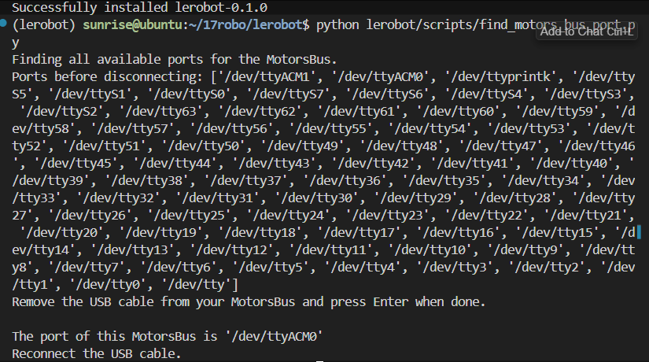
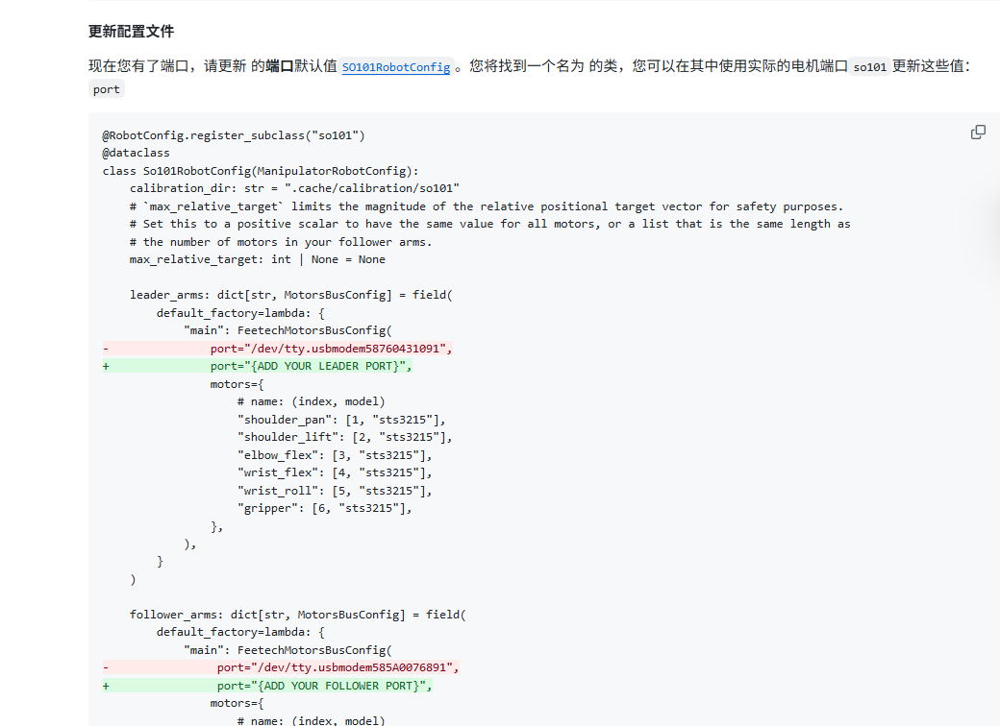
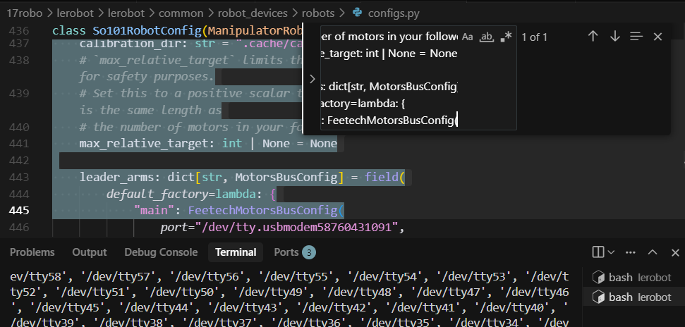
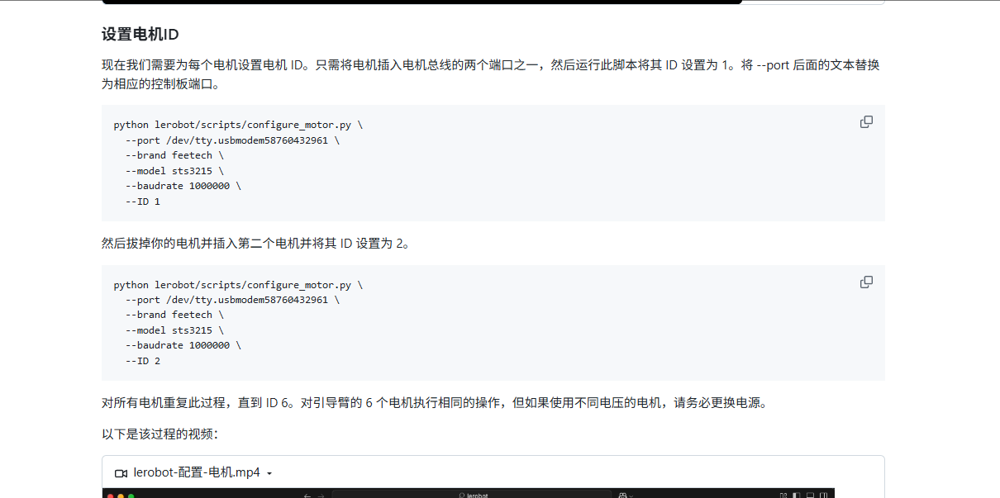
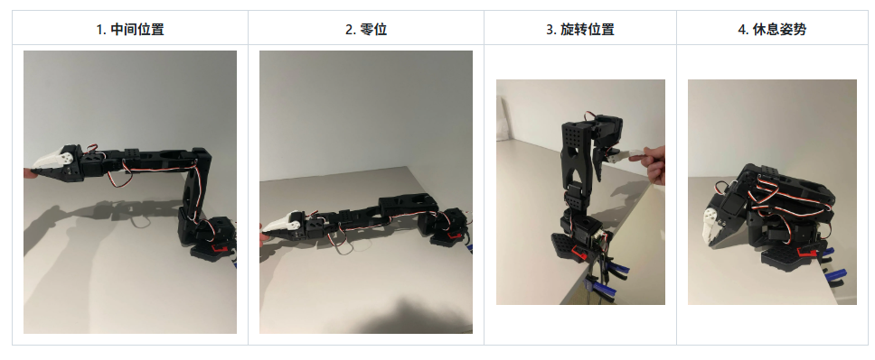
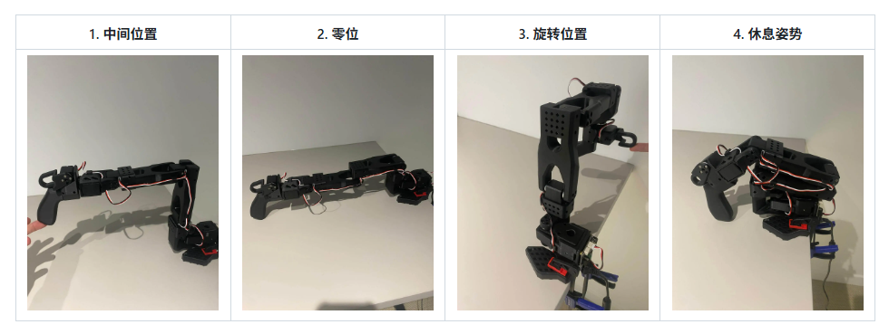

准备电源5V/5A 烧录镜像

https://developer.d-robotics.cc/rdk_doc/Quick_start/hardware_introduction/rdk_x5

烧录后直接可以使用，连接lerobot器材

连接wifi

```bash
nmcli dev wifi #查看列表
sudo nmcli dev wifi connect xxxxxx password xxxxxx #wifi名 和 密码
```


```Bash
# 下载并解压ARM64版本的micromambacurl -Ls https://micro.mamba.pm/api/micromamba/linux-aarch64/latest | tar -xvj bin/micromamba# 初始化shell./bin/micromamba shell init -s bash --root-prefix ./micromambaecho "alias mamba=micromamba" >> ~/.bashrcsource ~/.bashrcmamba create -y -n lerobot python=3.10mamba install ffmpeg -c conda-forgegit clone https://github.com/huggingface/lerobotcd lerobotgit fetch origingit checkout user/michel-aractingi/2025-06-02-docs-for-hil-serl

pip config set global.index-url https://pypi.tuna.tsinghua.edu.cn/simple
cd lerobot && pip install -e ".[feetech]"
```

测试机器人连接端口

```Bash
sudo chmod 666 /dev/ttyACM0sudo chmod 666 /dev/ttyACM1$ python lerobot/scripts/find_motors_bus_port.pyFinding all available ports for the MotorsBus.Ports before disconnecting: ['/dev/ttyACM1', '/dev/ttyACM0', '/dev/ttyprintk', '/dev/ttyS5', '/dev/ttyS1', '/dev/ttyS0', '/dev/ttyS7', '/dev/ttyS6', '/dev/ttyS4', '/dev/ttyS3', '/dev/ttyS2', '/dev/tty63', '/dev/tty62', '/dev/tty61', '/dev/tty60', '/dev/tty59', '/dev/tty58', '/dev/tty57', '/dev/tty56', '/dev/tty55', '/dev/tty54', '/dev/tty53', '/dev/tty52', '/dev/tty51', '/dev/tty50', '/dev/tty49', '/dev/tty48', '/dev/tty47', '/dev/tty46', '/dev/tty45', '/dev/tty44', '/dev/tty43', '/dev/tty42', '/dev/tty41', '/dev/tty40', '/dev/tty39', '/dev/tty38', '/dev/tty37', '/dev/tty36', '/dev/tty35', '/dev/tty34', '/dev/tty33', '/dev/tty32', '/dev/tty31', '/dev/tty30', '/dev/tty29', '/dev/tty28', '/dev/tty27', '/dev/tty26', '/dev/tty25', '/dev/tty24', '/dev/tty23', '/dev/tty22', '/dev/tty21', '/dev/tty20', '/dev/tty19', '/dev/tty18', '/dev/tty17', '/dev/tty16', '/dev/tty15', '/dev/tty14', '/dev/tty13', '/dev/tty12', '/dev/tty11', '/dev/tty10', '/dev/tty9', '/dev/tty8', '/dev/tty7', '/dev/tty6', '/dev/tty5', '/dev/tty4', '/dev/tty3', '/dev/tty2', '/dev/tty1', '/dev/tty0', '/dev/tty']Remove the USB cable from your MotorsBus and press Enter when done.通过拔掉对比拔掉之后，发现从臂是The port of this MotorsBus is '/dev/ttyACM0'主臂是The port of this MotorsBus is '/dev/ttyACM1'Reconnect the USB cable.
```



现在，可以更新端口文件：




```Bash
ls lerobot/common/robot_devices/robots/configs.py检索如下内容class So101RobotConfig(ManipulatorRobotConfig):    calibration_dir: str = ".cache/calibration/so101"    # `max_relative_target` limits the magnitude of the relative positional target vector for safety purposes.    # Set this to a positive scalar to have the same value for all motors, or a list that is the same length as    # the number of motors in your follower arms.    max_relative_target: int | None = None    leader_arms: dict[str, MotorsBusConfig] = field(        default_factory=lambda: {            "main": FeetechMotorsBusConfig(                        
```



买了预安装版本，**不需要**设置电机id



然后，配置主臂和从臂对齐数据

```Bash
python lerobot/scripts/control_robot.py \  --robot.type=so101 \  --robot.cameras='{}' \  --control.type=calibrate \  --control.arms='["main_follower"]'  
```

只需要运行第一条命令，即可同时完成两个的校准，注意，每次需要调整到对应位置，然后进行回车确认

运行这条命令，先校准从臂再校准主臂





这样，我们就可以顺利完成遥操作了！

```Bash
python lerobot/scripts/control_robot.py \  --robot.type=so101 \  --robot.cameras='{}' \  --control.type=teleoperate
```
