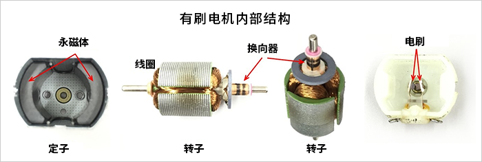
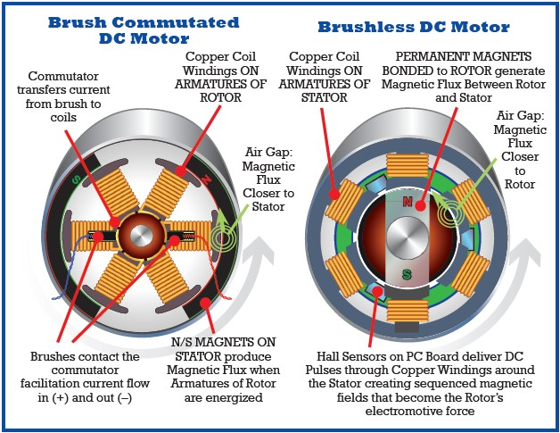
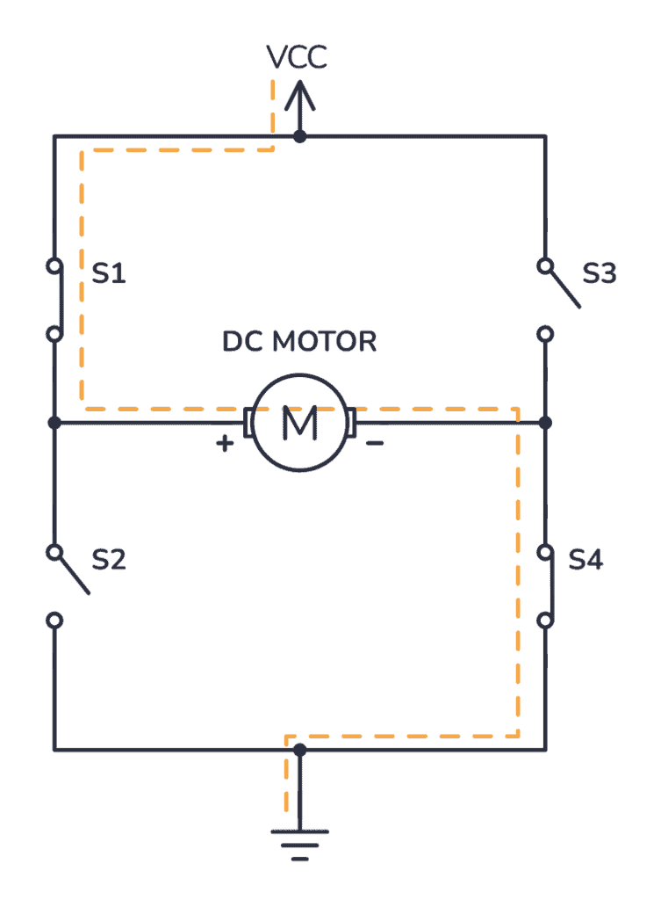
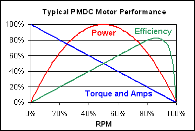
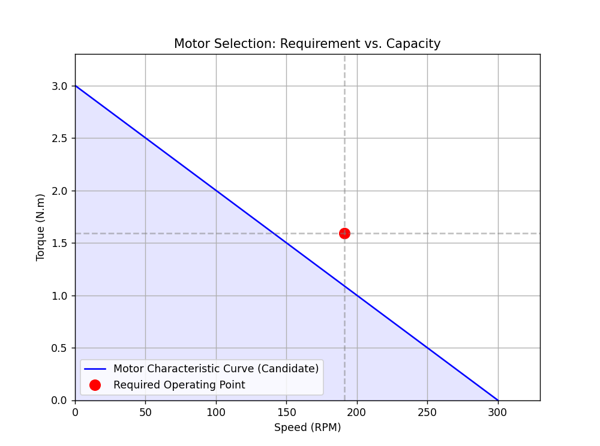

# 04. 机器人执行器：原理、选型与控制

执行器（Actuators）是机器人的“肌肉”。本章将深入探讨如何让机器人动起来，涵盖电机原理、驱动电路、传动机构以及核心的选型计算方法。

## 1. 电机分类与核心原理

机器人领域最常用的电机主要有三种：直流电机（DC）、步进电机（Stepper）和伺服电机（Servo/PMSM）。

### 1.1 直流有刷电机 (Brushed DC Motor)
* **原理**：利用电刷和换向器物理接触改变电流方向，产生连续旋转。
* **优点**：控制简单（给电就转）、成本低。
* **缺点**：电刷磨损寿命短、有火花干扰、效率较低。



图1：直流有刷电机内部结构


### 1.2 直流无刷电机 (BLDC / PMSM)
* **原理**：去除电刷，利用电子换向（ESC）。转子是永磁体，定子是线圈。
* **特点**：寿命长、噪音小、效率高、功率密度大。
* **应用**：四轴飞行器、高性能机械臂（如 UR5）、移动底盘。



图2: BLDC vs Brushed 对比


### 1.3 步进电机 (Stepper Motor)
* **原理**：通过脉冲信号控制，每输入一个脉冲转动一个固定的角度（步距角）。
* **特点**：开环控制即可实现精确定位，低速扭矩大。
* **缺点**：高速性能差，容易丢步，共振噪音大。

### 1.4 核心参数对比表

| 特性 | 直流有刷 | 直流无刷 (BLDC) | 步进电机 |
| :--- | :--- | :--- | :--- |
| **控制方式** | 电压/PWM | 电子换向 (FOC/六步) | 脉冲 (Pulse/Dir) |
| **寿命** | 低 (碳刷磨损) | 高 (轴承寿命) | 高 |
| **高速性能** | 中 | 优 | 差 (力矩随转速急降) |
| **成本** | 低 | 高 | 中 |
| **典型应用** | 玩具车、风扇 | 无人机、协作臂 | 3D打印机、云台 |

---

## 2. 驱动与传动系统

电机通常不能直接连接负载，需要驱动器（放大信号）和减速机（放大扭矩）。

### 2.1 电机驱动原理 (H桥与PWM)
MCU 的 GPIO 只能输出微弱电流，必须通过 H 桥电路驱动电机。
* **PWM (脉宽调制)**：通过快速开关电源来调节平均电压，从而控制速度。
* **H桥 (H-Bridge)**：通过 4 个开关管（MOSFET）的状态切换，控制电流方向（正反转）。

图3: H桥电路控制电机正反转]


### 2.2 常见传动机构
* **行星减速机**：体积小，传动比大，同轴输出。
* **谐波减速机**：零背隙（Backlash），高精度，用于机械臂关节。
* **同步带**：适合远距离传动，噪音低。


------

## 3. 电机选型实战：扭矩-转速曲线

这是新手最容易踩坑的地方。**不仅要看额定功率，更要看 T-N (扭矩-转速) 曲线。**

### 3.1 关键公式

$$ P = \tau \cdot \omega $$

- $P$: 功率 (Watt)
- $\tau$: 扭矩 (N·m)
- $\omega$: 角速度 (rad/s)

### 3.2 选型步骤

1. **确定运动学参数**：最大速度 $v_{max}$，最大加速度 $a_{max}$。
2. **计算负载扭矩**：
   - **惯性扭矩**：$T_{acc} = J \cdot \alpha$ （加速时需要）
   - **摩擦扭矩**：$T_{fric}$
   - **重力扭矩**：$T_{grav}$ （提升重物时需要）
3. **安全系数**：通常取 1.5 ~ 2 倍余量。




图4: 直流电机扭矩转速曲线


------

## 4. Python 实战：电机选型计算器

下面的代码用于计算移动机器人在给定加速度和坡度下，需要多大扭矩的电机。


```python
import numpy as np
import matplotlib.pyplot as plt

def motor_sizing_calculator(mass, radius, max_vel, max_acc, slope_deg):
    """
    计算移动机器人所需的电机参数 (峰值工况)
    """
    g = 9.81
    mu = 0.05
    
    # 1. 力学分析
    F_acc = mass * max_acc
    F_gravity = mass * g * np.sin(np.radians(slope_deg))
    F_friction = mass * g * np.cos(np.radians(slope_deg)) * mu
    
    Total_Force = F_acc + F_gravity + F_friction
    
    # 2. 转换为电机轴参数
    Required_Torque = Total_Force * radius 
    
    # 3. 转速计算
    omega = max_vel / radius 
    Required_RPM = omega * 60 / (2 * np.pi)
    
    return Required_Torque, Required_RPM

# --- 1. 计算需求点 (你的原始逻辑) ---
# 示例：10kg小车，10cm轮径，1m/s速度，1m/s^2加速度，10度坡
T_req, RPM_req = motor_sizing_calculator(mass=10, radius=0.05, max_vel=1.0, max_acc=1.0, slope_deg=10)

print(f"需求工况点: {T_req:.2f} N.m @ {RPM_req:.2f} RPM")

# --- 2. 模拟一个“候选电机”的特性曲线 (新增部分) ---
# 假设我们选了一个电机，它的参数如下：
# 空载转速 (No-load Speed): 300 RPM
# 堵转扭矩 (Stall Torque): 3.0 N.m
motor_no_load_rpm = 300
motor_stall_torque = 3.0

# 生成电机曲线数据 (直线: T = -k * n + T_stall)
# 直流电机特性通常近似为一条斜向下的直线
rpm_range = np.linspace(0, motor_no_load_rpm, 100)
slope = -motor_stall_torque / motor_no_load_rpm
torque_curve = slope * rpm_range + motor_stall_torque

# --- 3. 绘图 ---
plt.figure(figsize=(8, 6))

# 画出电机特性曲线 (能力边界)
plt.plot(rpm_range, torque_curve, 'b-', label='Motor Characteristic Curve (Candidate)')
# 画出安全区域 (曲线下方的填充)
plt.fill_between(rpm_range, torque_curve, color='blue', alpha=0.1)

# 画出你的需求点 (工况)
plt.plot(RPM_req, T_req, 'ro', markersize=10, label='Required Operating Point')

# 添加辅助线
plt.axvline(x=RPM_req, color='gray', linestyle='--', alpha=0.5)
plt.axhline(y=T_req, color='gray', linestyle='--', alpha=0.5)

plt.xlim(0, motor_no_load_rpm * 1.1)
plt.ylim(0, motor_stall_torque * 1.1)
plt.xlabel('Speed (RPM)')
plt.ylabel('Torque (N.m)')
plt.title('Motor Selection: Requirement vs. Capacity')
plt.grid(True)
plt.legend()

plt.show()
```




### 结果解读：

- **蓝线**：代表你买的电机的极限能力。
- **红点**：代表你的小车在最费劲时候的需求。
- **判断标准**：如果**红点在蓝线下方（蓝色阴影区内）**，说明这个电机能带动小车；如果红点在蓝线上方，说明电机扭矩不够或转速不够，需要换更强的电机。