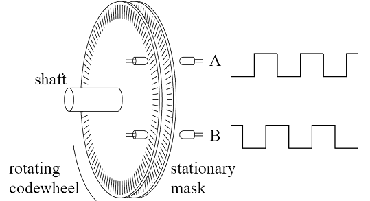
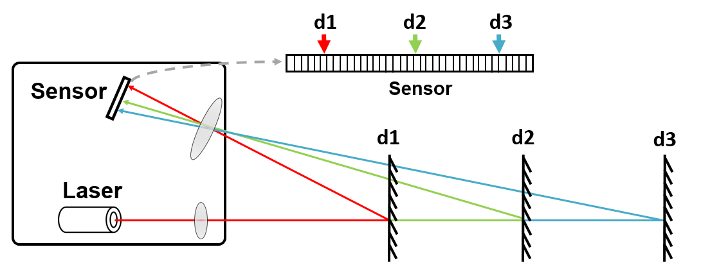
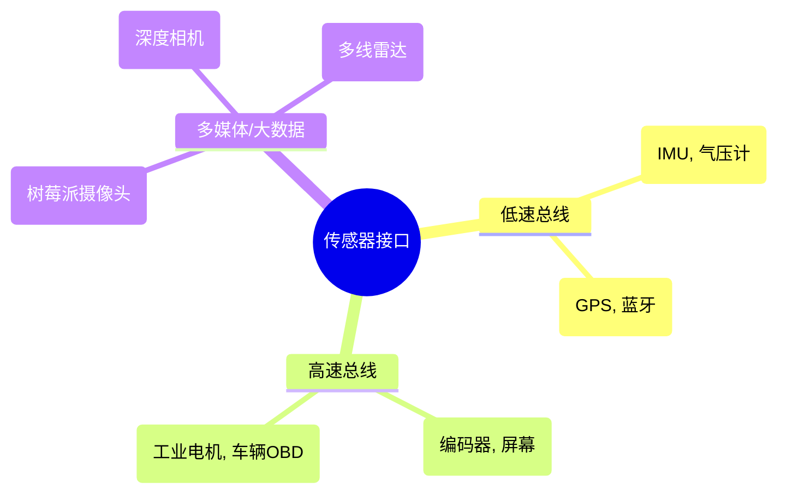
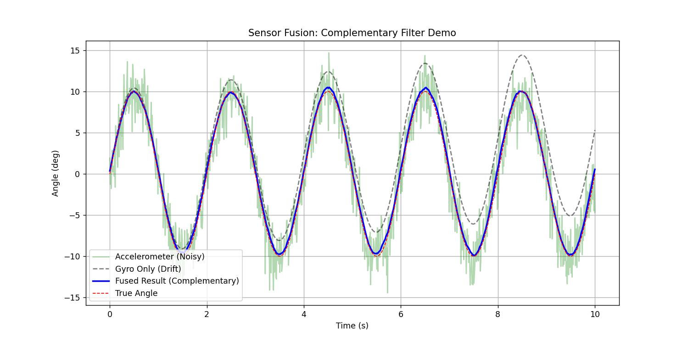

# 传感器：机器人的感知系统

传感器（Sensors）是机器人的五官。本章将介绍如何让机器人“看见”世界，包括传感器的分类、通信协议以及数据处理的基础算法。

## 1. 传感器分类体系

### 1.1 本体感知 (Proprioceptive)
测量机器人自身的状态。
* **编码器 (Encoder)**：测量电机旋转角度和速度。分为**增量式**（断电位置丢失）和**绝对式**（断电位置记忆）。

* **IMU (惯性测量单元)**：包含加速度计（测线性加速度/重力方向）和陀螺仪（测角速度）。是平衡车、无人机核心传感器。

  

  

图1: 光电编码器原理

### 1.2 环境感知 (Exteroceptive)
测量外部环境。
* **激光雷达 (LiDAR)**：
    * **2D LiDAR**：扫描一个平面，输出距离点云。用于 SLAM 建图。
    * **3D LiDAR**：多线扫描，用于自动驾驶。
    * **原理**：ToF (飞行时间) 或 三角测距。
* **视觉相机 (Camera)**：
    * **RGB**：普通彩色图像。
    * **RGB-D (深度相机)**：如 RealSense, Kinect。能同时输出色彩和像素距离。
* **超声波/毫米波**：用于近距离避障或穿透烟雾。



图2: 激光雷达三角测距原理

---

## 2. 硬件接口与通信协议

传感器选型不仅看性能，还要看接口是否匹配开发板（如树莓派、RDK-X5）。

| 协议 | 线数 | 速度 | 特点 | 适用场景 |
| :--- | :--- | :--- | :--- | :--- |
| **UART (串口)** | 2 (TX, RX) | 低/中 | 异步，点对点，简单 | GPS, 蓝牙模块, 激光雷达 |
| **I2C** | 2 (SDA, SCL) | 中 | 同步，总线式，主从架构 | IMU, 温湿度, 磁力计 |
| **SPI** | 4 (MOSI, MISO...) | 高 | 全双工，高速 | 高频 IMU, 彩色屏幕 |
| **USB** | 4+ | 极高 | 通用性强 | 摄像头, 高端雷达 |




------

## 3. 信号处理：从噪声到真值

传感器数据永远包含噪声。直接使用原始数据会导致机器人抖动甚至失控。

### 3.1 常见噪声处理

- **低通滤波 (Low-pass Filter)**：去除高频抖动。
- **卡尔曼滤波 (Kalman Filter)**：最优估计，融合预测值和观测值。
- **互补滤波 (Complementary Filter)**：常用于 IMU 姿态解算（融合加速度计和陀螺仪）。

### 3.2 互补滤波原理

- **加速度计**：低频特性好（长期准，指示重力方向），但高频震动大。
- **陀螺仪**：高频特性好（动态响应快），但有温漂，长期积分会漂移。
- **公式**：$\theta = \alpha \cdot (\theta + \omega \cdot dt) + (1-\alpha) \cdot \theta_{acc}$

------

## 4. Python 实战：IMU 数据融合 (互补滤波)

本示例模拟生成带噪声的传感器数据，并使用互补滤波融合出稳定的姿态角。


```Python
import numpy as np
import matplotlib.pyplot as plt

def complementary_filter_demo():
    # 1. 模拟真实角度 (正弦波运动)
    t = np.linspace(0, 10, 1000)
    dt = t[1] - t[0]
    true_angle = 10 * np.sin(2 * np.pi * 0.5 * t) # 真实角度
    
    # 2. 模拟传感器读数 (添加噪声)
    # 陀螺仪测的是角速度 (真实角度的导数) + 漂移 + 噪声
    true_gyro = 10 * 2 * np.pi * 0.5 * np.cos(2 * np.pi * 0.5 * t)
    gyro_reading = true_gyro + 0.5 # 模拟漂移 bias
    
    # 加速度计测的是角度 (假设静态) + 高频强噪声
    acc_reading = true_angle + np.random.normal(0, 2.0, len(t))
    
    # 3. 互补滤波算法
    fused_angle = []
    angle_est = 0.0
    alpha = 0.98 # 信任陀螺仪积分的权重 (0.95-0.99)
    
    for i in range(len(t)):
        # 陀螺仪积分项 (预测)
        gyro_rate = gyro_reading[i]
        angle_pred = angle_est + gyro_rate * dt
        
        # 加速度计观测项
        acc_obs = acc_reading[i]
        
        # 融合
        angle_est = alpha * angle_pred + (1 - alpha) * acc_obs
        fused_angle.append(angle_est)
        
    # 4. 绘图对比
    plt.figure(figsize=(12, 6))
    plt.plot(t, acc_reading, 'g-', alpha=0.3, label='Accelerometer (Noisy)')
    # 纯积分陀螺仪 (用于展示漂移)
    gyro_only = np.cumsum(gyro_reading) * dt
    plt.plot(t, gyro_only, 'k--', alpha=0.5, label='Gyro Only (Drift)')
    
    plt.plot(t, fused_angle, 'b-', linewidth=2, label='Fused Result (Complementary)')
    plt.plot(t, true_angle, 'r--', linewidth=1, label='True Angle')
    
    plt.title('Sensor Fusion: Complementary Filter Demo')
    plt.xlabel('Time (s)')
    plt.ylabel('Angle (deg)')
    plt.legend()
    plt.grid(True)
    plt.show()
    print("滤波完成：请观察蓝色曲线如何兼顾了绿色的'绝对位置'和陀螺仪的'平滑性'")

if __name__ == "__main__":
    complementary_filter_demo()
```

