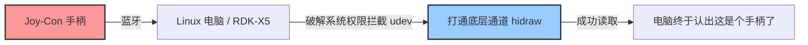
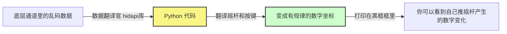
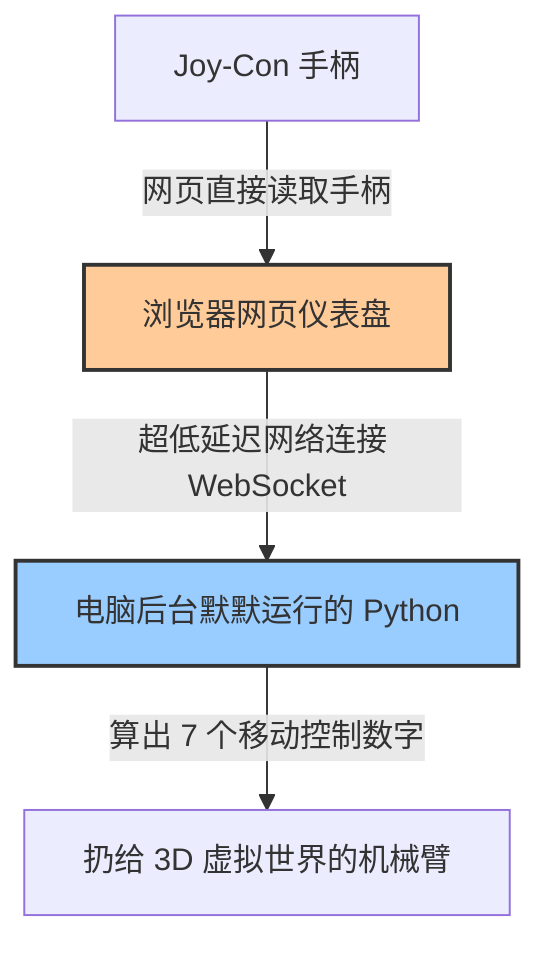
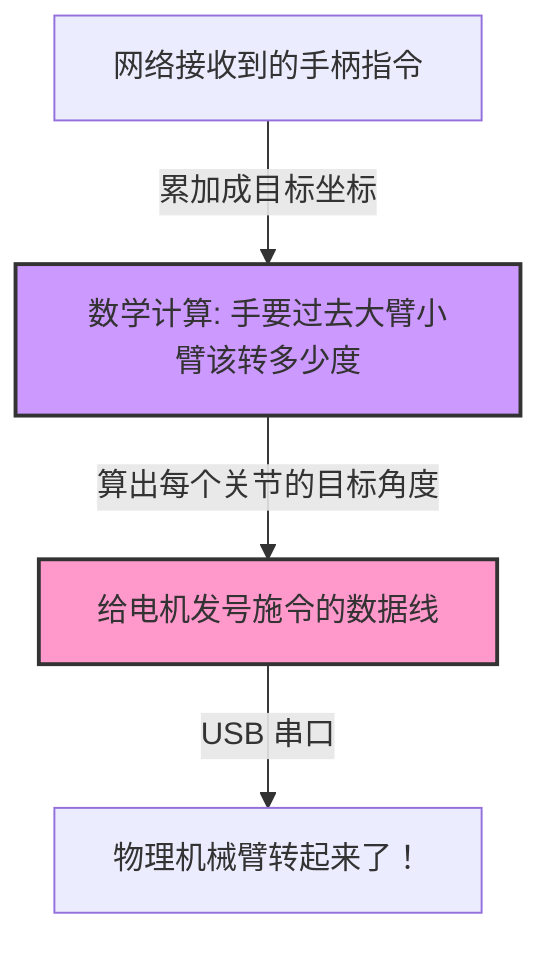

# 零基础实战：使用 Joy-Con 遥控 LeRobot 与具身智能仿真

> **导读：** 本教程为你重新梳理了学习路径。抛弃了一上来就安装庞大环境的传统方式。我们将按照 **“环境连通 -> 基础验证 -> Web高阶操控 -> 真实硬件接入”** 的四步走战略，带你轻松掌握具身智能低成本遥操作方案。

---

## 🟢 阶段一：破冰与连通（让电脑认识你的 Joy-Con）



在玩任何花里胡哨的机器人之前，第一步必须是：**让你的电脑（或 RDK-X5 开发板）能够稳定地连上手柄，并读取到数据。**

### 1.1 蓝牙连接手柄
1. 取出你的 Switch Joy-Con 手柄（推荐右手柄，即带有 `+` 号和 `HOME` 键的那一半）。
2. 长按手柄滑轨侧面的**黑色小圆点（同步键）**，直到 4 颗绿色指示灯来回闪烁，进入配对模式。
3. 打开你的电脑或开发板的蓝牙设置，搜索设备并连接名为 `Joy-Con (R)` 或 `Joy-Con (L)` 的设备。

### 1.2 解决 Linux 的系统权限拦截（极易踩坑！）
如果你在 Linux (如 Ubuntu) 或 RDK-X5 下，默认情况下普通用户是没有权限直接读取 USB/蓝牙手柄的底层 HID 数据的。
我们需要给系统打个“补丁”（配置 udev 规则）：

打开终端，依次输入：
```bash
# 1. 安装底层通信引擎
sudo apt update
sudo apt install libhidapi-dev

# 2. 告诉系统：允许任何人访问任天堂 (Vendor ID: 057e) 的设备
echo 'SUBSYSTEM=="hidraw", ATTRS{idVendor}=="057e", MODE="0666"' | sudo tee /etc/udev/rules.d/99-joycon.rules

# 3. 刷新系统规则，使其立刻生效
sudo udevadm control --reload-rules
sudo udevadm trigger
```
**⚠️ 极度重要：** 执行完上面三步后，**必须**将手柄的蓝牙断开，然后重新连接一次，刚才的权限才会应用到手柄上。

---

## 🟡 阶段二：安装核心库与底层数据测试



现在你的系统已经认识手柄了，我们需要安装 Python 库，把手柄按键转换为代码能读懂的数据。

### 2.1 创建干净的环境并安装
不要把依赖装得乱七八糟，推荐使用 `conda` 创建独立环境：

```bash
# 1. 创建名为 robosuite 的环境 (Python 3.10最佳)
conda create -n robosuite python=3.10
conda activate robosuite

# 2. 安装手柄底层驱动库 joycon-robotics
git clone https://github.com/box2ai-robotics/joycon-robotics.git
cd joycon-robotics
pip install -e .
sudo apt install dkms
make install
cd ..
```

### 2.2 见证奇迹：终端里的按键测试
我们要确保底层数据流动是通畅的。

```bash
# 下载控制代码库
git clone https://github.com/box2ai-robotics/robosuite-joycon.git
cd robosuite-joycon
pip install -r requirements.txt
pip install -e .

# 运行基础的 Joy-Con 数据测试脚本 (单手柄)
python robosuite/demos/demo_device_control_joycon_single.py
```
**成功标志：** 运行脚本后，当你推动手柄摇杆或按下按键时，终端里应该会滚动打印出动作向量（Action Vector）数据。如果报 `libhidapi` 错误，请退回**阶段一**检查权限配置。

---

## 🟠 阶段三：进阶架构——Web 网页端可视化操控



能够打印数据还不够直观。现代遥操作经常需要远程监控和漂亮的仪表盘。这一步我们将引入一套“前后端分离”的架构：让 Python 在后台默默处理机器人控制，而在浏览器网页上展示优美的仪表盘，并允许通过网页捕获手柄数据。

### 3.1 安装前端环境 (Bun)
我们将使用轻量级的 JS 运行环境 Bun。
```bash
# 安装 Bun
curl -fsSL https://bun.sh/install | bash
source ~/.bashrc

# 进入 Web 控制器目录 (假设你的代码位于 robosuite-joycon-web)
cd robosuite-joycon-web
bun install
```

### 3.2 启动“双核”系统
接下来需要打开**两个独立的终端窗口**（记得都要 `conda activate robosuite`）。

**终端窗口 1（启动后端）：**
测试后端逻辑是否能正常通信，避免一开始就开启沉重的仿真引擎导致卡死。
```bash
python test_server_no_render.py
# 如果看到 "✅ 所有测试通过！"，说明后端服务没问题！
```

**终端窗口 2（启动前端网页）：**
```bash
bun run dev
```
此时终端会打印出一个网址（通常是 `http://localhost:5173`）。

### 3.3 网页连线实战
1. 用浏览器打开那个网址。
2. 页面上点击 **“连接服务器”**。
3. **关键动作**：浏览器出于安全保护，你需要拿起你的 Joy-Con，**随便按几下按钮**，网页才会获得授权并点亮手柄图标。
4. 现在，你推动摇杆，网页上的虚拟手柄会同步做出反应。恭喜！你拥有了一个工业级的低延迟遥测仪表盘。

*(进阶玩家：如果你用的是 Chrome 浏览器，点击页面上的“连接 Joy-Con IMU”，甚至可以通过挥动手腕，利用内置陀螺仪直接控制机械臂的姿态！)*

---

## 🔴 阶段四：终极实战——联动真实 LeRobot / RDK-X5



最后，我们将通过 Web 手柄发送出来的动作指令，直接丢给现实世界中的物理机械臂。

### 4.1 理解映射逻辑
在阶段三中，手柄发出的数据已经被归一化为了一个标准的**7维数组**：
`[X平移, Y平移, Z平移, Roll旋转, Pitch旋转, Yaw旋转, 夹爪开合]`

### 4.2 LeRobot 硬件接入
在 RDK-X5 开发板上，我们通过 USB 接入真实的 LeRobot 机械臂（如 SO-101）。

```bash
# 确认硬件端口
python lerobot/scripts/find_motors_bus_port.py
# 假设主臂是 /dev/ttyACM1，从臂是 /dev/ttyACM0
```

接下来，我们不需要使用传统的从臂拉拽来控制主臂，而是**劫持（Hijack）**控制脚本，把输入源替换为我们阶段三的 Joy-Con 后端 WebSocket 服务！

由于具体的整合代码依项目而定，核心逻辑在于修改 LeRobot 的 `control_robot.py` 或编写一个中间件脚本：
1. 建立一个 WebSocket 客户端订阅阶段三的服务器（默认端口 8765）。
2. 将收到的 7维 动作向量（Delta 位移/姿态）。
3. 累加到机器人当前的末端位置（End-Effector Pose）上。
4. 传递给 LeRobot 的 `IK` (逆运动学) 求解器，计算出各关节电机的目标角度。
5. 发送指令让物理电机运动。

### 🎉 总结
按照这四个阶段：**系统赋权 -> 本地测试 -> Web可视化 -> 硬件驱动**。你不仅学会了如何使用百元级的 Joy-Con 控制专业机器人，还掌握了现代具身智能常用的“前后端网络分离”遥操作架构。一旦掌握，你可以轻松把手柄换成 Vision Pro、Quest 3 等任何更高级的输入设备！