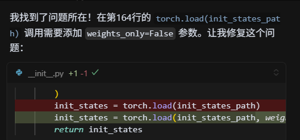
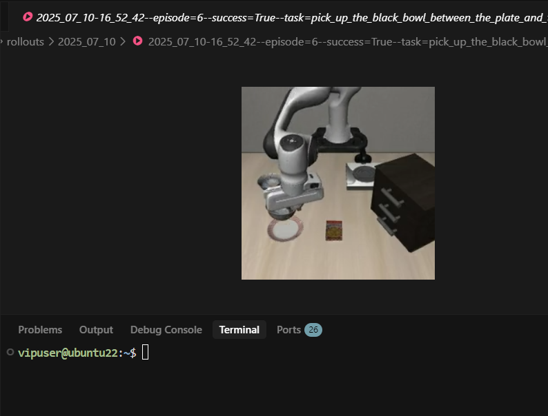
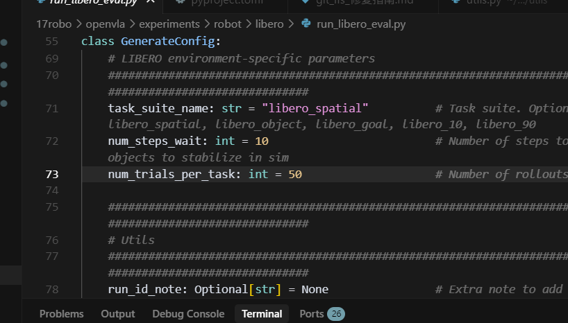

# OpenVLA 模型实战：环境搭建、评估与原理解析

## 1. 引言

本文档旨在提供 OpenVLA (Open Vision-Language-Action) 模型的完整实战指南。涵盖了从基础环境搭建、依赖库安装、模型权重批量下载，到在 Libero 仿真基准上进行评估的全过程。同时，文档详细记录了运行过程中可能遇到的典型错误及其解决方案，并深入剖析了 OpenVLA 的核心架构与多模态数据处理原理，为研究人员和开发者提供理论与实践的双重参考。

## 2. 环境搭建与模型准备

### 2.1 基础依赖安装

首先，需要安装 NVIDIA CUDA 工具包并克隆 OpenVLA 仓库。

```bash
# 安装 NVIDIA CUDA Toolkit
sudo apt install nvidia-cuda-toolkit

# 克隆 OpenVLA 模型权重仓库 (Hugging Face)
git clone https://huggingface.co/openvla/openvla-7b

# 克隆 OpenVLA 代码仓库 (GitHub)
git clone https://github.com/openvla/openvla.git
# 备用镜像地址：git clone https://bgithub.xyz/openvla/openvla.git
```

### 2.2 Python 环境配置

进入代码目录并安装必要的 Python 依赖。注意，部分安装步骤需要访问 GitHub，请确保网络连接正常。

```bash
cd openvla

# 安装当前目录为可编辑模式
# 注意：此步需访问 github.com，若网络不通可能报 "Failed to connect to github.com port 443"
pip install -e .

# 安装构建工具
pip install packaging ninja

# 验证 Ninja 安装 (应返回退出代码 "0")
ninja --version; echo $?

# 安装 Flash Attention (特定版本)
pip install "flash-attn==2.5.5" --no-build-isolation

# 可选：使用 mamba 安装 CUDA Toolkit (如果系统级安装有问题)
# mamba install -c nvidia cuda-toolkit=11.8

# 激活环境并验证 NVCC
mamba activate dl && nvcc -V
```

### 2.3 模型权重批量下载

为了提高效率，建议使用 `tmux` 并行下载 Libero 任务套件的微调模型权重。

```bash
# 创建一个新的 tmux 会话
tmux new-session -d -s openvla_download

# 创建 4 个窗格 (Pane) 来同时下载不同任务的模型
tmux split-window -h
tmux split-window -v
tmux select-pane -t 0
tmux split-window -v

# 在每个窗格中运行下载命令 (下载到 /data1 目录)
tmux send-keys -t 0 'cd /data1 && git lfs clone https://huggingface.co/openvla/openvla-7b-finetuned-libero-spatial' Enter
tmux send-keys -t 1 'cd /data1 && git lfs clone https://huggingface.co/openvla/openvla-7b-finetuned-libero-object' Enter
tmux send-keys -t 2 'cd /data1 && git lfs clone https://huggingface.co/openvla/openvla-7b-finetuned-libero-goal' Enter
tmux send-keys -t 3 'cd /data1 && git lfs clone https://huggingface.co/openvla/openvla-7b-finetuned-libero-10' Enter

# 附加到会话查看下载进度
tmux attach-session -t openvla_download
```

## 3. Libero 评估基准运行

### 3.1 标准评估命令

模型下载完成后，使用 `run_libero_eval.py` 脚本对不同任务套件（如 `libero_spatial`, `libero_goal`）进行评估。

```bash
# 评估 Libero Spatial 任务
python experiments/robot/libero/run_libero_eval.py \
    --model_family openvla \
    --pretrained_checkpoint /data1/openvla-7b-finetuned-libero-spatial \
    --task_suite_name libero_spatial \
    --center_crop True

# 评估 Libero Goal 任务
python experiments/robot/libero/run_libero_eval.py \
    --model_family openvla \
    --pretrained_checkpoint /data1/openvla-7b-finetuned-libero-goal \
    --task_suite_name libero_goal \
    --center_crop True
```

### 3.2 自定义评估参数

可以通过命令行参数调整评估配置，例如减少每个任务的试验次数以快速测试。

**查看帮助文档：**

```bash
micromamba activate dl && cd /home/vipuser/17robo/openvla && python experiments/robot/libero/run_libero_eval.py --help | grep -A 5 -B 5 "num_trials"
```

**修改评估次数示例：**

默认情况下 `num_trials_per_task` 为 50。若需修改为 10 次：

```bash
python experiments/robot/libero/run_libero_eval.py \
    --model_family openvla \
    --pretrained_checkpoint /data1/openvla-7b-finetuned-libero-spatial \
    --task_suite_name libero_spatial \
    --center_crop True \
    --num_trials_per_task 10
```

## 4. 故障排查与问题解决

在运行评估脚本时，可能会遇到以下错误。本节详细记录了报错信息及解决方法。

### 4.1 错误一：Weights only load failed (Pickle Error)

**报错信息：**

```plaintext
_pickle.UnpicklingError: Weights only load failed. This file can still be loaded, to do so you have two options...
WeightsUnpickler error: Unsupported global: GLOBAL numpy.core.multiarray._reconstruct was not an allowed global by default.
```

**原因分析：**

这是 PyTorch 新版本的安全特性导致的。`torch.load` 默认启用了 `weights_only=True`，限制了可以被反序列化的全局对象，而 Libero 的初始化状态文件包含 `numpy` 对象，被拦截了。

**解决方案：**

需要修改 `libero` 库中的加载代码，显式允许 `numpy` 对象或临时禁用 `weights_only` 限制。

**修改位置：**

文件 `/data/17robo/LIBERO/libero/libero/benchmark/__init__.py` (第 164 行左右)。



**修改代码：**

将：
```python
init_states = torch.load(init_states_path)
```
修改为：
```python
# 允许加载 numpy 相关对象
import numpy as np
init_states = torch.load(init_states_path, weights_only=False) 
# 或者更安全的做法（如果 PyTorch 版本支持）：
# torch.serialization.add_safe_globals([np.core.multiarray._reconstruct])
# init_states = torch.load(init_states_path)
```

### 4.2 错误二：EGL Context Error (可忽略)

**报错信息：**

```plaintext
OpenGL.raw.EGL._errors.EGLError: EGLError(err = EGL_NOT_INITIALIZED, ...)
```

**分析：**

这是 Robosuite/MuJoCo 在销毁渲染上下文时的报错。通常发生在程序结束或任务切换时，**不影响评估流程和结果生成**，可以忽略。

### 4.3 成功运行验证

修复上述 Pickle 错误后，脚本应能正常运行并生成评估视频。

**运行日志示例：**

```plaintext
Loading checkpoint shards: 100%|██████████████████| 4/4 [00:01<00:00,  3.16it/s]
Loaded model: <class 'transformers_modules.openvla...OpenVLAForActionPrediction'>
Task: pick up the black bowl between the plate and the ramekin and place it on the plate
Starting episode 1...
Saved rollout MP4 at path ./rollouts/...--success=True--task=....mp4
Success: True
```



**显存占用监控：** 约占用 10321M 显存。



## 5. OpenVLA 架构与仿真原理

本节深入解析 OpenVLA 的内部工作机制及其在 Libero 仿真环境中的运作流程。

### 5.1 核心架构 (Core Architecture)

OpenVLA 是一个典型的**视觉-语言-动作 (Vision-Language-Action, VLA)** 多模态模型，其架构设计旨在将视觉感知、语言理解和动作生成统一在一个端到端的 Transformer 网络中。

#### 1. 视觉骨干网络 (Vision Backbone)

- **功能**：提取图像的高层语义特征。
- **模型支持**：SigLIP, DINOv2, CLIP 等主流预训练模型。
- **双编码器策略**：支持同时使用两个视觉编码器（如 DINOv2 + CLIP）以融合不同的视觉特征（例如 DINOv2 擅长空间几何，CLIP 擅长语义对齐）。
- **输出**：图像 Patch Embeddings，形状为 `[batch, num_patches, vision_dim]`。

#### 2. 视觉-语言映射层 (Projector)

- **功能**：将视觉特征投影到语言模型（LLM）的嵌入空间，使其能被 LLM 理解。
- **结构**：通常为多层感知机 (MLP)。

```python
# 双视觉编码器示例结构
fc1: vision_dim -> 4 * vision_dim
fc2: 4 * vision_dim -> llm_dim
fc3: llm_dim -> llm_dim
```

#### 3. 语言模型骨干 (LLM Backbone)

- **功能**：处理多模态输入序列，进行推理和生成。
- **模型支持**：LLaMA-2, Vicuna, Mistral 等。
- **优化**：集成了 **Flash Attention 2** 以加速计算，并采用 **BF16** 精度以降低显存占用。

#### 4. 动作预测头 (Action Head)

- **功能**：将 LLM 的输出解码为具体的机器人控制指令。
- **输出空间**：7 维连续动作向量 `[x, y, z, rx, ry, rz, gripper]`（位置 + 姿态 + 夹爪开合）。
- **归一化**：模型预测的是归一化后的动作，推理时需利用数据集统计信息进行反归一化 (De-normalization)。

### 5.2 仿真工作原理 (Simulation Workflow)

Libero 仿真基准基于 **RoboSuite** 和 **MuJoCo** 物理引擎构建，提供了一套标准化的评估流程。

#### 评估循环伪代码：

```python
# 遍历任务套件中的每个任务 (如 Libero Spatial 有 10 个任务)
for task_id in range(10):
    # 每个任务进行多次试验 (默认为 50 次)
    for episode in range(50):
        env.reset()
        # 设置预定义的初始状态，保证公平性
        obs = env.set_init_state(initial_states[episode])

        for step in range(max_steps):
            # 1. 获取当前帧的 RGB 图像
            image = get_libero_image(obs)

            # 2. 构建任务提示词 (Prompt)
            prompt = f"What action should the robot take to {task_description}?"

            # 3. VLA 模型推理
            # 输入：提示词 + 图像
            # 输出：归一化动作 -> 反归一化动作
            action = vla.predict_action(prompt, image, unnorm_key=task_suite_name)

            # 4. 在仿真环境中执行动作
            obs, reward, done, info = env.step(action)

            if done: break
```

## 6. 多模态数据处理机制

OpenVLA 如何高效融合视觉、文本和动作数据是其核心竞争力的来源。

### 6.1 多模态融合策略 (Multimodal Fusion)

#### 1. 输入预处理
- **文本**：使用 Tokenizer 将 Prompt 转换为 Token IDs。
- **图像**：Resize 至 224x224，经由 Vision Backbone 提取特征 `[num_patches, vision_dim]`。

#### 2. 特征对齐与拼接
- 视觉特征通过 Projector 映射到 LLM 维度 `[num_patches, llm_dim]`。
- 在输入序列中，视觉 Token 被插入到文本 Token 之间（通常在指令之前或之中）。

```python
input_embeds = [text_embeds[:prefix], projected_vision, text_embeds[prefix:]]
```

#### 3. 联合注意力机制
- **跨模态交互**：利用 Transformer 的 Self-Attention 机制，文本 Token 可以关注（Attend to）视觉 Patch，反之亦然。这使得模型能够理解“捡起[图像中的]那个红色方块”这样的指令。
- **因果掩码 (Causal Mask)**：保持自回归生成特性，防止信息泄露。

### 6.2 训练数据流 (Training Data Pipeline)

1. **数据格式**：
   - **图像**：RGB 观察数据。
   - **文本**：自然语言任务描述。
   - **标签**：专家演示轨迹中的 7 维动作向量。

2. **数据增强 (Data Augmentation)**：
   - **训练阶段**：随机裁剪 (Random Crop)、颜色抖动 (Color Jitter) 等，以提高鲁棒性。
   - **推理阶段**：中心裁剪 (Center Crop)，保持输入一致性。

3. **动作归一化 (Action Normalization)**：
   由于不同任务的动作幅度差异巨大，直接回归原始值很难收敛。OpenVLA 采用 Z-Score 归一化：
   $$\text{normalized\_action} = \frac{\text{action} - \mu}{\sigma}$$
   推理时：
   $$\text{action} = \text{normalized\_action} \times \sigma + \mu$$

通过这种端到端的架构和精细的数据处理，OpenVLA 实现了从感知到决策的高效闭环，在 Libero 等基准测试中展现了优异的泛化能力。
