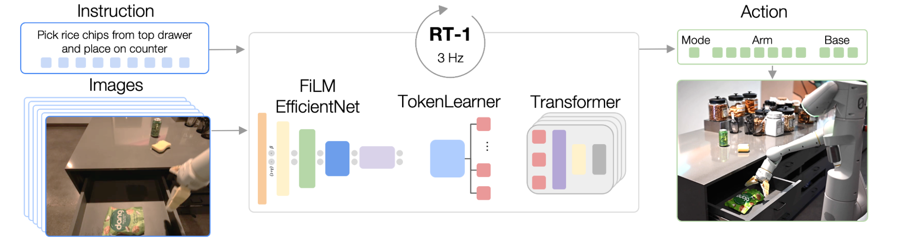
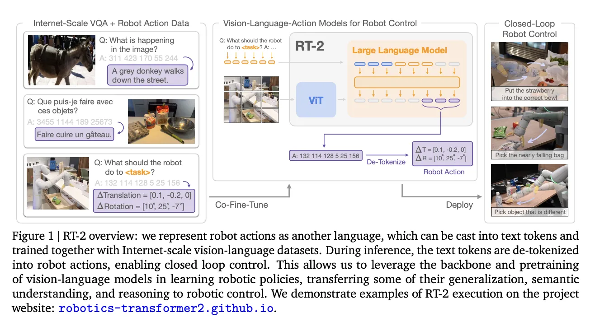
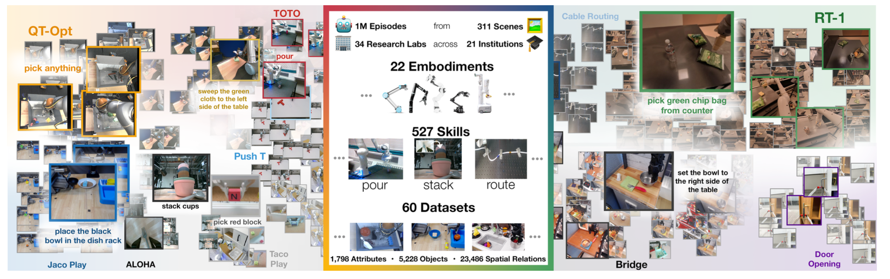

# 机器人 Transformer 系列：RT-1, RT-2 与 RT-X 详解

## 1. 引言：从专家模型到通才模型

在传统的机器人学习中，由于数据稀缺和物理世界的复杂性，我们通常为特定任务训练特定的模型（Specialist）。然而，大语言模型（LLM）的成功启发了机器人领域：我们能否构建一个通用的**机器人基础模型（Robot Foundation Model）**，让它像 ChatGPT 理解语言一样理解物理世界的操作？

Google DeepMind 的 RT 系列正是这一方向的里程碑：

- **RT-1 (2022)**：证明了 Transformer 架构在机器人控制中的有效性，提出了 **Action Tokenization**（动作分词）的核心概念。
- **RT-2 (2023)**：提出了 **VLA (Vision-Language-Action)** 范式，将机器人动作视为一种“语言”，实现了互联网知识向机器人领域的迁移。
- **RT-X (2023)**：通过 **Open X-Embodiment** 数据集，证明了跨机器人形态（Cross-Embodiment）训练的可行性。

------

## 2. RT-1: 机器人操作的 Transformer 基础

RT-1 是一个基于 Transformer 的端到端控制模型。它的核心贡献在于设计了一套高效的架构，能够以 3Hz 的频率实时输出控制指令，并具有极高的抗干扰能力。

### 2.1 模型架构

RT-1 采用 **EfficientNet** 作为视觉编码器，**FiLM (Feature-wise Linear Modulation)** 层用于融合语言指令，最后通过 **Token Learner** 压缩视觉特征输入到 Transformer 中。

<p align="center">



<b>图1：RT-1 模型架构与 FiLM 调节机制示意图</b>

</p>

### 2.2 核心创新：动作分词 (Action Tokenization)

这是 RT 系列的基石。传统的模仿学习通常回归连续的动作值（如速度、位置）。RT-1 将连续动作**离散化**。

- **离散化区间**：将每个维度的动作（如 $x, y, z$ 轴移动，夹爪开合等）均匀划分为 256 个区间（Bins）。
- **Token 化**：每个动作维度变成一个分类问题（0-255 的整数）。
- **优势**：Transformer 非常擅长处理离散的 Token 序列（类似预测下一个单词），这种设计让机器人控制变成了“预测下一个动作词”。

### 2.3 Python 代码解析：动作分词器

以下代码展示了 RT-1 如何将连续的机械臂动作转换为 Transformer 可读的 Token。


```Python
import numpy as np
import tensorflow as tf

class RT1ActionTokenizer:
    def __init__(self, action_min=-1.0, action_max=1.0, vocab_size=256):
        self.min = action_min
        self.max = action_max
        self.vocab_size = vocab_size

    def tokenize(self, action_continuous):
        """
        将连续动作 [-1, 1] 转换为离散 Token [0, 255]
        """
        # 1. 归一化到 [0, 1]
        action_norm = (action_continuous - self.min) / (self.max - self.min)
        action_norm = np.clip(action_norm, 0, 1)
        
        # 2. 映射到 [0, vocab_size - 1]
        action_tokens = np.floor(action_norm * (self.vocab_size - 1)).astype(np.int32)
        return action_tokens

    def detokenize(self, action_tokens):
        """
        将离散 Token 解码回连续动作
        """
        # 1. 映射回 [0, 1]
        action_norm = (action_tokens + 0.5) / self.vocab_size
        
        # 2. 反归一化到 [min, max]
        action_continuous = action_norm * (self.max - self.min) + self.min
        return action_continuous

# --- 示例 ---
tokenizer = RT1ActionTokenizer()
raw_action = np.array([0.5, -0.2, 0.9]) # x, y, z 速度
tokens = tokenizer.tokenize(raw_action)

print(f"原始动作: {raw_action}")
print(f"Token化结果: {tokens}") 
# 输出示例: [191, 102, 242] -> 这些整数直接作为 Transformer 的输入 Target
```

------

## 3. RT-2: 视觉-语言-动作 (VLA) 模型

RT-2 是一次质的飞跃。它不再从头训练机器人模型，而是将一个已经训练好的**视觉-语言大模型 (VLM)**（如 PaLI-X 或 PaLM-E）进行微调，使其能够输出动作。

### 3.1 核心理念：动作即语言

在 RT-2 中，机器人动作被编码为文本字符串（例如数字 Token）。对于模型来说，回答“图像中是什么？”（输出："Apple"）和回答“如何捡起苹果？”（输出："128 128 100..."）在本质上是一样的。

这使得 RT-2 能够继承 VLM 在互联网海量数据中学到的**语义理解**和**逻辑推理**能力。


<p align="center">



<b>图2：RT-2 的联合微调 (Co-fine-tuning) 策略</b>

</p>


### 3.2 涌现能力 (Emergent Capabilities)

由于继承了互联网知识，RT-2 展现出了惊人的泛化能力：

1. **符号推理**：指令“捡起快灭绝的动物”，RT-2 能识别出恐龙玩具并抓取（即使训练数据中从未有过“灭绝动物”和动作的配对）。
2. **视觉语义泛化**：能够识别训练集中未见过的物体和背景。

### 3.3 训练策略：联合微调 (Co-fine-tuning)

RT-2 并不是只在机器人数据上微调，而是将机器人数据与原始的互联网视觉问答 (VQA) 数据**混合训练**。

- **目的**：防止“灾难性遗忘”。如果只用机器人数据微调，大模型会变成一个只会干活的傻瓜，丢失原有的常识推理能力。

------

## 4. RT-X: 跨形态的大规模泛化

如果说 RT-2 解决了“脑子”的问题，RT-X 则是为了解决“身体”多样性的问题。

### 4.1 Open X-Embodiment 数据集

Google 联合 33 家实验室，收集了来自 22 种不同机器人（Franka, UR5, WidowX 等）的数据，构建了 Open X-Embodiment 数据集。


<p align="center">



<b>图3：Open X-Embodiment 数据集包含的机器人形态</b>

</p>


### 4.2 跨形态推理 (Cross-Embodiment)

不同机器人的关节数量、臂长、控制频率都不一样，如何用一个模型控制它们？

- **统一动作空间**：将所有机器人的动作映射到标准的 7-DoF（位置+姿态+夹爪）空间。
- **RT-X 模型**：基于 RT-1 和 RT-2 架构，在混合数据集上训练。结果表明，**用别人的机器人数据训练，能提升自己机器人的性能**（Positive Transfer），特别是在数据稀缺的任务上。

------

## 5. 总结与对比分析

下表总结了 RT 系列的演进逻辑，这对于理解 OpenVLA（RT-2 的开源复现版）至关重要。

| **特性**       | **RT-1**                               | **RT-2**                        | **RT-X**                           |
| -------------- | -------------------------------------- | ------------------------------- | ---------------------------------- |
| **发布时间**   | 2022                                   | 2023                            | 2023                               |
| **核心架构**   | EfficientNet + Transformer             | VLM (PaLI-X / PaLM-E)           | RT-1 / RT-2 变体                   |
| **模型参数量** | 35M (极小，推理快)                     | 55B (极大，推理慢)              | 多种规格                           |
| **输入模态**   | 图像 + 文本指令                        | 图像 + 文本                     | 图像 + 文本 + 机器人类型           |
| **输出模态**   | 离散动作 Token                         | 文本 Token (解释为动作)         | 离散动作 Token                     |
| **主要贡献**   | 验证了 Transformer + Tokenization 可行 | 提出了 VLA 范式，实现了语义推理 | 验证了跨机器人形态数据训练的有效性 |
| **推理频率**   | ~3Hz (实时)                            | <1Hz (需云端或量化)             | 视基座模型而定                     |

### 学习建议

对于初学者，建议按照以下路径进行实践：

1. **复现 RT-1**：了解基础的 Tokenization 和 Transformer 训练流程（Google 开源了 `rt-1` 代码）。
2. **使用 OpenVLA**：这是 RT-2 的开源平替（基于 Llama 2 + Prismatic），可以直接下载权重进行微调（参考上一章文档）。
3. **探索 BridgeData V2**：这是 RT-X 数据集中最常用的子集之一，适合用来测试跨域泛化。