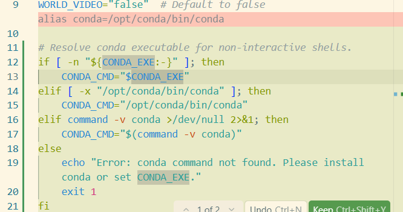
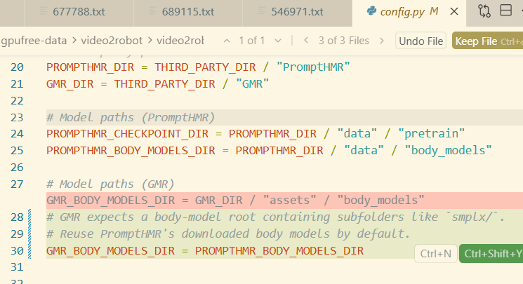

```
# Clone repo (with submodules)
git clone --recursive https://github.com/AIM-Intelligence/video2robot.git
cd video2robot

# Or initialize submodules after cloning
git submodule update --init --recursive


conda create -n gmr python=3.10 -y
conda activate gmr
pip install -e .

对于blackwell架构

conda create -n phmr python=3.11 -y
conda activate phmr
cd third_party/PromptHMR
bash scripts/install_blackwell.sh


对于我们服务器用的4090
修改一下install.sh
然后
bash scripts/install.sh --pt_version=2.4

```




手动配置方案(gdown不可以使用过可以选择)

```
conda create -n phmr python=3.10 -y
conda activate phmr
cd /root/gpufree-data/video2robot/third_party/PromptHMR
pip install -r requirements.txt

mkdir -p python_libs
git clone https://github.com/Arthur151/chumpy python_libs/chumpy
python -m pip install -e python_libs/chumpy --no-build-isolation

在bashrc中加入
export PYTHONPATH=$PYTHONPATH:/root/gpufree-data/video2robot/third_party/PromptHMR


conda install -c conda-forge eigen -y

mkdir -p python_libs
cd python_libs
git clone https://github.com/princeton-vl/lietorch.git
cd lietorch
python setup.py install
cd ../..


git clone https://github.com/facebookresearch/detectron2.git


conda activate phmr
cd /root/gpufree-data/detectron2
# 使用 --no-build-isolation 强制使用当前环境的 torch
pip install -e . --no-build-isolation


git clone https://github.com/facebookresearch/segment-anything-2.git

cd segment-anything-2
pip install -e .

# 修改文件：/root/gpufree-data/video2robot/third_party/PromptHMR/pipeline/detector/sam2_video_predictor.py
sed -i 's/load_video_frames, load_video_frames_from_np/load_video_frames/g' /root/gpufree-data/video2robot/third_party/PromptHMR/pipeline/detector/sam2_video_predictor.py
```


下载相关模型权重

```
cd /root/gpufree-data/video2robot/third_party/PromptHMR
bash scripts/fetch_smplx.sh

cd /root/gpufree-data/video2robot/third_party/PromptHMR
bash scripts/fetch_data.sh
```


```
conda activate phmr
cd ~/gpufree-data/video2robot
python scripts/extract_pose.py --project data/video_001
大概需要10min

conda activate gmr
cd /root/gpufree-data/video2robot
python scripts/convert_to_robot.py --project data/video_001

# gmr下可能需要安装

pip install loop-rate-limiters
pip install smplx
pip install imageio
pip install mink
pip install rich
```



这里需要修改


```
python scripts/visualize.py --project data/video_001
python scripts/visualize.py --project data/video_001 --pose
python scripts/visualize.py --project data/video_001 --robot-viser
python scripts/visualize.py --project data/video_001 --robot
```


5条轨迹都做成机器人动作

```
conda activate gmr
cd /root/gpufree-data/video2robot
python scripts/convert_to_robot.py --project data/video_001 --all-tracks

python scripts/visualize.py --project data/video_001 --robot-viser --robot-all

只用某一条亦可以
python scripts/visualize.py --project data/video_001 --robot-viser --robot-track 3
```

