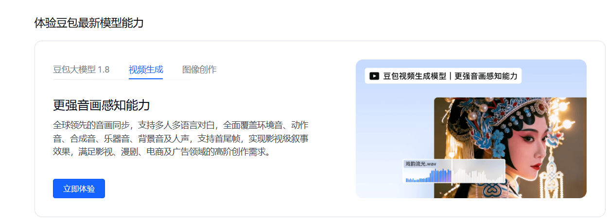

### 一、官方主渠道：火山引擎（暂未开放，预计3月上线）

#### 1. 注册与认证

- 访问：[火山引擎官网](https://www.volcengine.com/) → 注册 / 登录账号
- 完成**个人 / 企业实名认证**（企业需提交资质）

#### 2. 开通 Seedance API 并获取 Key

1. 进入**火山引擎控制台https://console.volcengine.com/home**




2. 仅可在线体验

# 二、其他渠道

可以进入：https://seedanceapi.org/dashboard/api-keys

python调用方式如下

```python
import requests
import time

API_KEY = "YOUR_API_KEY"
BASE_URL = "https://seedanceapi.org/v1"

# Generate video
response = requests.post(
    f"{BASE_URL}/generate",
    headers={
        "Authorization": f"Bearer {API_KEY}",
        "Content-Type": "application/json"
    },
    json={
        "prompt": "A cinematic shot of mountains at sunrise with flowing clouds",
        "aspect_ratio": "16:9",
        "resolution": "720p",
        "duration": "8"
    }
)

data = response.json()
task_id = data["data"]["task_id"]
print(f"Task created: {task_id}")

# Poll for status
while True:
    status_response = requests.get(
        f"{BASE_URL}/status?task_id={task_id}",
        headers={"Authorization": f"Bearer {API_KEY}"}
    )
    status_data = status_response.json()["data"]
    
    if status_data["status"] == "SUCCESS":
        video_url = status_data["response"][0]
        print(f"Video URL: {video_url}")
        break
    elif status_data["status"] == "FAILED":
        print(f"Error: {status_data.get('error_message')}")
        break
    
    time.sleep(10)
```

