# 任务定义

  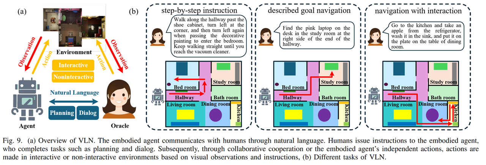

视觉语言导航 (Visual Language Navigation, VLN) 是具身 AI 的一个关键研究问题，旨在使智能体能够按照语言指令在不可见的环境中导航。VLN 要求机器人能够理解复杂多样的视觉观察，同时以不同的粒度解释指令。

VLN 的输入通常由两部分组成：视觉信息和自然语言指令。视觉信息既可以是过去轨迹的视频，也可以是历史-当前观测图像的集合。自然语言指令包括具身智能体需要达到的目标或者具身智能体期望完成的任务。具身 Agent 必须利用上述信息从候选动作列表中选择一个或一系列动作来完成自然语言指令的要求。

## 任务设定

视觉语言导航 (VLN) 任务在数学形式上均可被统一建模为一个部分可观测马尔可夫决策过程 (POMDP)，由元组描述：

$$
\langle \mathcal{S}, \mathcal{A}, \mathcal{T}, \mathcal{O}, \mathcal{R}, \mathcal{J} \rangle
$$

其中， $\mathcal{S}$ 代表状态空间， $\mathcal{A}$ 为智能体的动作空间， $\mathcal{T}$ 为状态转移函数， $\mathcal{O}$ 为视觉观测空间， $\mathcal{R}$ 为奖励函数， $\mathcal{J}$ 为自然语言指令。

在这一框架下，导航问题的核心在于学习一个策略映射函数 $a_t = \pi(o_t, I, s_t)$ （通常参数化为深度神经网络模型 $F$ ）。即在时间步 $t$ ，智能体根据当前的第一人称视觉观测 $o_t$ 、全局自然语言指令 $I$ 以及智能体状态 $s_t$ ，推导出最优动作 $a_t$ ，以最大化累积奖励并逼近目标位置。

根据状态空间、动作空间及状态转移函数上的不同，VLN 任务被划分为离散 VLN 与连续 VLN。

---

### 离散环境视觉语言导航 (VLN) 任务设定

  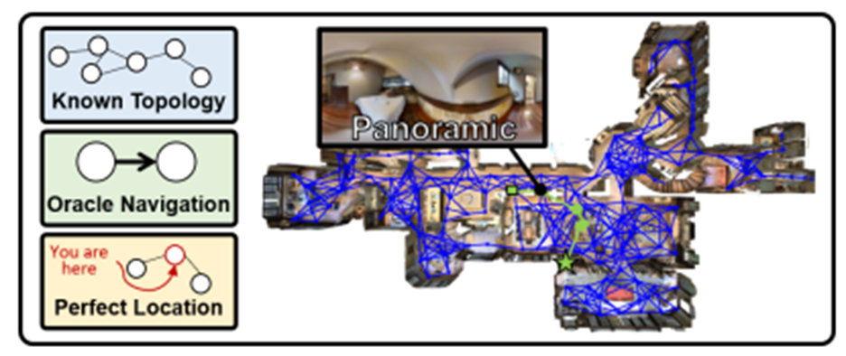
   
  <b>图 1 离散环境 VLN。蓝色连线图表示预定义的连通图；绿色线条表示专家轨迹。</b>

 

离散 VLN 研究主要依托 Matterport3D 模拟器展开。如图 1 所示，环境被抽象为一个预定义的连通图 $\mathcal{G}=\langle V,\mathcal{E}\rangle$ ，图中的蓝色节点图所示，其中 $V$ 代表一组固定的全景视点， $\mathcal{E}$ 表示视点间的连通关系。

* **状态空间 (** $\boldsymbol{S}_{disc}$ **)：** 智能体的状态 $S_t$ 被严格限制为图 $\mathcal{G}$ 中的某个节点，即 $s_t \in V$ 。
* **动作空间 (** $\mathcal{A}_{disc}$ **)：** 假定 $t$ 时刻智能体的状态 $s_t$ 在图 $\mathcal{G}$ 上的所有邻域连通节点表示为 $N(s_t)$ ， $N(s_t)$ 中的每个节点称为候选节点， $N(s_t)$ 是智能体在 $t$ 时刻的动作空间。智能体第 $t$ 时刻的动作决策表现为“选择候选节点”，策略函数 $F$ 输出一个关于 $N(s_t)$ 的概率分布，用于从候选节点中选择一个节点做为下一个“跳跃点”。
* **状态转移 (** $\mathcal{T}_{disc}$ **)：** 状态转移表现为确定性的“隐形传送”机制。一旦下一个“跳跃点”生成，系统会将智能体位置瞬间切换至选中的候选节点坐标。该过程忽略中间路径，且不考虑物理碰撞或摩擦，这种“Oracle Navigation”设定虽然简化了控制难度，但严重脱离了真实机器人在现实环境的运动规律。

---

### 连续环境视觉语言导航 (VLNCE) 任务设定

  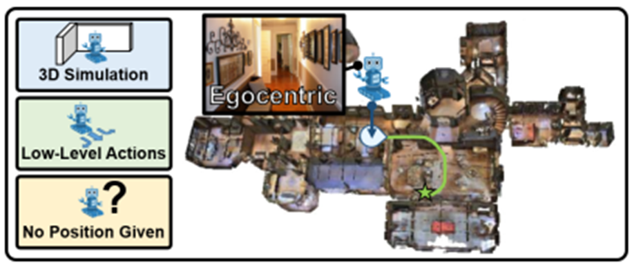
   
  <b>图 2 连续环境 VLN。绿色线条表示专家轨迹。</b>

 

为了弥合仿真环境与现实环境的差距，VLN-CE 在 Habitat 模拟器中进行训练。如图 2 所示，该环境加载了来自 Matterport3D 数据集的高度逼真室内 3D 扫描场景，能够提供与真实世界一致的第一人称视觉观测。与此同时，Habitat 引入了导航网格来定义物理运动空间。该网格将环境的可行走区域构建为一系列紧密连通的多边形表面，允许智能体驻留在网格范围内的任意连续坐标点上。正是这种空间上的连续性，使得智能体能够在物理引擎的支持下执行“前进固定距离”与“旋转固定角度”等低级动作。当智能体执行一步前进指令（如 0.25米）时，导航网格确保了这不仅是坐标数值的跳变，而是一段在连续几何表面上真实的滑动位移过程，从而像在真实世界一样处理连续的位姿变化。与离散 VLN 中智能体从一个节点“跳跃式”移动到与之连通的节点相比，连续 VLN 中智能体基于导航网格的平滑运动更符合真实环境中的移动规律。

* **状态空间 (** $\boldsymbol{S}_{cont}$ **)：** 智能体的状态由世界坐标系中的精确三维坐标 $P=(x,y,z)$ 和姿态朝向 $\Phi =(\theta,\psi)$ 表示，其中分别表示俯仰角和航向角。
* **动作空间 (** $\mathcal{A}_{cont}$ **)：** 智能体在任意时刻的动作空间由一组低级动作原语组成，如图 2 中“Low-Level Actions”标签所示，包括固定距离的前进（如前进 0.25 米），左转固定角度的旋转（如左转 15°）, 右转固定角度的旋转（如右转 15°）和停止 (stop)。智能体第 $t$ 时刻的动作决策表现为“选择一个动作原语”，策略函数输出一个关于所有动作原语的概率分布，用于从中选择一个做为具体的运动控制指令。
* **状态转移 (** $\mathcal{T}_{cont}$ **)：** 状态转移 $\mathcal{T}(s_t,a_t)$ 受到仿真器物理引擎的动力学规则的严格约束。当智能体执行动作与环境物体发生接触时，会触发 “滑动 (Sliding)” 或阻滞机制。

---

# VLNCE 任务数据集

### 常用数据集

#### 1. R2R-CE

**模拟器**
* **仿真环境：** Habitat-Sim v0.1.7
* **环境场景：** 基于 Matterport3D (MP3D) 数据集的 90 个真实室内场景（房屋、办公室等）。

**输入 **

**每一时刻的观测空间 （$O_t$)**

* **视觉输入：** RGB-D 图像（RGB + 深度图）。
* **分辨率：** 通常 RGB 图片分辨率为 (224×224)，Depth 图片分辨率为 (256×256)。
* **视场角 (FOV)：** 90度。
* **视角：** 这里默认是单目视角。许多模型如 ETPNav 会通过从左到右旋转 12 次 (每 30° 一个间隔) 来构建全景视角。

**文本指令 (Text Instruction)**
* **指令语言：** 仅英语。
* **指令类型：** **分步导航 (Step-by-Step)**。指令并不仅仅告诉智能体“去哪里（目的地）”，而是提供了一个**动作序列**的描述。它会告诉智能体如何从当前位置一步步导航到终点。
* **实例：**”Go down the stairs, turnleft at the picture and enter the bedroom.“

**输出 (动作空间)**
* 智能体输出**离散的低级控制指令**：
    1.  `MoveForward` (向前移动 0.25米)
    2.  `TurnLeft` (向左旋转 15度)
    3.  `TurnRight` (向右旋转 15度)
    4.  `Stop` (停止，判断是否到达终点)
* **判定标准：** 智能体执行 `Stop` 动作时，距离目标点 **3.0米** 以内即视为成功。

**数据集规模**
* **路径数量：** 约 **4,475 条** 连续轨迹（从离散 R2R 路径重建而来）。
* **指令数量：** 约 **13,425 条**（平均每条路径 3 条指令）。
* **平均路径长度：** 约 **9.89 米**。
* **划分：** 训练集 (10.8k)、验证集 (Seen: 778 / Unseen: 1.8k)、测试集 (3.4k)。

#### 2. RxR-CE

**模拟器**
* **仿真环境：** Habitat-Sim v0.1.7
* **环境场景：** 同样基于 Matterport3D (MP3D) 数据集。但相比 R2R-CE，RxR-CE 采样的路径覆盖率更高，探索了更多复杂的区域和回环。

**输入 **

**每一时刻的观测空间 （$O_t$)**

* **视觉输入：** RGB-D 图像（RGB + 深度图）。
* **分辨率：** 通常 RGB 图片分辨率为 (224×224)，Depth 图片分辨率为 (256×256)。
* **视场角 (FOV)： **79度。
* **注意：** 默认是单目视角。

**文本指令 (Text Instruction)**

* **指令语言：**  **多语言 (Multilingual)**。包含 **英语 (English)、印地语 (Hindi)、泰卢固语 (Telugu)**。
* **指令类型：** **过程导向 (Process-Oriented)**。指令非常详尽，不仅描述动作序列，还像“导游”一样描述沿途的所有视觉细节。最重要的是，指令中的词语与智能体在路径上的位姿（Pose）是时间对齐的。
* **实例：**"Standing on the rug, turn right and face the wooden cabinet. Walk past the cabinet, keeping it on your left, and enter the hallway. You will see a painting of a flower on the wall. Stop just after passing the painting." (站在地毯上，右转面向木柜。走过柜子，保持它在你的左手边，然后进入走廊。你会看到墙上有一幅花的画。刚走过画就停下。)

**输出**

* **动作空间：** 与 R2R-CE 一致。
* **判定标准：**
    * **成功标准：** 距离目标点 3.0米 以内。
    * **路径一致性 (NDTW)：** 任务更看重智能体是否**忠实地**按照指令描述的路线行走。

**数据集规模**
* **路径数量：** 约 **42,000+ 条** 连续轨迹（规模比 R2R 大一个数量级）。
* **指令数量：** 约 **126,069 条**。
* **平均路径长度：** 约 **15 米**。

> **数据集获取地址：** [https://github.com/jacobkrantz/VLN-CE](https://github.com/jacobkrantz/VLN-CE)

---

### 评价指标

**(1) 导航误差 (Navigation Error, NE)**
定义为智能体最终停止位置与目标位置之间的平均测地距离（米）。

$$
NE = \frac{1}{N} \sum_{i=1}^N \mathrm{dist}(p_{final}^{(i)}, p_{target}^{(i)})
$$

**(2) 成功率 (Success Rate, SR)**
定义为智能体停止位置与目标位置之间的测地距离小于特定阈值（标准设定为 3m）的比例。

$$
SR = \frac{1}{N} \sum_{i=1}^N \mathbb{I}(\mathrm{dist}(p_{final}^{(i)}, p_{target}^{(i)}) < 3m)
$$

**(3) 路径长度加权成功率 (Success weighted by Path Length, SPL)**
SPL 是 VLN-CE 的核心指标，它旨在平衡“成功率”与“路径长度”。

$$
SPL = \frac{1}{N} \sum_{i=1}^N S_i \frac{l_i}{\max(l_i, p_i)}
$$

**(4) Oracle 成功率 (Oracle Success Rate, OSR)**
智能体的轨迹中任意一点与目标的测地距离小于阈值，视为成功。OSR 衡量了智能体“经过”目标的潜力。OSR 与 SR 之间的差距通常反映了智能体停止策略 (Stop Policy) 的缺陷。

$$
OSR = \frac{1}{N} \sum_{i=1}^N \mathbb{I}(\min_t \mathrm{dist}(p_t^{(i)}, p_{target}^{(i)}) < 3m)
$$

**(5) 归一化动态时间规整 (Normalized Dynamic Time Warping, nDTW)**
nDTW 利用动态规划算法计算预测轨迹 $P$ 与参考轨迹 $Q$ 之间的最小累积距离，并进行指数归一化。

$$
nDTW = \exp\left(-\frac{DTW(P,Q)}{\sqrt{|P|\cdot|Q|}}\right)
$$

**(6) SDTW (Success weighted by normalized Dynamic Time Warping)**
SDTW 统计成功到达终点的任务的 nDTW 指标，是衡量“指令依从性”与“任务完成度”的综合指标。

$$
SDTW = \frac{1}{N} \sum_{i=1}^N S_i \cdot \text{nDTW}_i
$$

# 连续环境视觉语言导航方法

## 1. 传统单阶段方法

### 基础端到端基准模型 (2020 ECCV)

**论文题目：** Beyond the Nav-Graph: Vision-and-Language Navigation in Continuous Environments
**作者：** Jacob Krantz, Erik Wijmans, Arjun Majumdar, Dhruv Batra, Stefan Lee
**单位：** Oregon State University, Georgia Tech, FAIR
**论文地址：** [PDF Link](https://www.ecva.net/papers/eccv_2020/papers_ECCV/papers/123730103.pdf) | **项目地址：** [Project Page](https://jacobkrantz.github.io/vlnce/)

  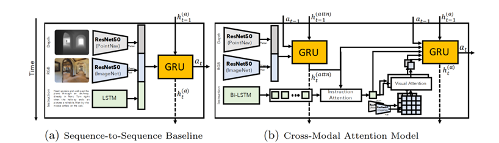

**方法简介：**
主要包括序列到序列 (Seq2Seq) 模型和交模态注意力 (Cross-Modal Attention, CMA) 模型，采用端到端架构，模型直接输出低级动作的概率。
* **Seq2Seq 架构 (图 a)：** 语言编码器 (LSTM) 将指令压缩为语义向量；动作解码器 (RNN) 基于语义向量和当前视觉特征预测动作分布。
* **CMA 模型 (图 b)：** 引入注意力机制，利用当前视觉特征作为 Query，与指令特征序列进行交叉注意力计算，动态聚焦于相关的指令片段，实现视觉与语言的细粒度对齐。

---

## 2. 传统两阶段导航方法

采用分层结构，将导航分解为“决策”和“执行”两个阶段。
1.  **决策阶段：** 根据全景图和指令，预测下一个高级目标点 (Local Goal / Waypoint)，通常是 $r, \theta$ 坐标。
2.  **执行阶段：** 底层控制器接收目标点坐标，通过算法（如 DWB）自动规划路径并控制智能体到达该点。

### (1) 航点预测器的提出：两阶段导航的开端

**论文题目：** Bridging the Gap Between Learning in Discrete and Continuous Environments for VLN (2022 CVPR)
**作者：** Yicong Hong, Zun Wang, Qi Wu, Stephen Gould
**单位：** ANU, University of Adelaide
**论文地址：** [PDF Link](https://openaccess.thecvf.com/content/CVPR2022/papers/Hong_Bridging_the_Gap_Between_Learning_in_Discrete_and_Continuous_Environments_CVPR_2022_paper.pdf) | **项目地址：** [GitHub](https://github.com/YicongHong/Discrete-Continuous-VLN)

  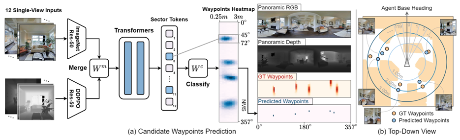
  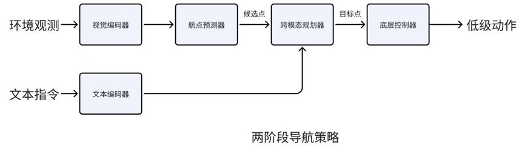

**方法创新：**
* **候选航点预测器 (Candidate Waypoint Predictor)：** 在连续环境中基于深度图实时生成可通行的“虚拟节点”，让连续空间看起来像是一个离散的导航图。
* **分层导航系统：** 拆解为“高层规划”和“底层执行”。
* **离散到连续的迁移：** 证明了只需将离散环境 (Nav-Graph) 中训练好的模型微调，即可在连续环境中取得 SOTA 效果。

### (2) 基于地图的方法

#### 拓扑地图：ETPNav

**论文题目：** ETPNav: Evolving Topological Planning for Vision-Language Navigation in Continuous Environments (2024 TPAMI)
**作者：** Dong An, Hanqing Wang, Wenguan Wang, Zun Wang, Yan Huang, Keji He, Liang Wang
**单位：** CASIA, UCAS
**论文地址：** [PDF Link](https://arxiv.org/abs/2304.03047) | **项目地址：** [GitHub](https://github.com/MarSaKi/ETPNav)

  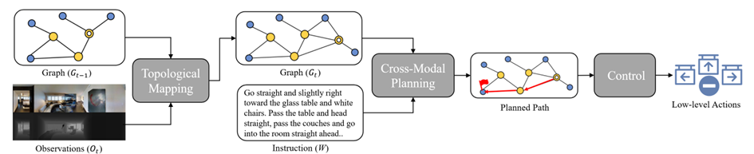
  
ETP 导航框架

  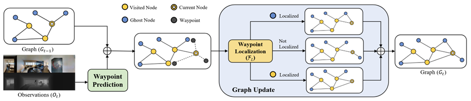
  
ETPNav 生成第 t 时刻拓扑图的过程

**方法简介：**
ETPNav 核心在于**在线演化拓扑建图 (Online Evolving Topological Mapping)**。它将未知的连续物理空间实时抽象为一张动态更新的拓扑图，通过拓扑地图存储历史信息。
* **跨模态规划器：** 基于拓扑图和指令进行长程语义推理，选定最佳航点。
* **试错法控制器 (Trial-and-Error Controller)：** 负责底层的动作执行与鲁棒避障，解决了传统模型容易陷入死胡同或发生碰撞的问题。

#### BEV 地图：BEVBert

**论文题目：** BEVBert: Multimodal Map Pre-training for Language-guided Navigation (2023 ICCV)
**作者：** Dong An, Yuankai Qi, Yangguang Li, Yan Huang, Liang Wang, Tieniu Tan, Jing Shao
**单位：** CASIA, UCAS, University of Adelaide, SenseTime, NJU, PJLab
**论文地址：** [PDF Link](https://arxiv.org/pdf/2212.04385) | **项目地址：** [GitHub](https://github.com/MarSaKi/VLN-BEVBert)

  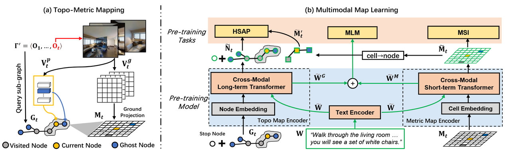

**方法简介：**
提出空间感知的多模态地图预训练范式。
* **混合地图 (Hybrid Map)：** 结合用于消除视觉重叠的局部鸟瞰图 (BEV) 度量地图，以及用于记忆长程路径的全局拓扑地图。
* **预训练任务：** 通过掩码地图建模等任务，让模型直接在地图表征上进行跨模态推理。

### (3) 基于未来想象的方法

#### HNR

**论文题目：** Lookahead Exploration with Neural Radiance Representation for Continuous Vision-Language Navigation (2024 CVPR)
**作者：** Zihan Wang, Xiangyang Li, Jiahao Yang, Yeqi Liu, Junjie Hu, Ming Jiang, Shuqiang Jiang
**单位：** ICT, CAS, UCAS
**论文地址：** [PDF Link](https://openaccess.thecvf.com/content/CVPR2024/papers/Wang_Lookahead_Exploration_with_Neural_Radiance_Representation_for_Continuous_Vision-Language_Navigation_CVPR_2024_paper.pdf) | **项目地址：** [GitHub](https://github.com/MrZihan/HNR-VLN)

  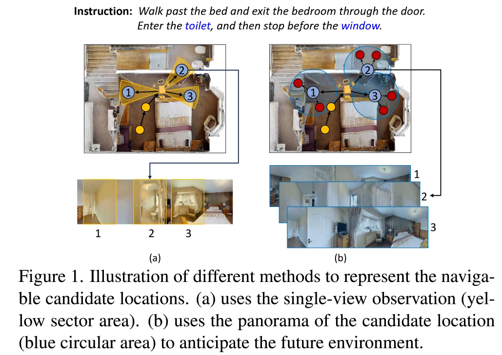
  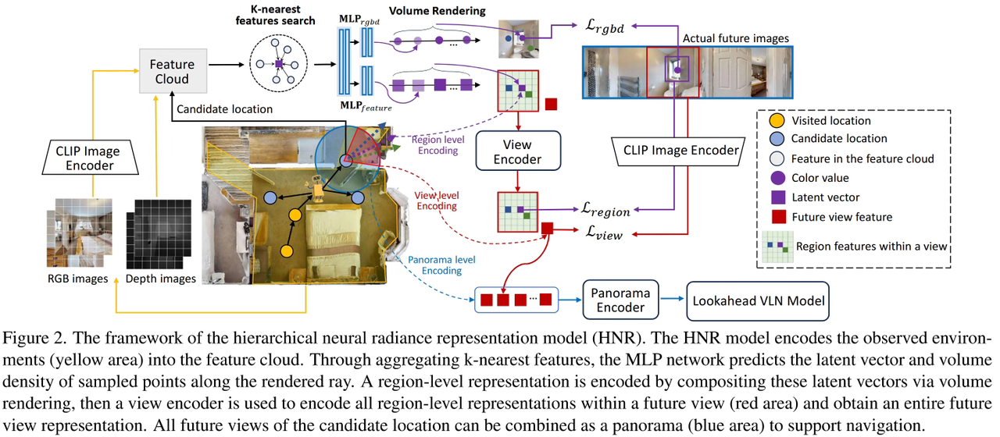

**方法简介：**
提出了**分层神经辐射表示 (HNR) 框架**。
* **前瞻性探索 (Lookahead Exploration)：** 利用 CLIP 语义嵌入合成环境特征，通过构建延伸至当前视界之外的**未来路径树**，智能体能够并行评估多个潜在分支的语义匹配度，从而实现兼顾长远规划的全局最优路径选择。

#### NavMorph (世界模型)

**论文题目：** NavMorph: A Self-Evolving World Model for Vision-and-Language Navigation in Continuous Environments (2025 ICCV)
**作者：** Xuan Yao, Junyu Gao, Changsheng Xu
**单位：** CASIA, UCAS, Peng Cheng Lab
**论文地址：** [PDF Link](https://openaccess.thecvf.com/content/ICCV2025/papers/Yao_NavMorph_A_Self-Evolving_World_Model_for_Vision-and-Language_Navigation_in_Continuous_ICCV_2025_paper.pdf) | **项目地址：** [GitHub](https://github.com/Feliciaxyao/NavMorph)

  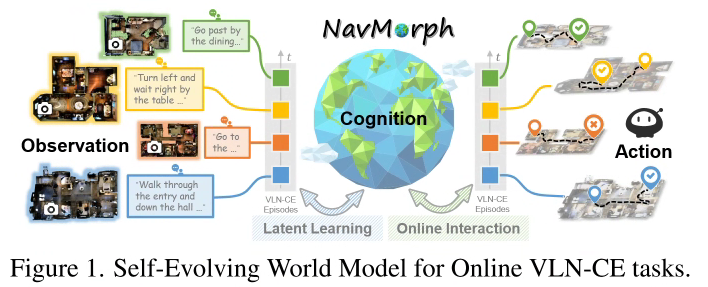
  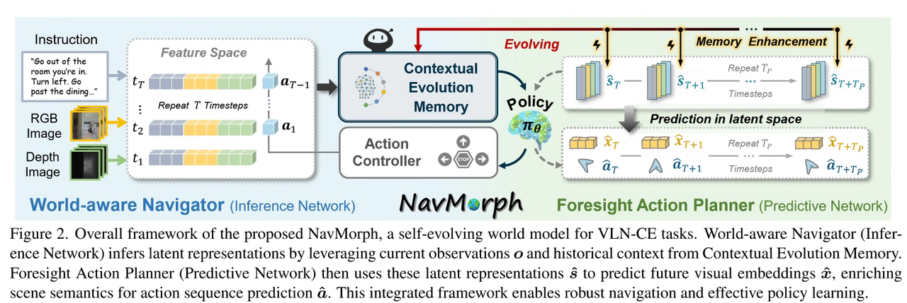

**方法创新：**
* **自演化世界模型：** 通过在线交互构建不断进化的潜空间。
* **上下文演化记忆 (CEM)：** 采用前向迭代更新机制，在在线测试阶段快速适应新场景。
* **分层架构：** 包含“世界感知导航器”和“前瞻动作规划器”，放弃像素级预测，改为在**特征层级**进行未来预测和重构，显著提升效率。

### (4) 基于 Sim2Real (虚实迁移) 的方法

#### Sim2Real-VLN-3DFF

**论文题目：** Sim-to-Real Transfer via 3D Feature Fields for Vision-and-Language Navigation (2024 CoRL)
**作者：** Zihan Wang, et al.
**论文地址：** [PDF Link](https://proceedings.mlr.press/v155/anderson21a/anderson21a.pdf) | **项目地址：** [GitHub](https://github.com/MrZihan/Sim2Real-VLN-3DFF)

  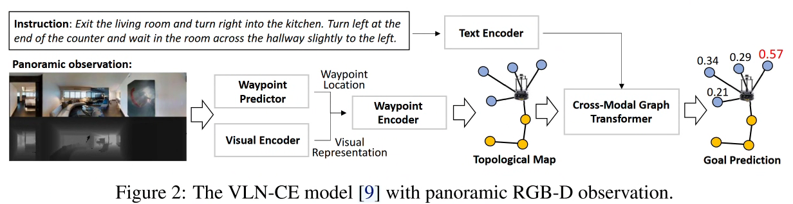
  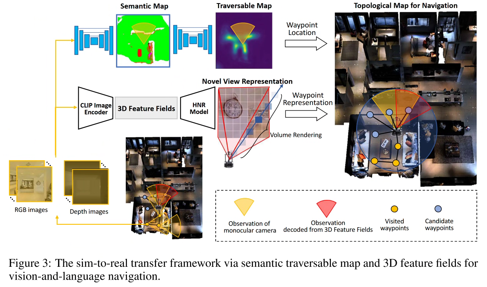

**核心思想：**
针对现实机器人常配备**单目相机**但模型需要**全景输入**的矛盾。
* **3D 特征场：** 利用 NeRF 思想，将单目观测映射到 3D 空间，渲染出虚拟全景图。
* **语义可通行地图：** 代理中心地图，同时进行环境语义对齐和障碍物预测。

#### monoVLN

**论文题目：** monoVLN: Bridging the Observation Gap between Monocular and Panoramic Vision and Language Navigation (2025 ICCV)
**作者：** Renjie Lu, Yu Zhou, Hao Cheng, Jingke Meng, Wei-Shi Zheng
**单位：** SYSU, HNU
**论文地址：** [PDF Link](https://openaccess.thecvf.com/content/ICCV2025/papers/Lu_monoVLN_Bridging_the_Observation_Gap_between_Monocular_and_Panoramic_Vision_ICCV_2025_paper.pdf)

  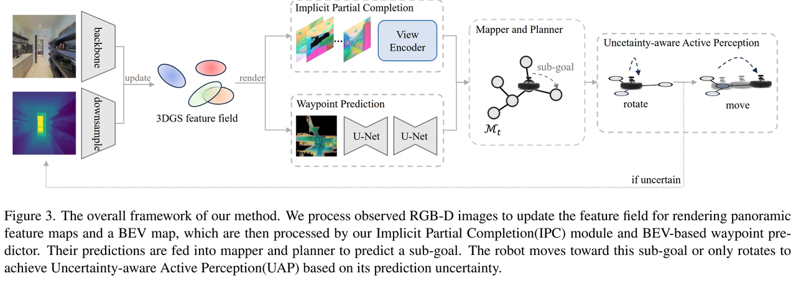

**方法创新：**
* **3D Gaussian Splatting (3DGS)：** 使用 3DGS 快速重建 3D 特征场并渲染虚拟全景。
* **隐式局部补全：** 自动预测并补全因遮挡导致的特征空洞。
* **不确定性感知策略：** 当特征置信度低时，主动执行“转身”动作采集数据。

---

## 3. 零样本视觉语言导航 (Zero-Shot VLN)

### Open-Nav (2025 ICRA)
**论文：** [Open-Nav: Exploring Zero-Shot VLN with Open-Source LLMs](https://arxiv.org/abs/2409.18794)
**GitHub：** [Link](https://github.com/YanyuanQiao/Open-Nav)

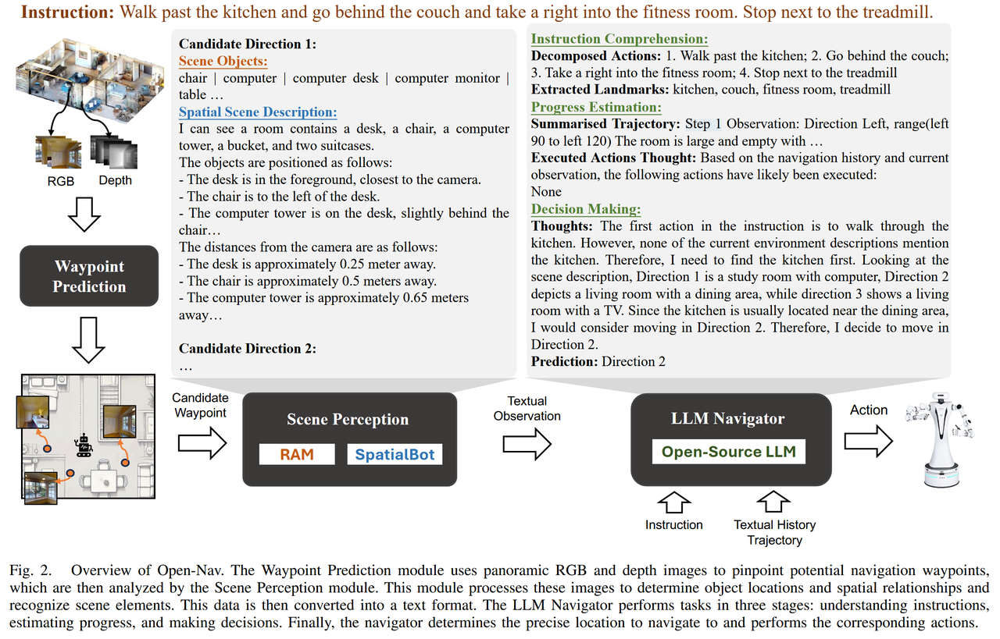

### CA-Nav (2025 TPAMI)
**论文：** [Constraint-Aware Zero-Shot VLN](https://arxiv.org/pdf/2412.10137)
**GitHub：** [Link](https://chenkehan21.github.io/CA-Nav-project/)

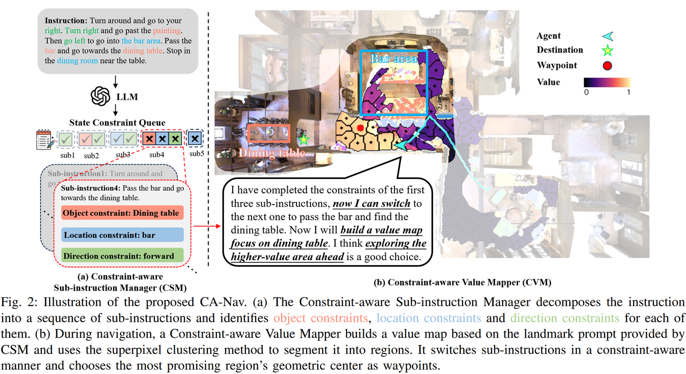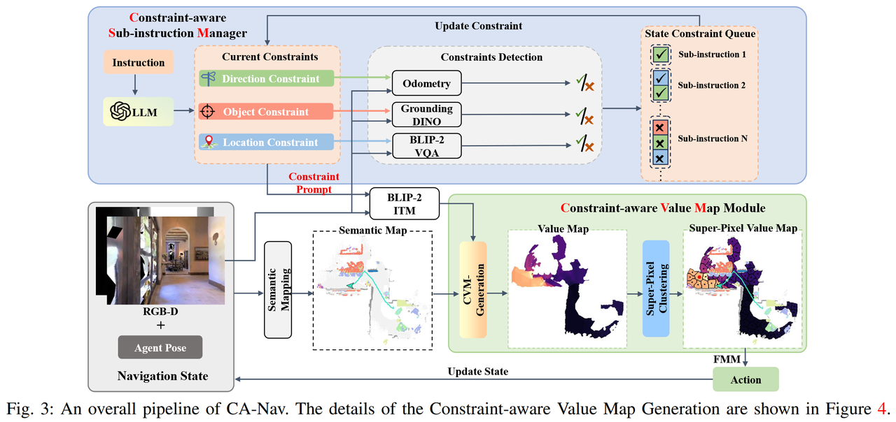

### 其他近期工作
* **LaViRA:** [Language-Vision-Robot Actions Translation](https://arxiv.org/abs/2510.19655)
* **SmartWay (2025 IROS):** [Enhanced Waypoint Prediction](https://arxiv.org/abs/2503.10069)
* **Fast-SmartWay:** [Panoramic-Free End-to-End Zero-Shot](https://arxiv.org/pdf/2511.00933)

---

## 4. 基于 VLA (Vision-Language-Action) 的方法

VLA 模型将感知、理解和控制统一在端到端框架中，逐渐取代模块化架构。

### NaVILA

**论文题目：** NaVILA: Legged Robot Vision-Language-Action Model for Navigation
**作者：** An-Chieh Cheng, et al.
**单位：** UCSD, USC, NVIDIA
**论文地址：** [PDF Link](https://navila-bot.github.io/static/navila_paper.pdf) | **GitHub：** [Link](https://github.com/AnjieCheng/NaVILA)

  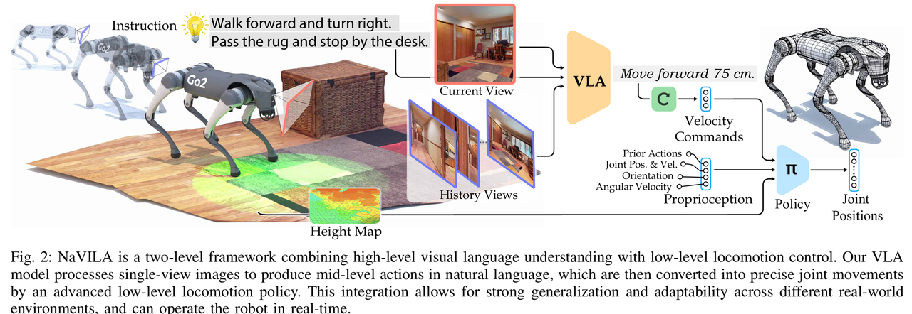
  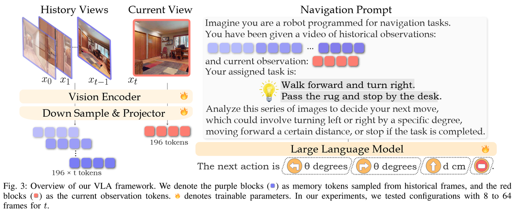
  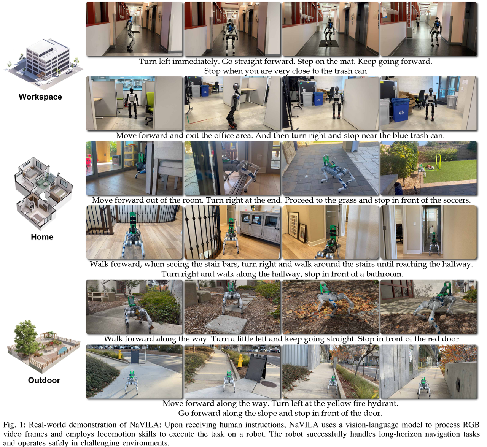

**方法：**
* **高级 VLA 层：** 输出“中级动作”（如“左转30度”），利用互联网视频数据增强。
* **低级执行层：** 基于 RL 的策略，将语言指令转化为电机控制命令。

### StreamVLN

**论文题目：** StreamVLN: Streaming Vision-and-Language Navigation via SlowFast Context Modeling
**作者：** Meng Wei, et al.
**单位：** PJLab, HKU
**论文地址：** [PDF Link](https://arxiv.org/abs/2507.05240) | **GitHub：** [Link](https://github.com/InternRobotics/StreamVLN)

  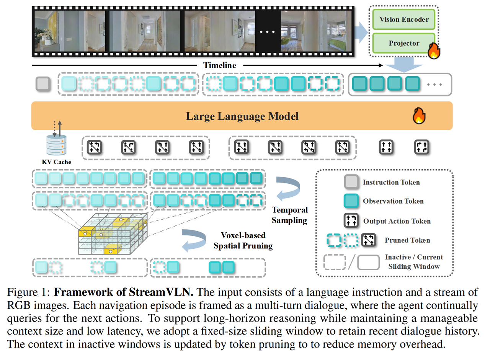

**核心：SlowFast 上下文建模**
* **快流上下文 (Fast-Streaming)：** 滑动窗口机制，只看最近几帧，保证实时响应。
* **慢更新记忆 (Slow-Updating)：** 3D Token 剪枝策略，只保留关键地标，解决显存爆炸问题，实现长程流式导航。

### DualVLN

**论文题目：** GROUND SLOW, MOVE FAST: A DUAL-SYSTEM FOUNDATION MODEL
**作者：** Meng Wei, et al.
**单位：** PJLab, HKU, Tsinghua
**论文地址：** [PDF Link](https://arxiv.org/pdf/2512.08186) | **GitHub：** [Link](https://github.com/InternRobotics/InternNav?tab=readme-ov-file)

  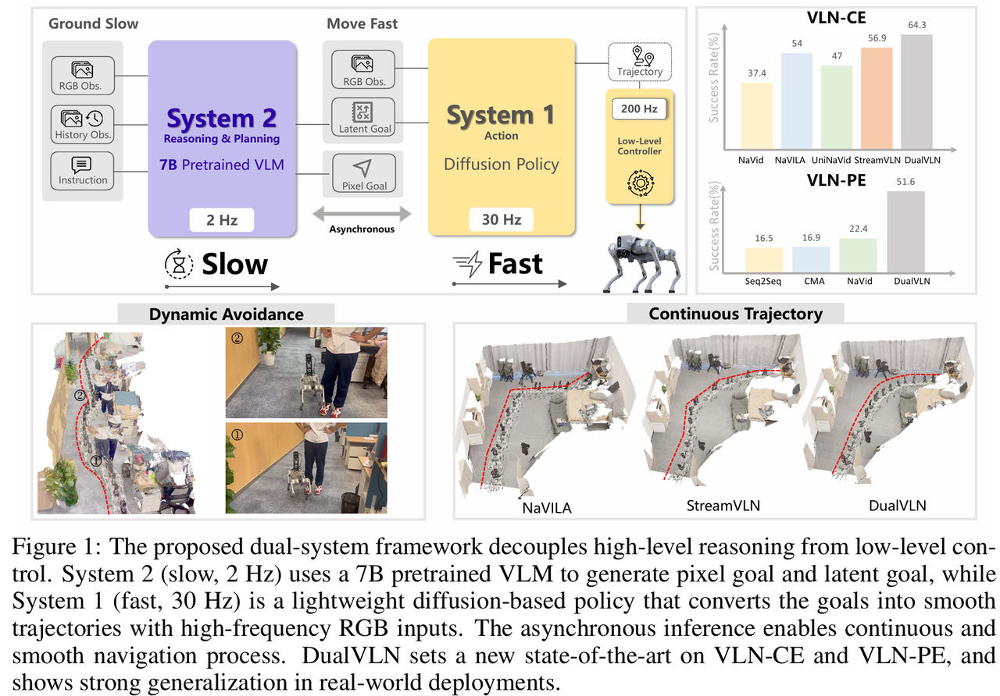

**方法：模拟人类“双过程理论”**
* **System 2 (Ground Slow):** 大脑。使用 InternVLA 大模型进行全局规划，低频输出中期航点 (Pixel Goal)。
* **System 1 (Move Fast):** 小脑。轻量级 Diffusion Transformer，高频输出线速度和角速度，处理避障和运动控制。
