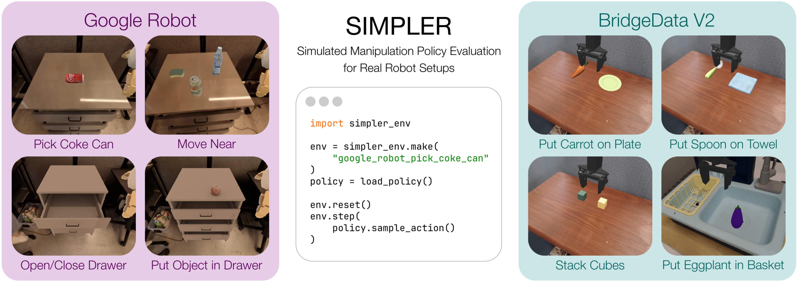

# SimplerEnv 基准测试体系详解

## 1 概述

SimplerEnv 是一个专为评估机器人真机策略（Real-Robot Policies）而设计的闭环仿真环境。它建立在 ManiSkill2 物理引擎之上，旨在解决“Sim-to-Real（仿真到真机）”和“Real-to-Sim（真机到仿真）”之间的鸿沟。

本章将详细拆解 SimplerEnv 的评估基准（Benchmark）。该基准测试不仅关注机器人的运动规划能力，还着重评估策略在视觉变化、物理属性干扰下的鲁棒性。根据官方定义的标准评估协议，我们可以将核心测试集划分为 **18 个标准评估场景**，涵盖了 **Google Robot** 和 **WidowX** 两个主要的机器人操作平台。

  
   
  <b>图1：Simplerenv环境示意图</b>

------

## 2 机器人平台与任务分类

SimplerEnv 的任务设计遵循“视觉匹配（Visual Matching）”原则，即仿真环境中的纹理、光照和物体布局尽可能模拟真实的机器人数据集（如 RT-1 数据集和 Bridge 数据集）。

### 2.1 Google Robot 任务组 (基于 RT-1)

Google Robot 任务组主要模拟移动操作机器人（Mobile Manipulator）在厨房和办公场景下的交互。这组任务对机器人的全身控制（Base + Arm）以及对关节物体（Articulated Objects，如抽屉）的处理能力提出了挑战。

我们将 Google Robot 的 14 个具体评估场景归纳为以下三类核心能力：

1. **抓取与操纵 (Grasping & Manipulation)**：针对不同姿态物体的抓取。
2. **导航与接近 (Navigation & Reaching)**：移动到底座并接近目标。
3. **关节物体交互 (Articulated Object Interaction)**：对抽屉的开合操作。

#### 表 1：Google Robot 详细评估场景清单

| **核心任务能力 (Capability)**    | **任务代码 (Task ID)**       | **具体场景描述 (Scenario Description)**                      | **场景数量** | **技术难点解析**                   |
| -------------------------------- | ---------------------------- | ------------------------------------------------------------ | ------------ | ---------------------------------- |
| **物体抓取** *(Pick Coke Can)*   | `pick_horizontal_coke_can`   | **捡起水平放置的可乐罐** 目标物体倒置于桌面，需调整末端执行器角度进行侧向或俯冲抓取。 | 1            | 物体姿态估计 抓取规划              |
|                                  | `pick_vertical_coke_can`     | **捡起垂直放置的可乐罐** 目标物体直立，是最标准的抓取任务。  | 1            | 基础抓取成功率                     |
|                                  | `pick_standing_coke_can`     | **捡起立着的可乐罐** (注：SimplerEnv 中有时将 vertical/standing 视为细微差别的变体，或作为同义测试)。 | 1            | 鲁棒性测试                         |
| **通用抓取** *(Pick Object)*     | `GraspSingleRandomObject`    | **捡起场景中的随机物体** 物体不再局限于可乐罐，而是随机采样的几何体或日常用品。 | 1            | 泛化能力 (Generalization)          |
| **移动接近** *(Move Near)*       | `MoveNearGoogleBakedTex`     | **移动到场景物体附近** 机器人需控制底盘移动，使末端执行器接近目标区域而不发生碰撞。 | 1            | 全身控制 (Whole-body Control)      |
| **打开抽屉** *(Open Drawer)*     | `open_top_drawer`            | **打开上层抽屉**                                             | 1            | 接触力控制 运动学约束              |
|                                  | `open_middle_drawer`         | **打开中层抽屉**                                             | 1            | 不同的操作高度                     |
|                                  | `open_bottom_drawer`         | **打开下层抽屉**                                             | 1            | 低位操作规划                       |
| **关闭抽屉** *(Close Drawer)*    | `close_top_drawer`           | **关闭上层抽屉**                                             | 1            | 施力方向控制                       |
|                                  | `close_middle_drawer`        | **关闭中层抽屉**                                             | 1            |                                    |
|                                  | `close_bottom_drawer`        | **关闭下层抽屉**                                             | 1            |                                    |
| **抽屉放置** *(Place in Drawer)* | `place_in_closed_top_drawer` | **放入关闭的上层抽屉** 复合任务：先打开抽屉 -> 放入物体 -> (可选)关闭抽屉。 | 1            | 长程任务 (Long-horizon) 多阶段规划 |
|                                  | `place_in_closed_middle_`    | **放入关闭的中层抽屉**                                       | 1            |                                    |
|                                  | `place_in_closed_bottom_`    | **放入关闭的下层抽屉**                                       | 1            |                                    |
| **小计**                         |                              |                                                              | **14**       |                                    |

------

### 2.2 WidowX Robot 任务组 (基于 Bridge Data V2)

WidowX 任务组模拟的是固定基座的桌面机械臂（Tabletop Manipulator）。这组任务的数据来源于 Bridge Data V2，侧重于精确的桌面操作、堆叠以及简单的物体放置。环境背景通常包含由于不同实验室环境导致的视觉多样性。

#### 表 4-2：WidowX Robot 详细评估场景清单

| **核心任务能力 (Capability)**          | **任务代码 (Task ID)**   | **具体场景描述 (Scenario Description)**                      | **场景数量** | **技术难点解析**            |
| -------------------------------------- | ------------------------ | ------------------------------------------------------------ | ------------ | --------------------------- |
| **精确放置** *(Pick & Place)*          | `PutSpoonOnTableCloth`   | **将勺子放在毛巾上** 需识别可变形物体（毛巾）区域，并精确放置刚性物体（勺子）。 | 1            | 目标区域识别 精细操作       |
|                                        | `PutCarrotOnPlate`       | **将胡萝卜放在盘子里** 典型的“物体-容器”交互任务。           | 1            | 深度感知 避障               |
| **物体堆叠** *(Stacking)*              | `StackGreenCubeOnYellow` | **将绿色方块堆叠在黄色方块上** 经典的积木堆叠任务，要求极高的垂直对齐精度。 | 1            | 精度控制 物体稳定性物理模拟 |
| **容器交互** *(Container Interaction)* | `PutEggplantInBasket`    | **将茄子放入篮子中** 涉及不规则形状物体（茄子）与深容器（篮子）的交互。 | 1            | 抓取点选择 防掉落           |
| **小计**                               |                          |                                                              | **4**        |                             |

------

## 3 评估体系的扩展性与变体聚合

虽然上文列出了 **18 个标准场景**，但读者必须理解，SimplerEnv 的核心价值在于其评估的**广度**和**鲁棒性**。在实际的基准测试代码（Benchmark Code）中，每一个标准场景都包含着复杂的“变体聚合（Variant Aggregation）”机制。

### 3.1 什么是变体聚合？

在 SimplerEnv 中，一个单一的“任务”（如 `pick_coke_can`）并非静态不变的。为了真实评估机器人的泛化能力，系统会在每次 Reset 环境时随机化以下参数，从而生成成百上千种实际的运行状态：

1. **视觉变体 (Visual Variants)**：
   - **背景纹理**：更换桌布颜色、地板材质。
   - **光照条件**：改变光源强度、阴影方向。
   - **干扰物 (Distractors)**：在工作空间中随机生成与任务无关的物体，测试视觉模型的注意力机制。
2. **物理变体 (Physical Variants)**：
   - **物体初始位置**：在一定分布范围内随机化目标物体的 $(x, y)$ 坐标和旋转角度 $\theta$。
   - **相机姿态**：对相机视角进行微小的扰动，模拟真实世界中相机标定的误差。

### 3.2 评估指标

对于上述 18 个场景，SimplerEnv 通常采用以下指标进行量化评估：

- **成功率 (Success Rate)**：在 $N$ 次试验（Episode）中，成功完成任务目标的百分比。通常建议 $N \ge 100$ 以获得统计学意义。
- **平均步数 (Average Steps)**：完成任务所需的平均控制步数，用于衡量策略的效率。
- **Sim-to-Real 相关性 (Correlation)**：这是 SimplerEnv 最独特的指标。它计算仿真环境中的成功率排名（Rank）与真实世界实验中策略排名的相关性（如 Pearson 或 Spearman 相关系数）。一个好的仿真基准应当能够准确预测哪个策略在真机上表现更好。

------

## 4 本章小结

SimplerEnv 通过定义 **18 个基础评估场景**，构建了一个覆盖移动操作（Google Robot）和桌面操作（WidowX）的标准测试集。这些场景从简单的拾取任务延伸到复杂的长程关节物体操作。结合其底层的视觉和物理随机化机制，该基准测试为具身智能（Embodied AI）领域的通用机器人策略提供了一个严格且可复现的“考场”。