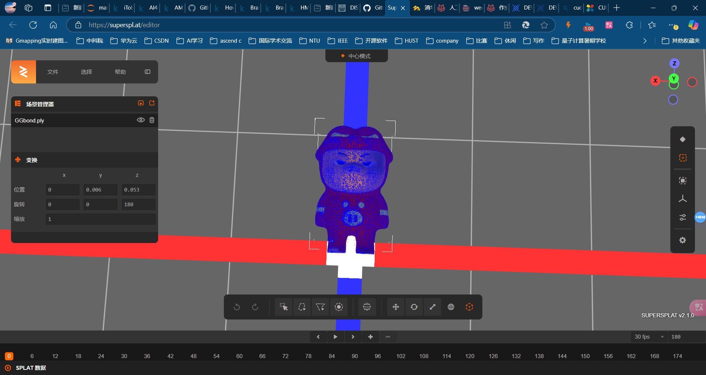
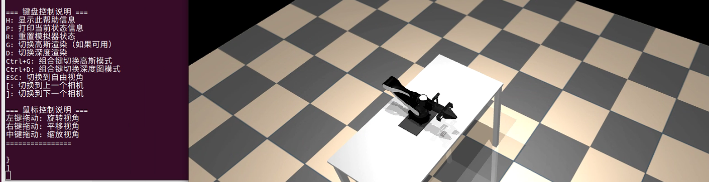
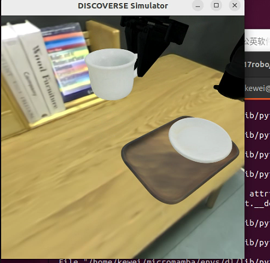
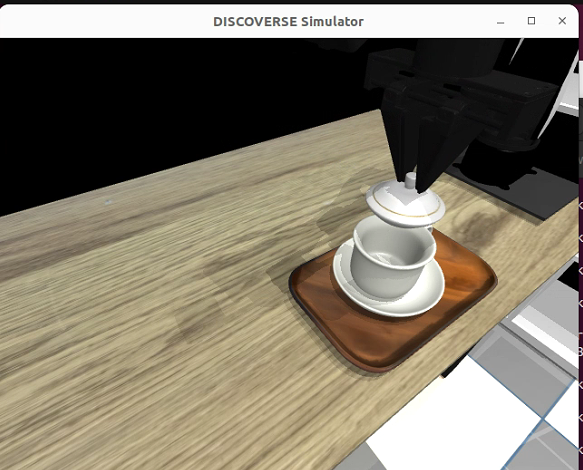

论文地址

https://drive.google.com/file/d/1637XPqWMajfC_ZqKfCGxDxzRMrsJQA1g/view

项目网站[DISCOVERSE](https://air-discoverse.github.io/)

## 📦 Installation 📦安装

[](https://github.com/TATP-233/DISCOVERSE/tree/main#-installation)

```shell
git clone https://github.com/TATP-233/DISCOVERSE.git --recursive
cd DISCOVERSE
pip install -r requirements.txt
pip install -e .
```

### Download Resource Files 下载资源文件

[](https://github.com/TATP-233/DISCOVERSE/tree/main#download-resource-files)

Download the `meshes` and `textures` folders from [Baidu Netdisk](https://pan.baidu.com/s/1y4NdHDU7alCEmjC1ebtR8Q?pwd=bkca) or [Tsinghua Netdisk](https://cloud.tsinghua.edu.cn/d/0b92cdaeb58e414d85cc/) and place them under the `models` directory. After downloading the model files, the `models` directory will contain the following contents.  
从[百度网盘](https://pan.baidu.com/s/1y4NdHDU7alCEmjC1ebtR8Q?pwd=bkca)或[清华网盘](https://cloud.tsinghua.edu.cn/d/0b92cdaeb58e414d85cc/)下载`meshes`和`textures`文件夹，放在`models`目录下。下载模型文件后，`模型`目录将包含以下内容。

```
models
├── meshes
├── mjcf
├── textures
└── urdf
```

## 📷 Photorealistic Rendering

真实感渲染

[](https://github.com/TATP-233/DISCOVERSE/tree/main#-photorealistic-rendering)

[](https://github.com/TATP-233/DISCOVERSE/blob/main/assets/img2.png)

### Preparation 制备

[](https://github.com/TATP-233/DISCOVERSE/tree/main#preparation)

The physical engine of `DISCOVERSE` is [mujoco](https://github.com/google-deepmind/mujoco). If the user does not need the high-fidelity rendering function based on [3DGS](https://github.com/graphdeco-inria/gaussian-splatting), this section can be skipped. If photorealistic rendering is required, please follow the instructions in this subsection.  
`DISCOVERSE`的物理引擎是[mujoco](https://github.com/google-deepmind/mujoco)。如果用户不需要基于[3DGS](https://github.com/graphdeco-inria/gaussian-splatting)的高保真渲染功能，可以跳过本节。如果需要真实感渲染，请遵循本小节中的说明。

1. Install CUDA. Please install the corresponding version of CUDA according to your graphics card model from the [download link](https://developer.nvidia.com/cuda-toolkit-archive).  
    安装CUDA。请根据显卡型号从[下载链接](https://developer.nvidia.com/cuda-toolkit-archive)安装相应版本的CUDA。

2. pip install -r requirements\_gs.txt

3. Install `diff-gaussian-rasterization`  
    安装`diff-gaussian-rasterization`
   
   ```shell
   cd submodules/diff-gaussian-rasterization/
   git checkout 8829d14
   ```
   
    Modify line 154 of `submodules/diff-gaussian-rasterization/cuda_rasterizer/auxiliary.h`, change `(p_view.z <= 0.2f)` to `(p_view.z <= 0.01f)`.  
    修改 `submodules/diff-gaussian-rasterization/cuda_rasterizer/auxiliary.h` 的第154行，将`（p_view.z <= 0.2f）`更改为`（p_view.z <= 0.01f）`。
   
   ```shell
   cd ../..
   pip install submodules/diff-gaussian-rasterization
   ```

4. Prepare 3DGS model files. The high-fidelity visual effect of `DISCOVERSE` depends on 3DGS technology and corresponding model files. The pre-reconstructed robot, object, and scene models are placed on Baidu Netdisk [link](https://pan.baidu.com/s/1y4NdHDU7alCEmjC1ebtR8Q?pwd=bkca) and Tsinghua Netdisk [link](https://cloud.tsinghua.edu.cn/d/0b92cdaeb58e414d85cc/). After downloading the model files, the `models` directory will contain the following contents. (Note: Not all models are necessary. Users can download according to their own needs. It is recommended to download all ply models except those in the `scene` directory, and for the models in the `scene` folder, only download the ones that will be used.)  
    准备3DGS模型文件。`DISCOVERSE`的高保真视觉效果依赖于3DGS技术和相应的模型文件。将重构后的机器人、物体和场景模型分别放置在百度网盘和清华[网盘](https://cloud.tsinghua.edu.cn/d/0b92cdaeb58e414d85cc/)上。[](https://pan.baidu.com/s/1y4NdHDU7alCEmjC1ebtR8Q?pwd=bkca)下载模型文件后，`模型`目录将包含以下内容。(Note：并非所有的模型都是必需的。用户可以根据自己的需要进行下载。建议下载除`场景`目录中的模型外的所有层模型，对于`场景`文件夹中的模型，仅下载将使用的模型。）

```
models
├── 3dgs
│   ├── airbot_play
│   ├── mmk2
│   ├── tok2
│   ├── skyrover
│   ├── hinge
│   ├── object
│   └── scene
├── meshes
├── mjcf
├── textures
└── urdf
```

配置cuda

在网站[CUDA Toolkit 12.8 Update 1 Downloads | NVIDIA Developer](https://developer.nvidia.com/cuda-downloads?target_os=Linux&target_arch=x86_64&Distribution=Ubuntu&target_version=22.04&target_type=deb_local)

```bash
wget https://developer.download.nvidia.com/compute/cuda/repos/ubuntu2204/x86_64/cuda-ubuntu2204.pin
sudo mv cuda-ubuntu2204.pin /etc/apt/preferences.d/cuda-repository-pin-600
wget https://developer.download.nvidia.com/compute/cuda/12.8.1/local_installers/cuda-repo-ubuntu2204-12-8-local_12.8.1-570.124.06-1_amd64.deb
sudo dpkg -i cuda-repo-ubuntu2204-12-8-local_12.8.1-570.124.06-1_amd64.deb
sudo cp /var/cuda-repo-ubuntu2204-12-8-local/cuda-*-keyring.gpg /usr/share/keyrings/
sudo apt-get update
sudo apt-get -y install cuda-toolkit-12-8
```

https://superspl.at/editor

[SuperSplat](https://superspl.at/editor)

在线观看仿真建模



查看渲染效果



```bash
pip install mujoco==2.3.7
sudo apt-get install libosmesa6-dev freeglut3-dev
sudo apt install libglew-dev
```



放咖啡杯的也很不错




室内3D高斯重建 非常厉害
