安装vulkan

```bash
sudo apt-get install libvulkan1
sudo apt-get install vulkan-utils
或者
sudo apt install vulkan-tools
vulkaninfo
```

如果不存在，请尝试创建包含以下内容的文件：`/usr/share/vulkan/icd.d/nvidia_icd.json`

{
 "file\_format\_version" : "1.0.0",
 "ICD": {
 "library\_path": "libGLX\_nvidia.so.0",
 "api\_version" : "1.2.155"
 }
}

测试安装

python -m mani_skill.examples.demo_random_action

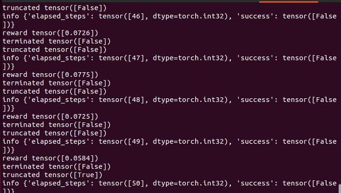

import gymnasium as gym
import mani_skill.envs

env = gym.make(
    "PickCube-v1", # there are more tasks e.g. "PushCube-v1", "PegInsertionSide-v1", ...
    num_envs=1,
    obs_mode="state", # there is also "state_dict", "rgbd", ...
    control_mode="pd_ee_delta_pose", # there is also "pd_joint_delta_pos", ...
    render_mode="human"
)
print("Observation space", env.observation_space)
print("Action space", env.action_space)

obs, _ = env.reset(seed=0) # reset with a seed for determinism
done = False
while not done:
    action = env.action_space.sample()
    obs, reward, terminated, truncated, info = env.step(action)
    done = terminated or truncated
    env.render()  # a display is required to render
env.close()

# run headless / without a display

python -m mani_skill.examples.demo_random_action -e PickCube-v1

# run with A GUI and ray tracing

python -m mani_skill.examples.demo_random_action -e PickCube-v1 --render-mode="human" --shader="rt-fast"

python -m mani_skill.examples.benchmarking.gpu_sim --num-envs=1024

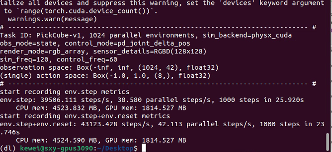

并行真的超快

# rendering RGB + Depth data from all cameras

python -m mani_skill.examples.benchmarking.gpu_sim --num-envs=64 --obs-mode="rgbd"

# directly save 64 videos of the visual observations put into one video

python -m mani_skill.examples.benchmarking.gpu_sim --num-envs=64 --save-video

import gymnasium as gym
import mani_skill.envs

env = gym.make(
    "PickCube-v1",
    obs_mode="state",
    control_mode="pd_joint_delta_pos",
    num_envs=16,
    parallel_in_single_scene=True,
    viewer_camera_configs=dict(shader_pack="rt-fast"),
)
env.reset()
while True:
    env.step(env.action_space.sample())
    env.render_human()

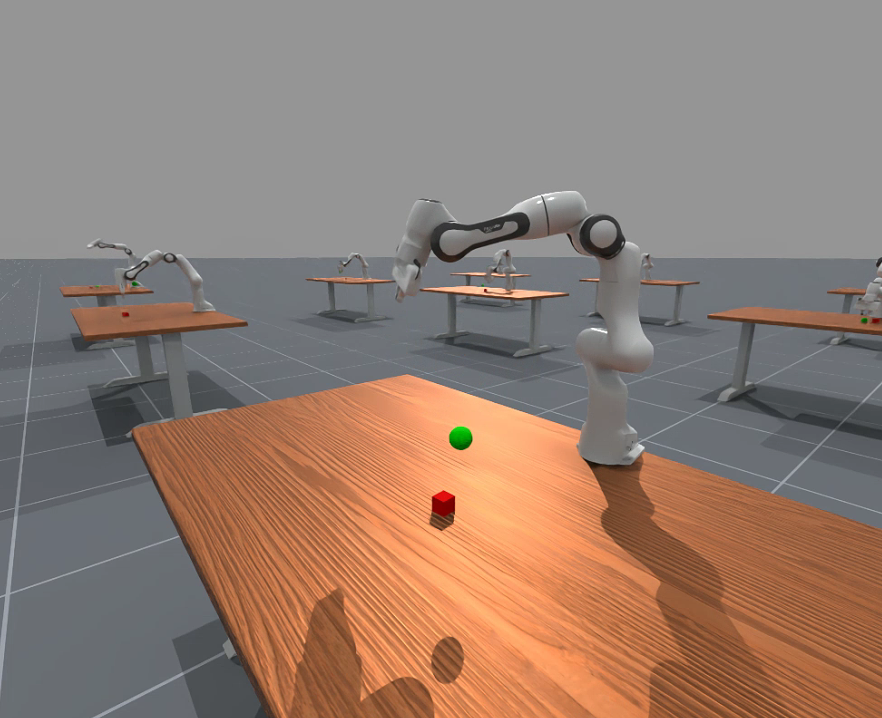

python -m mani_skill.examples.demo_random_action -e PushCube-v1 -b gpu --render-mode human --seed 42

生成随机模拟

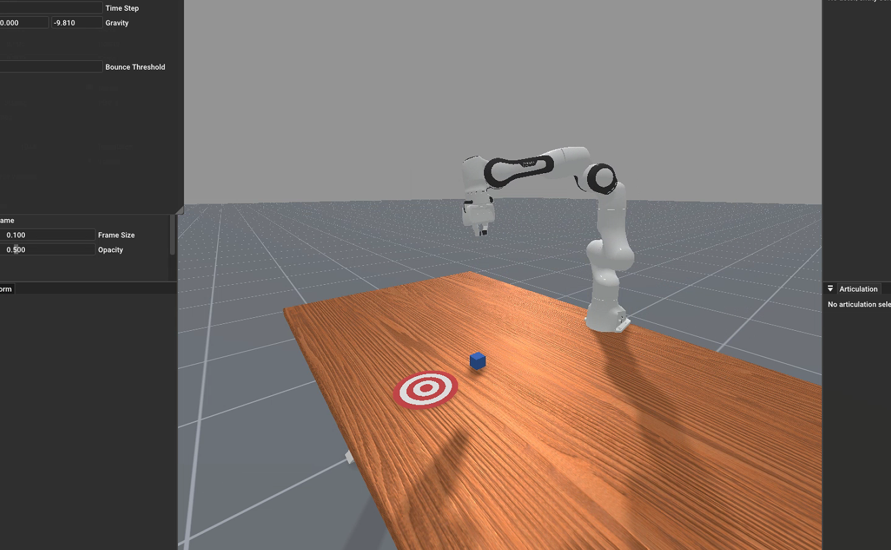

默认下载数据的路径

python -m mani_skill.utils.download_asset "ReplicaCAD"

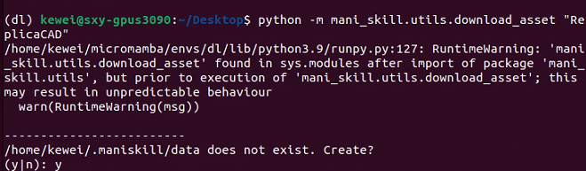

python -m mani_skill.examples.demo_random_action -e "ReplicaCAD_SceneManipulation-v1" \
  --render-mode="rgb_array" --record-dir="videos"

python -m mani_skill.examples.demo_random_action -e "ReplicaCAD_SceneManipulation-v1" \
  --render-mode="human" # run with GUI

python -m mani_skill.examples.demo_random_action -e "ReplicaCAD_SceneManipulation-v1" \
  --render-mode="human" --shader="rt-fast" # faster ray-tracing option but lower quality

python -m mani_skill.examples.demo_random_action -e "ReplicaCAD_SceneManipulation-v1" \
  --render-mode="human" --shader="rt" 

比较推荐中等分辨率

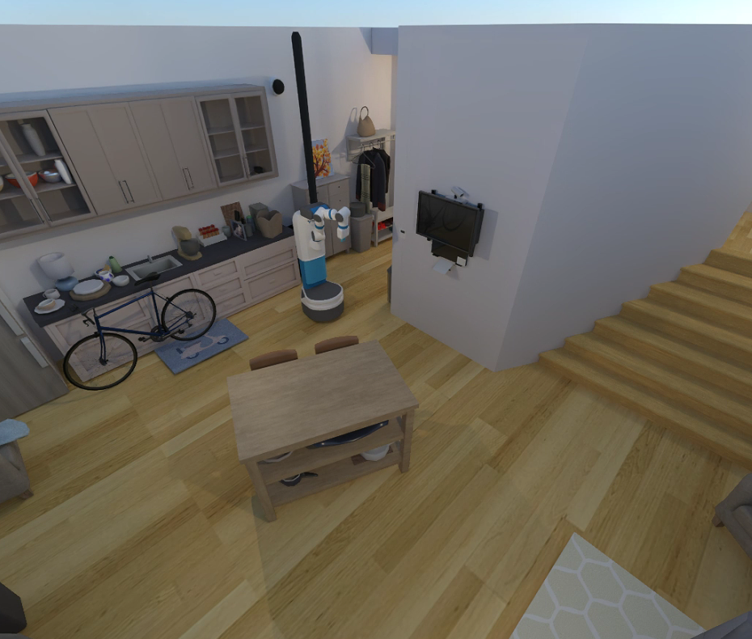

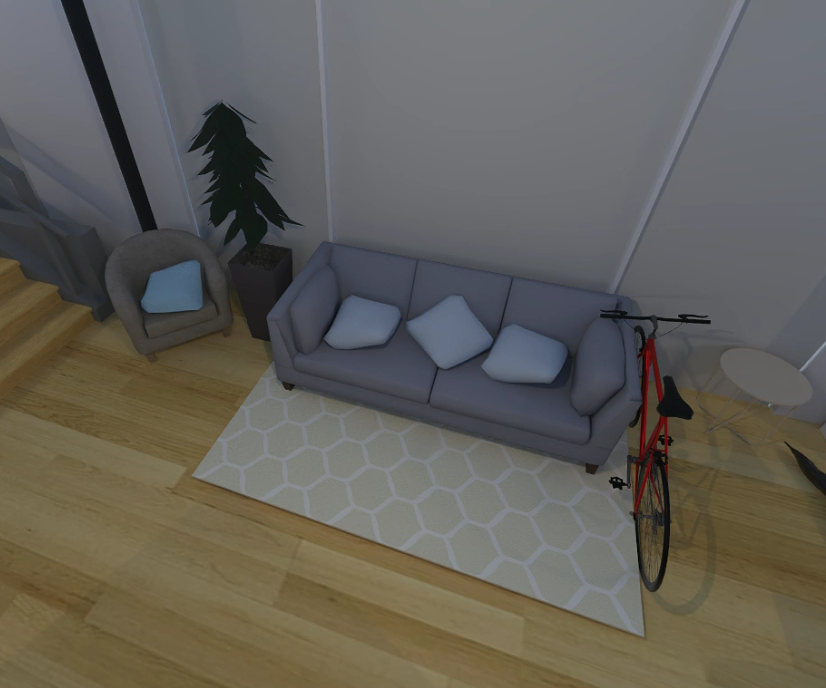

python -m mani_skill.examples.demo_random_action -e "TwoRobotStackCube-v1" \
  --render-mode="human"

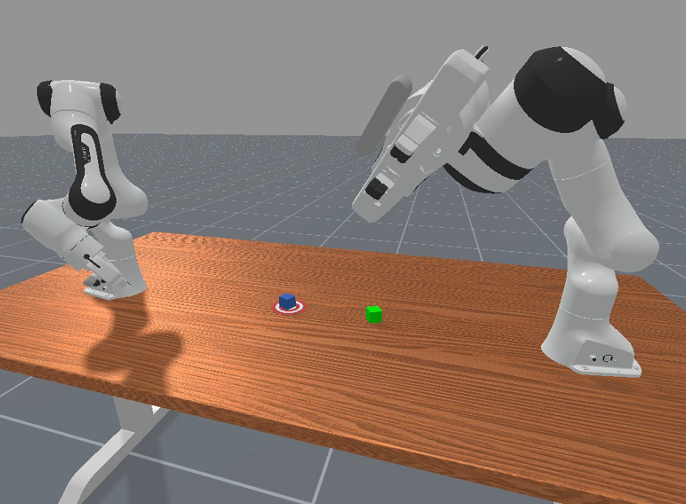

python -m mani_skill.examples.demo_random_action -e "RotateValveLevel2-v1" \
  --render-mode="human"

灵巧手

python -m mani_skill.examples.demo_random_action -e "RotateSingleObjectInHandLevel3-v1" \
  --render-mode="human"

模拟触觉

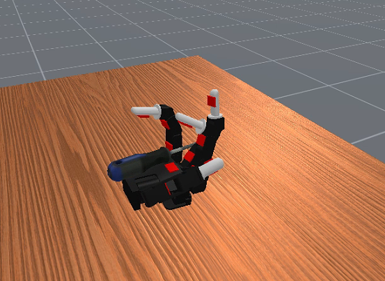

要使用 4096 个并行任务对 PickCube-v1 任务上的 GPU 模拟进行基准测试，可以运行

python -m mani_skill.examples.benchmarking.gpu_sim -e "PickCube-v1" -n 4096

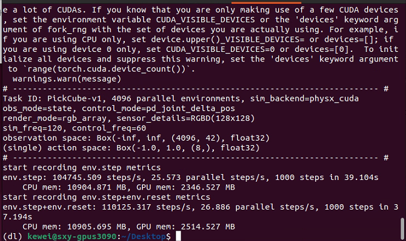

速度非常之快

要保存代理获得的视觉观察视频（在本例中只有 rgb 和深度），可以运行

python -m mani_skill.examples.benchmarking.gpu_sim -e "PickCube-v1" -n 64 \
  --save-video --render-mode="sensors"

它应该运行得相当快！（4090 上 3000+ fps，可以增加环境数量以获得更高的 FPS）。可以更改`--render-mode="rgb_array"`为从更高质量的相机进行渲染。

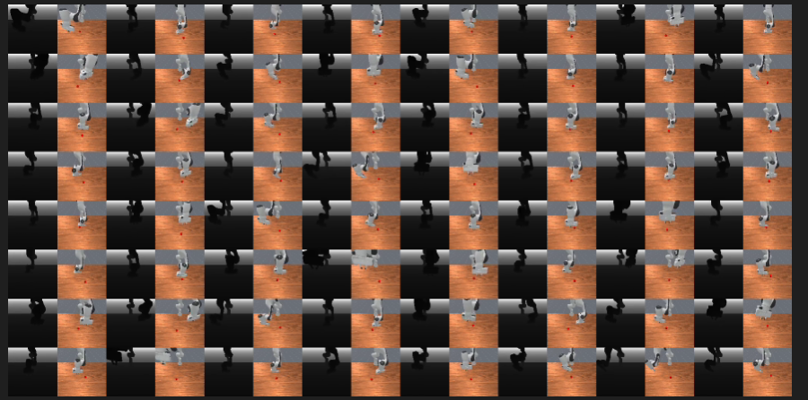

要尝试各种并行模拟功能，可以运行

python -m mani_skill.examples.benchmarking.gpu_sim -e "PickSingleYCB-v1" -n 64 \
  --save-video --render-mode="sensors"

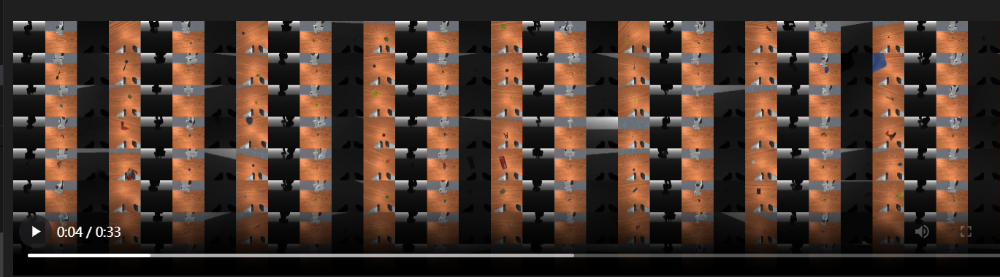

同时训练抓取不同的物体

python -m mani_skill.examples.benchmarking.gpu_sim -e "OpenCabinetDrawer-v1" -n 64 \
  --save-video --render-mode="sensors"

显示了在每个并行环境中具有不同对象和关节的两个任务。以下是 OpenCabinetDrawer 任务的一个示例。

[更多详细信息和性能基准测试结果可在本页面](https://maniskill.readthedocs.io/en/latest/user_guide/additional_resources/performance_benchmarking.html)找到[](https://maniskill.readthedocs.io/en/latest/user_guide/additional_resources/performance_benchmarking.html)

## 交互控制[#](https://maniskill.readthedocs.io/en/latest/user_guide/demos/scripts.html#interactive-control "此标题的永久链接")

单击+拖动远程操作：

简单的工具，可以单击并拖动 Panda 机械臂的末端执行器来解决各种任务。只需单击并拖动，按“n”移动到拖动到的位置，“g”切换打开/关闭抓取，然后重复。按“q”退出并保存结果视频。

python -m mani_skill.examples.teleoperation.interactive_panda -e "StackCube-v1" 

有关如何使用此工具（用于演示和数据收集）的更多详细信息，请参阅[主页](https://maniskill.readthedocs.io/en/latest/user_guide/data_collection/teleoperation.html#click-drag-system)。下面的视频显示了系统的运行情况。

关于这个，有一个bug，我提了discord

- python -m mani\_skill.examples.teleoperation.interactive\_panda -e "StackCube-v1" Traceback (most recent call last): File "/home/kewei/micromamba/envs/dl/lib/python3.9/runpy.py", line 197, in \_run\_module\_as\_main return \_run\_code(code, main\_globals, None, File "/home/kewei/micromamba/envs/dl/lib/python3.9/runpy.py", line 87, in \_run\_code exec(code, run\_globals) File "/home/kewei/micromamba/envs/dl/lib/python3.9/site-packages/mani\_skill/examples/teleoperation/interactive\_panda.py", line 11, in <module> from mani\_skill.examples.motionplanning.panda\_stick.motionplanner import \\ ModuleNotFoundError: No module named 'mani\_skill.examples.motionplanning.panda\_stick' hi could anyone help me with this problem?

- _\[_17:36_\]_
  
  ok well I have solved it. Just install from github not pypi helped me out

- ### kewei_—_ 今天17:43
  
  it might be a issue in example code. the right should be
  
  `from mani_skill.examples.motionplanning.panda.motionplanner_stick import PandaStickMotionPlanningSolver`

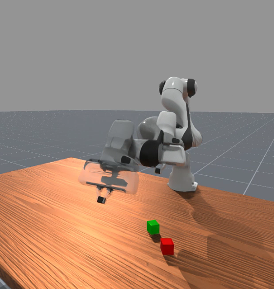

## 运动规划解决方案[#](https://maniskill.readthedocs.io/en/latest/user_guide/demos/scripts.html#motion-planning-solutions "此标题的永久链接")

我们为熊猫手臂在某些任务上提供了运动规划解决方案/演示，现在可以尝试并使用以下内容记录演示：

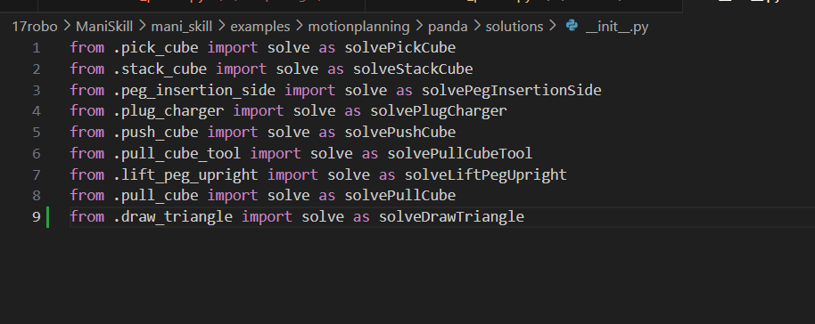

python -m mani_skill.examples.motionplanning.panda.run -e "PickCube-v1" # runs headless and only saves video
python -m mani_skill.examples.motionplanning.panda.run -e "StackCube-v1" --vis # opens up the GUI
python -m mani_skill.examples.motionplanning.panda.run -h # open up a help menu and also show what tasks have solutions

(dl) kewei@sxy-gpus3090:~/Desktop$ python -m mani_skill.examples.motionplanning.panda.run -h # open up a help menu and also show what tasks have solutions
usage: run.py [-h] [-e ENV_ID] [-o OBS_MODE] [-n NUM_TRAJ]
              [--only-count-success] [--reward-mode REWARD_MODE]
              [-b SIM_BACKEND] [--render-mode RENDER_MODE] [--vis]
              [--save-video] [--traj-name TRAJ_NAME] [--shader SHADER]
              [--record-dir RECORD_DIR] [--num-procs NUM_PROCS]

optional arguments:
  -h, --help            show this help message and exit
  -e ENV_ID, --env-id ENV_ID
                        Environment to run motion planning solver on.
                        Available options are ['DrawTriangle-v1',
                        'PickCube-v1', 'StackCube-v1', 'PegInsertionSide-v1',
                        'PlugCharger-v1', 'PushCube-v1', 'PullCubeTool-v1',
                        'LiftPegUpright-v1', 'PullCube-v1']
  -o OBS_MODE, --obs-mode OBS_MODE
                        Observation mode to use. Usually this is kept as
                        'none' as observations are not necesary to be stored,
                        they can be replayed later via the
                        mani_skill.trajectory.replay_trajectory script.
  -n NUM_TRAJ, --num-traj NUM_TRAJ
                        Number of trajectories to generate.
  --only-count-success  If true, generates trajectories until num_traj of them
                        are successful and only saves the successful
                        trajectories/videos
  --reward-mode REWARD_MODE
  -b SIM_BACKEND, --sim-backend SIM_BACKEND
                        Which simulation backend to use. Can be 'auto', 'cpu',
                        'gpu'
  --render-mode RENDER_MODE
                        can be 'sensors' or 'rgb_array' which only affect what
                        is saved to videos
  --vis                 whether or not to open a GUI to visualize the solution
                        live
  --save-video          whether or not to save videos locally
  --traj-name TRAJ_NAME
                        The name of the trajectory .h5 file that will be
                        created.
  --shader SHADER       Change shader used for rendering. Default is 'default'
                        which is very fast. Can also be 'rt' for ray tracing
                        and generating photo-realistic renders. Can also be
                        'rt-fast' for a faster but lower quality ray-traced
                        renderer
  --record-dir RECORD_DIR
                        where to save the recorded trajectories
  --num-procs NUM_PROCS
                        Number of processes to use to help parallelize the
                        trajectory replay process. This uses CPU
                        multiprocessing and only works with the CPU simulation
                        backend at the moment.

## Real2Sim 评估[#](https://maniskill.readthedocs.io/en/latest/user_guide/demos/scripts.html#real2sim-evaluation "此标题的永久链接")

ManiSkill3 支持通过 GPU 模拟 + 渲染 RT-1 和 Octo 等策略进行极快的 real2sim 评估。有关支持哪些环境的详细信息，请参阅[此页面](https://maniskill.readthedocs.io/en/latest/tasks/digital_twins/index.html)[。要运行 RT-1 和 Octo 的推理，请参阅SimplerEnv 项目](https://github.com/simpler-env/SimplerEnv/tree/maniskill3)`maniskill3`的分支。[](https://github.com/simpler-env/SimplerEnv/tree/maniskill3)

## 可视化点云[数据](https://maniskill.readthedocs.io/en/latest/user_guide/demos/scripts.html#visualize-pointcloud-data "此标题的永久链接")

可以运行以下命令来可视化点云观测结果（需要显示器才能工作）

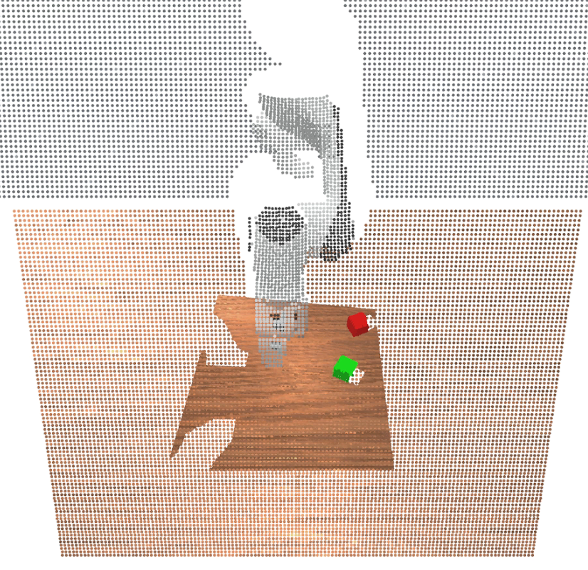

pip install "pyglet<2" # make sure to install this dependency
python -m mani_skill.examples.demo_vis_pcd -e "StackCube-v1"

/home/kewei/17robo/ManiSkill/mani_skill/examples/demo_vis_pcd.py
这个文件也要改

在 `demo_vis_pcd.py` 的第 46 行：

`pcd = trimesh.points.PointCloud(xyz, colors)`

你需要在 `xyz` 和 `colors` 变量上 **调用 `.cpu().numpy()`** 来确保它们是 CPU 上的 NumPy 数组，而不是 GPU Tensor。

**修改代码：**

`pcd = trimesh.points.PointCloud(xyz.cpu().numpy(), colors.cpu().numpy())`

## 可视化分割数据[#](https://maniskill.readthedocs.io/en/latest/user_guide/demos/scripts.html#visualize-segmentation-data "此标题的永久链接")

可以运行以下命令来可视化分段数据

python -m mani_skill.examples.demo_vis_segmentation -e "StackCube-v1"
python -m mani_skill.examples.demo_vis_segmentation -e "StackCube-v1" \
  --id id_of_part # mask out everything but the selected part

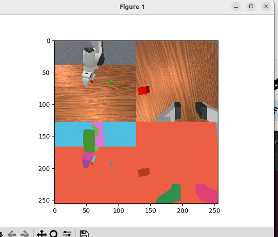

这一句命令目前还有报错

Visualizing 2 RGBD cameras
ID to Actor/Link name mappings
0: Background
1: Link, name - panda_link0
2: Link, name - panda_link1
3: Link, name - panda_link2
4: Link, name - panda_link3
5: Link, name - panda_link4
6: Link, name - panda_link5
7: Link, name - panda_link6
8: Link, name - panda_link7
9: Link, name - panda_link8
10: Link, name - panda_hand
11: Link, name - panda_hand_tcp
12: Link, name - panda_leftfinger
13: Link, name - panda_rightfinger
14: Link, name - camera_base_link
15: Link, name - camera_link
16: Actor, name - table-workspace
17: Actor, name - ground
18: Actor, name - cubeA
19: Actor, name - cubeB
Traceback (most recent call last):
  File "/home/kewei/micromamba/envs/dl/lib/python3.9/runpy.py", line 197, in _run_module_as_main
    return _run_code(code, main_globals, None,
  File "/home/kewei/micromamba/envs/dl/lib/python3.9/runpy.py", line 87, in _run_code
    exec(code, run_globals)
  File "/home/kewei/17robo/ManiSkill/mani_skill/examples/demo_vis_segmentation.py", line 144, in <module>
    main(parse_args())
  File "/home/kewei/17robo/ManiSkill/mani_skill/examples/demo_vis_segmentation.py", line 118, in main
    selected_id = reverse_seg_id_map[selected_id]
KeyError: 'id_of_part'

## 可视化相机纹理（RGB、深度、反照率等）[#](https://maniskill.readthedocs.io/en/latest/user_guide/demos/scripts.html#visualize-camera-textures-rgb-depth-albedo-etc "此标题的永久链接")

可以运行以下命令来可视化相机生成的任意数量的纹理。请注意，默认情况下使用的着色器是“默认”着色器，它输出可能需要的几乎所有纹理。请参阅[相机和着色器页面](https://maniskill.readthedocs.io/en/latest/user_guide/demos/scripts.html#../../)

python -m mani_skill.examples.demo_vis_textures -e "StackCube-v1" -o rgb+depth
python -m mani_skill.examples.demo_vis_textures -e "OpenCabinetDrawer-v1" -o rgb+depth+albedo+normal

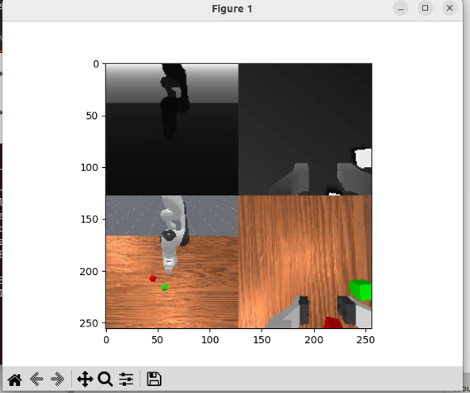


## 可视化重置分布[#](https://maniskill.readthedocs.io/en/latest/user_guide/demos/scripts.html#visualize-reset-distributions "此标题的永久链接")

确定强化学习和模仿学习等机器学习算法的任务难度在很大程度上取决于任务的重置分布。要查看任何任务的重置分布（重复 env.reset 调用的结果），可以运行以下命令将视频保存到`videos`文件夹中

python -m mani_skill.examples.demo_reset_distribution -e "PegInsertionSide-v1" --record-dir="videos"

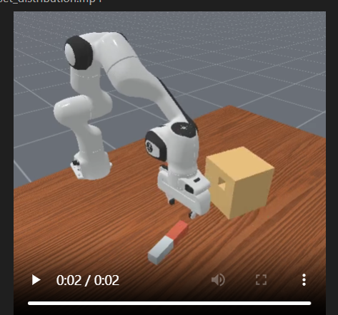

## 可视化任意机器人[#](https://maniskill.readthedocs.io/en/latest/user_guide/demos/scripts.html#visualize-any-robot "此标题的永久链接")

运行以下命令打开查看器，显示空场景中给定的任意机器人（只有地板）。如果要可视化任何预定义的关键帧，还可以指定不同的关键帧。

python -m mani_skill.examples.demo_robot -r "panda"

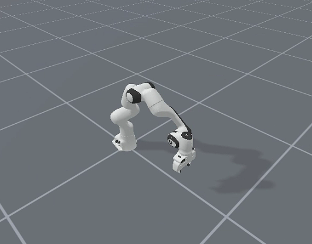
