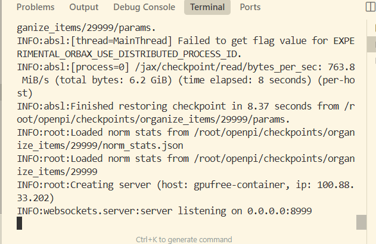
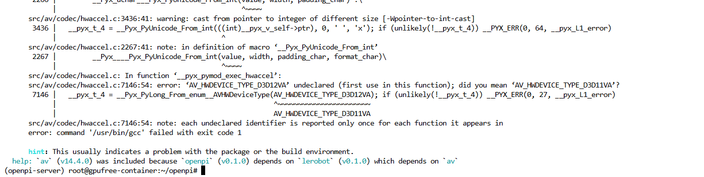
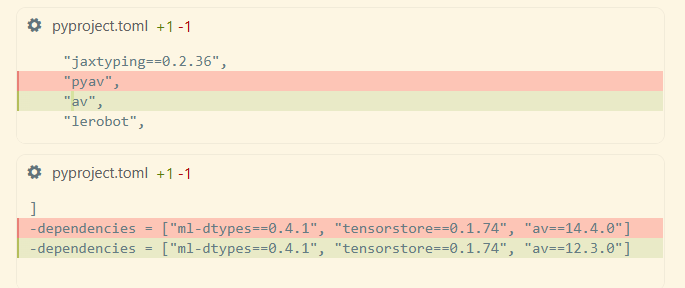
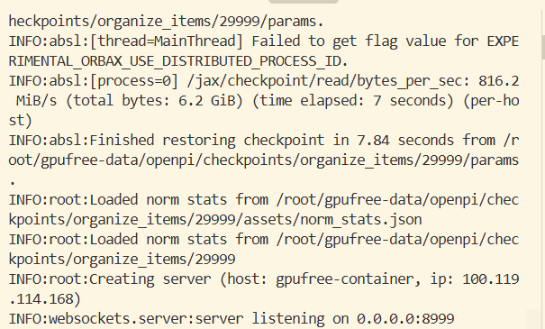
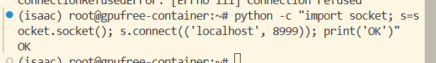
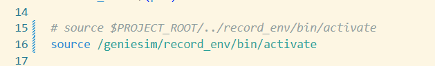
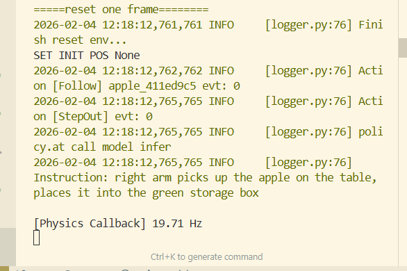

# 1、openpi部署服务端

GenieSim一键启动视频教程：https://www.datawhale.cn/learn/content/258/6172


```bash
cd /root/openpi

XLA_PYTHON_CLIENT_MEM_FRACTION=0.7 uv run scripts/serve_policy.py --host='0.0.0.0' --port=8999 policy:checkpoint --policy.config=organize_items --policy.dir ./checkpoints/organize_items/29999
也可以执行
python scripts/serve_policy.py --host='0.0.0.0' --port=8999 policy:checkpoint --policy.config=organize_items --policy.dir ./checkpoints/organize_items/29999
# 原因：启动命令的uv run会重新创建一个虚拟环境而不是使用已经创建的openpi-server虚拟环境。把uv run换成python就可以了，然后这个命令自动下载的openpi相关模型保存在~/.cache/openpi下，如果用户误删再重新下载会很麻烦。所以也需要说明一下，不要随便删文件
```


---

出现这个ip就算成功



如果av有版本报错，根据lerobot的依赖改成pyav（这个新版镜像已经给大家修复了）

需要修改一个地方



需要修改pyproject.toml 



# 2、GenieSim客户端



```
(isaac) root@gpufree-container:~# ssh -CNg -L 8999:127.0.0.1:8999 root@100.88.33.251
root@100.119.114.168's password: 
(需要看下服务端日志显示的ip地址)
密码xxxxx
python -c "import socket; s=socket.socket(); s.connect(('localhost', 8000)); print('OK')"

```




下载资产（这里我们的镜像已经给大家配置好了，不需要再额外配置）：

```
clone下载到
genie_sim/source/geniesim/assets
https://modelscope.cn/datasets/agibot_world/GenieSimAssets

```

设置环境变量（已经在服务器镜像的.bashrc给大家配置好，这里不需要额外配置）

```
# 1. 设置基础变量
export SIM_REPO_ROOT=/root/genie_sim


# 5. 设置 API Key
export BASE_URL="https://dashscope.aliyuncs.com/compatible-mode/v1"
export API_KEY="sk-"
export MODEL="qwen3-max"
export VL_MODEL="qwen3-vl-plus"

# 6. 设置 Genie Sim 环境变量
export SIM_ASSETS=$SIM_REPO_ROOT/source/geniesim/assets

```

然后

```
cd /root/genie_sim

/isaac-sim/python.sh source/geniesim/app/app.py --config source/geniesim/config/organize_items.yaml
或者
omni_python source/geniesim/app/app.py --config source/geniesim/config/organize_items.yaml

```

就可以看到渲染仿真器执行动作了

# 3、录制仿真结果

替换
/root/genie_sim/scripts/auto_record_and_extract.py

为当前教程文件夹下 [auto_record_and_extract.py](auto_record_and_extract.py) 

```
修改
/root/genie_sim/scripts/start_auto_record.sh

```



```
cd /root/genie_sim

/isaac-sim/python.sh source/geniesim/app/app.py --config source/geniesim/config/organize_items_record.yaml
或者
omni_python source/geniesim/app/app.py --config source/geniesim/config/organize_items_record.yaml


```

然后新开一个terminal

等待出现仿真频率



```
cd /root/genie_sim
bash scripts/start_auto_record.sh
```

然后cmap文件会在仿真结束后自动解析并保存为mp4

```
ls /root/genie_sim/output/recording_data/recording_data/place_object_into_box_color/recording_20260204_121814/recording_20260204_121814_0.mcap -lh
```


如果已经有了mcap

```
# 进入项目根目录
cd /root/genie_sim

# 使用新增加的 --bag_path 参数指向你已有的录制文件夹
python3 scripts/auto_record_and_extract.py \
  --bag_path "/root/genie_sim/output/recording_data/recording_data/place_object_into_box_color/recording_20260204_141040"  #--delete_db3_after 可选，决定是否运行后删除mcap文件，因为文件较大
```

