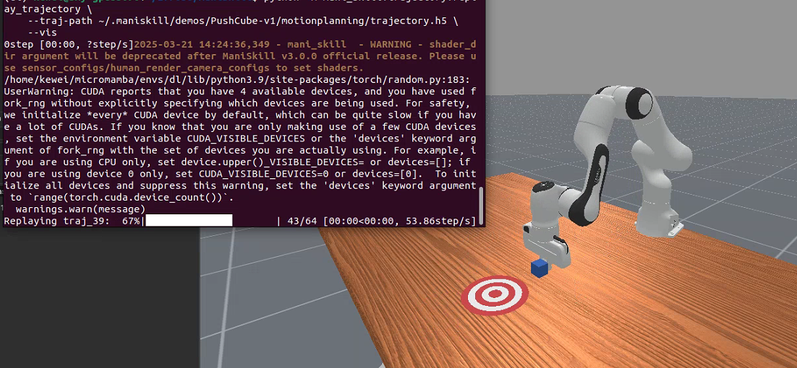
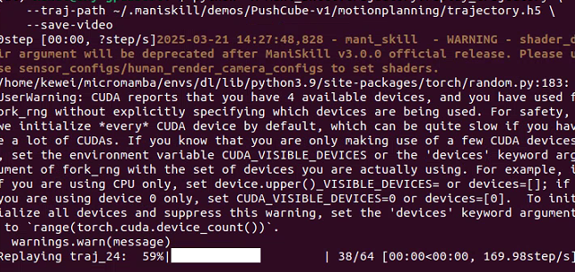
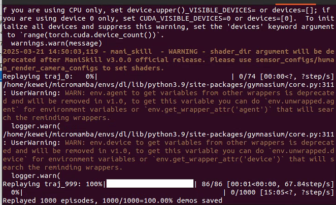
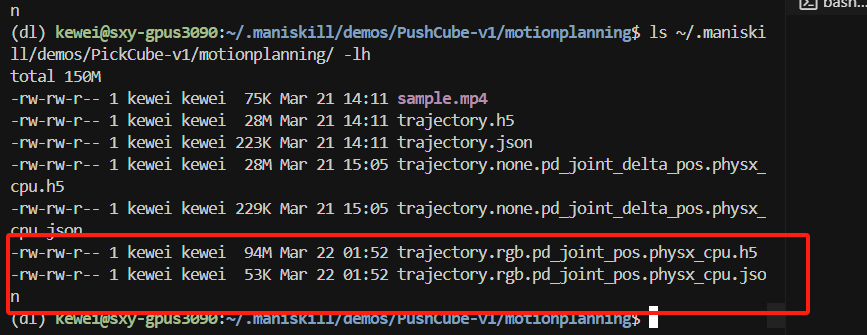

# 场景数据集

我们提供了一个命令行工具来下载场景数据集（通常是从原始数据集改编而来）。

ManiSkill 可以构建任何场景，只要提供了相关的资源。ManiSkill 默认提供了代码和下载链接，以便使用 [RoboCasa](https://github.com/robocasa/robocasa)、[ReplicaCAD](https://aihabitat.org/datasets/replica_cad/) 和 [AI2THOR](https://github.com/allenai/ai2thor) 等场景数据集（如下所示）。这些场景因其一般较高的建模质量和互动性而被选中。

ManiSkill 还支持异构 GPU 仿真，其中每个并行环境可以具有不同的物体和纹理。以下是由仿真器生成的鸟瞰图示例，展示了 RoboCasa 厨房场景

要开始使用这些场景，可以使用以下命令下载它们。请注意，如果在工作中使用这些场景，请同时引用 ManiSkill3 和场景数据集的作者。

```bash
# 列出所有可下载的场景数据集
python -m mani_skill.utils.download_asset --list "scene"
python -m mani_skill.utils.download_asset ReplicaCAD # 小场景，下载速度快
python -m mani_skill.utils.download_asset RoboCasa # 大量程序生成的场景，下载速度快
python -m mani_skill.utils.download_asset AI2THOR # 大量场景，下载速度慢
```

## 探索场景数据集

要探索场景数据集，可以提供环境 ID 和种子（如果有多个可用场景，可更改采样的场景），并运行随机动作脚本。下面展示了已经配置好的各种环境，可以用来与 RoboCasa、ReplicaCAD 和 ArchitecTHOR（AI2THOR 的一个变体）进行交互。

```bash
python -m mani_skill.examples.demo_random_action \
  -e "ReplicaCAD_SceneManipulation-v1" \
  --render-mode="rgb_array" --record-dir="videos" # 无头模式运行并保存视频

python -m mani_skill.examples.demo_random_action \
  -e "ArchitecTHOR_SceneManipulation-v1" --render-mode="human" \
  -s 3 # 打开 GUI 并使用种子 3 采样一个场景

# 加载 4 个环境并使用种子 0, 1, 2, 3 采样场景
# 使用 fetch 机器人
python -m mani_skill.examples.demo_random_action \
  -e "RoboCasaKitchen-v1" \
  -n 4 -s 0 1 2 3 \
  --render-mode="human" -r "fetch"
```

还可以传递 `-r "none"` 来在没有任何智能体的情况下运行环境。

## 在场景数据集上进行训练

像 ReplicaCAD 和 AI2THOR 这样的大型场景数据集，包含数百个物体，可以用于训练更通用的机器人/智能体，并且还可以作为合成数据生成的来源。我们仍在提供更多示例代码和文档的过程中，以便更好地利用这些场景数据集，但目前我们提供了代码来探索和与这些场景数据集进行交互。

### 强化学习 / 模仿学习

我们目前正在构建类似于 ReplicaCAD Rearrange 挑战的任务代码，并将在完成后开源。除此之外，目前没有任何训练任务具有定义的成功/失败条件和/或奖励，并且使用任何大型场景数据集。

# 演示

我们提供了一个命令行工具，可以通过任务 ID 从我们的 [Hugging Face 🤗 数据集](https://huggingface.co/datasets/haosulab/ManiSkill_Demonstrations)直接下载演示。该工具将演示文件下载到一个文件夹，并且还会下载一些展示演示外观的视频。有关所有支持的任务及其演示的列表，请参见 [任务](https://7mlcen.aitianhu6.top/tasks/index.md)。

```bash
# 下载特定任务的演示数据集
python -m mani_skill.utils.download_demo ${ENV_ID}
python -m mani_skill.utils.download_demo # 没有参数时，这会打印所有可用的数据集
# 下载完整的数据集（可能非常慢）
python -m mani_skill.utils.download_demo all
```

演示数据集通常以简化格式存储（例如，不包含观察数据），而是存储环境状态以进行压缩。我们提供了一个灵活的工具，可以重播演示数据集并修改它们，例如添加视觉观察数据、录制视频等，详见 [轨迹重播文档](https://7mlcen.aitianhu6.top/datasets/replay.md)。如果希望在本地生成原始的压缩数据集，我们将用于数据集生成的所有脚本保存在 [data_generation](https://github.com/haosulab/ManiSkill/tree/main/scripts/data_generation) 文件夹中。对于希望基准化模仿学习的用户，我们强烈建议遵循 [模仿学习设置页面](https://7mlcen.aitianhu6.top/learning_from_demos/setup.md) 上的说明，了解如何重播压缩数据集以进行训练数据集的基准测试。

## 格式

每个任务的所有演示都以 HDF5 格式保存，可以通过 [h5py](https://github.com/h5py/h5py) 打开。每个 HDF5 数据集命名为 `trajectory.{obs_mode}.{control_mode}.{sim_backend}.h5`，并且有一个与其同名的 JSON 元数据文件。除非另有说明，`trajectory.h5` 是 `trajectory.none.pd_joint_pos.physx_cpu.h5` 的简写，其中包含由 `pd_joint_pos` 控制器生成的原始演示，使用 `none` 观察模式（空观察数据）并在基于 CPU 的仿真中生成。然而，可能存在由其他控制器生成的演示。**因此，请检查关联的 JSON 文件以确保使用了哪个控制器。**

## 元信息 (JSON)

每个 JSON 文件包含：

- `env_info`（字典）：任务（也称为环境）信息，可用于初始化任务
  - `env_id`（字符串）：任务 ID
  - `max_episode_steps`（整数）
  - `env_kwargs`（字典）：初始化任务的关键字参数。**这是重现环境所必需的。**
- `episodes`（列表[字典]）：回合信息
- `source_type`（可选[字符串]）：一个简单的分类字符串，描述生成轨迹数据的过程。
- `source_desc`（可选[字符串]）：对数据生成过程的更长解释。

回合信息（`episodes` 的元素）包括：

- `episode_id`（整数）：回合的唯一 ID
- `reset_kwargs`（字典）：重置任务的关键字参数。**重现轨迹时必须使用这些参数。**
- `control_mode`（字符串）：用于该回合的控制模式。
- `elapsed_steps`（整数）：轨迹长度
- `info`（字典）：回合结束时的信息。

仅凭元数据，通常可以重现任务，就像它在收集轨迹时创建的方式一样：

```python
env = gym.make(env_info["env_id"], **env_info["env_kwargs"])
episode = env_info["episodes"][0] # 选择第一个
env.reset(**episode["reset_kwargs"])
```

有时轨迹数据是在 GPU 仿真中收集的，这意味着随机化不仅依赖于种子，还依赖于并行环境的数量。为了确保相同的起始状态，可以使用存储在轨迹中的第一个环境状态数据，并相应地设置环境状态。

## 轨迹数据 (HDF5)

每个 HDF5 演示数据集由多个轨迹组成。每个轨迹的键是 `traj_{episode_id}`，例如，`traj_0`。

每个轨迹是一个 `h5py.Group`，其中包含：

- actions: [T, A]，`np.float32`。`T` 是转移次数。
- terminated: [T]，`np.bool_`。表示任务是否在每个时间步结束。
- truncated: [T]，`np.bool_`。表示任务是否在每个时间步被截断。
- env_states: [T+1, D]，`np.float32`。环境状态。可以用来通过 `env.set_state_dict` 将环境设置为特定状态。然而，这可能不足以重现轨迹。
- success（可选）：[T]，`np.bool_`。表示任务在每个时间步是否成功。如果任务定义了成功，则包括该字段。
- fail（可选）：[T]，`np.bool_`。表示任务在每个时间步是否失败。如果任务定义了失败，则包括该字段。
- obs（可选）：[T+1, D] 观察数据。

注意，`env_states` 是以字典形式存储的（观察数据也可能如此，具体取决于观察模式），它被格式化为一个列表字典。例如，典型的环境状态如下所示：

```python
env_state = env.get_state_dict()
"""
env_state = {
  "actors": {
    "actor_id": [...numpy_actor_state...],
    ...
  },
  "articulations": {
    "articulation_id": [...numpy_articulation_state...],
    ...
  }
}
"""
```

在轨迹文件中，`env_states` 将具有相同的结构，但字典中的每个值/叶子节点将是一个表示该实体在仿真中随时间变化的状态序列。

在实践中，使用 `env_states` 数据的切片（或观察数据）可能会更有用，可以通过以下方式完成：

```python
import mani_skill.trajectory.utils as trajectory_utils
env_states = trajectory_utils.dict_to_list_of_dicts(env_states)
# 现在 env_states[i] 就是 env.get_state_dict() 在第 i 个时间步返回的数据
i = 10
env_state_i = trajectory_utils.index_dict(env_states, i)
# 现在 env_state_i 就是 env.get_state_dict() 在第 i 个时间步返回的数据
```

这些工具也用于我们提供的 PyTorch 数据集实现，详细信息见下一部分。

## 加载轨迹数据集

### PyTorch

我们提供了一个示例方式来构建 PyTorch 数据集，并轻松加载轨迹 .h5 数据，具体请见 https://github.com/haosulab/ManiSkill/tree/main/mani_skill/trajectory/datasets.py。虽然它不是超级优化的，但展示了如何灵活地处理我们的数据格式。代码副本已粘贴在下面的下拉框中。

:::{dropdown} dataset.py
:color: primary
:icon: code

```python
from typing import Union
import h5py
import numpy as np
from torch.utils.data import Dataset
from tqdm import tqdm

from mani_skill.utils.io_utils import load_json
from mani_skill.utils import sapien_utils
from mani_skill.utils import common

# loads h5 data into memory for faster access
def load_h5_data(data):
    out = dict()
    for k in data.keys():
        if isinstance(data[k], h5py.Dataset):
            out[k] = data[k][:]
        else:
            out[k] = load_h5_data(data[k])
    return out

class ManiSkillTrajectoryDataset(Dataset):
    """
    一个通用的 PyTorch 数据集，可以立即使用它加载任何由 ManiSkill 生成的轨迹 .h5 数据。
    这个类只是一个简单的起始代码，用于轻松加载轨迹数据，但不做任何数据转换或高级操作
    我们建议直接复制此代码并根据更高级的用例进行修改

    参数：
        dataset_file (str): 要加载的数据 .h5 文件的路径
        load_count (int): 要加载到内存中的轨迹数量。如果为 -1，将加载所有数据
        success_only (bool): 是否跳过最终不成功的轨迹。默认为 False
        device: 数据保存的位置。如果为 None，将以 numpy 格式存储（默认），否则会将数据移动到指定的设备上
    """

    def __init__(self, dataset_file: str, load_count=-1, success_only: bool = False, device = None) -> None:
        self.dataset_file = dataset_file
        self.device = device
        self.data = h5py.File(dataset_file, "r")
        json_path = dataset_file.replace(".h5", ".json")
        self.json_data = load_json(json_path)
        self.episodes = self.json_data["episodes"]
        self.env_info = self.json_data["env_info"]
        self.env_id = self.env_info["env_id"]
        self.env_kwargs = self.env_info["env_kwargs"]

        self.obs = None
        self.actions = []
        self.terminated = []
        self.truncated = []
        self.success, self.fail, self.rewards = None, None, None
        if load_count == -1:
            load_count = len(self.episodes)
        for eps_id in tqdm(range(load_count)):
            eps = self.episodes[eps_id]
            if success_only: 
                assert "success" in eps, "episodes in this dataset do not have the success attribute, cannot load dataset with success_only=True"
                if not eps["success"]:
                    continue
            trajectory = self.data[f"traj_{eps['episode_id']}"]
            trajectory = load_h5_data(trajectory)
            eps_len = len(trajectory["actions"])

            # exclude the final observation as most learning workflows do not use it
            obs = common.index_dict_array(trajectory["obs"], slice(eps_len))
            if eps_id == 0:
                self.obs = obs
            else:
                self.obs = common.append_dict_array(self.obs, obs)

            self.actions.append(trajectory["actions"])
            self.terminated.append(trajectory["terminated"])
            self.truncated.append(trajectory["truncated"])

            # handle data that might optionally be in the trajectory
            if "rewards" in trajectory:
                if self.rewards is None:
                    self.rewards = [trajectory["rewards"]]
                else:
                    self.rewards.append(trajectory["rewards"])
            if "success" in trajectory:
                if self.success is None:
                    self.success = [trajectory["success"]]
                else:
                    self.success.append(trajectory["success"])
            if "fail" in trajectory:
                if self.fail is None:
                    self.fail = [trajectory["fail"]]
                else:
                    self.fail.append(trajectory["fail"])

        self.actions = np.vstack(self.actions)
        self.terminated = np.concatenate(self.terminated)
        self.truncated = np.concatenate(self.truncated)

        if self.rewards is not None:
            self.rewards = np.concatenate(self.rewards)
        if self.success is not None:
            self.success = np.concatenate(self.success)
        if self.fail is not None:
            self.fail = np.concatenate(self.fail)

        def remove_np_uint16(x: Union[np.ndarray, dict]):
            if isinstance(x, dict):
                for k in x.keys():
                    x[k] = remove_np_uint16(x[k])
                return x
            else:
                if x.dtype == np.uint16:
                    return x.astype(np.int32)
                return x

        # uint16 dtype is used to conserve disk space and memory
        # you can optimize this dataset code to keep it as uint16 and process that
        # dtype of data yourself. for simplicity we simply cast to a int32 so
        # it can automatically be converted to torch tensors without complaint
        self.obs = remove_np_uint16(self.obs)

        if device is not None:
            self.actions = sapien_utils.to_tensor(self.actions, device=device)
            self.obs = sapien_utils.to_tensor(self.obs, device=device)
            self.terminated = sapien_utils.to_tensor(self.terminated, device=device)
            self.truncated = sapien_utils.to_tensor(self.truncated, device=device)
            if self.rewards is not None:
                self.rewards = sapien_utils.to_tensor(self.rewards, device=device)
            if self.success is not None:
                self.success = sapien_utils.to_tensor(self.terminated, device=device)
            if self.fail is not None:
                self.fail = sapien_utils.to_tensor(self.truncated, device=device)
    def __len__(self):
        return len(self.actions)


    def __getitem__(self, idx):
        action = sapien_utils.to_tensor(self.actions[idx], device=self.device)
        obs = common.index_dict_array(self.obs, idx, inplace=False)

        res = dict(
            obs=obs,
            action=action,
            terminated=self.terminated[idx],
            truncated=self.truncated[idx],
        )
        if self.rewards is not None:
            res.update(reward=self.rewards[idx])
        if self.success is not None:
            res.update(success=self.success[idx])
        if self.fail is not None:
            res.update(fail=self.fail[idx])
        return res
```

:::

# 轨迹重播/转换

ManiSkill 提供了工具，不仅可以收集/加载轨迹，还可以重播轨迹并转换观察/动作。

要重播演示（不改变观察模式和控制模式）：

```bash
# 通过 sapien viewer 重播并查看轨迹
python -m mani_skill.trajectory.replay_trajectory \
    --traj-path ~/.maniskill/demos/PushCube-v1/motionplanning/trajectory.h5 \
    --vis

# 保存轨迹的视频（保存到与轨迹相同的目录）
python -m mani_skill.trajectory.replay_trajectory \
    --traj-path ~/.maniskill/demos/PushCube-v1/motionplanning/trajectory.h5 \
    --save-video

# 查看所有可用选项
python -m mani_skill.trajectory.replay_trajectory -h
```

结果分别如下





:::{note}
该脚本要求 `trajectory.h5` 和 `trajectory.json` 文件都位于相同目录下。
:::

默认情况下，原始演示文件包含重现轨迹所需的所有必要信息（例如初始状态、动作、种子）。由于没有后处理，观察数据通常不包含在内，因为它们可能导致文件大小过大。此外，这些文件中的动作不涵盖所有控制模式。因此，需要将原始文件转换为所需的观察和控制模式。我们提供了一个实用脚本，使用方式如下：

```bash
# 重播演示，控制模式为 pd_joint_delta_pos
python -m mani_skill.trajectory.replay_trajectory \
  --traj-path ~/.maniskill/demos/PickCube-v1/motionplanning/trajectory.h5 \
  --save-traj --target-control-mode pd_joint_delta_pos \
  --obs-mode none #--num-procs 10
```



:::{dropdown} 点击查看轨迹重播工具选项

```
╭─ options ──────────────────────────────────────────────────────────────────────────────────────────────────────────────────────────────────────╮
│ -h, --help              显示此帮助信息并退出                                                                                                      │
│ --traj-path STR         要重播的轨迹 .h5 文件路径（必需）                                                                                         │
│ --sim-backend {None}|STR, -b {None}|STR                                                                                                          │
│                         使用的仿真后端，可以是 'physx_cpu' 或 'physx_gpu'。如果未指定，默认使用收集轨迹数据时的后端。（默认：None）               │
│ --obs-mode {None}|STR, -o {None}|STR                                                                                                             │
│                         要记录到轨迹中的目标观察模式。请参见                                                                                     │
│                         https://maniskill.readthedocs.io/en/latest/user_guide/concepts/observation.html 获取完整的支持的观察模式列表。（默认：None） │
│ --target-control-mode {None}|STR, -c {None}|STR                                                                                                │
│                         要转换为的目标控制模式。                                                                                               │
│                         注意，并非所有控制模式可以成功转换，且并非所有机器人都有容易转换的控制模式。                                           │
│                         目前 Panda 机器人在控制模式转换方面支持得最好。此外，在 GPU 并行化环境中不支持控制模式转换。（默认：None）            │
│ --verbose, --no-verbose                                                                                                                        │
│                         是否在轨迹重播过程中打印详细信息（默认：False）                                                                       │
│ --save-traj, --no-save-traj                                                                                                                    │
│                         是否保存轨迹到磁盘。这不会覆盖原始轨迹文件。（默认：False）                                                           │
│ --save-video, --no-save-video                                                                                                                  │
│                         是否保存视频（默认：False）                                                                                             │
│ --num-procs INT         用于并行化轨迹重播过程的进程数。对于 CPU 后端，通常通过 Python 多进程并行化。                                               │
│                         对于像 physx_gpu 这样的并行仿真后端，这将在单个 Python 进程内通过利用 GPU 来并行化。（默认：1）                             │
│ --max-retry INT         在任务成功结束前，重播轨迹的最大尝试次数。（默认：0）                                                                  │
│ --discard-timeout, --no-discard-timeout                                                                                                        │
│                         是否丢弃超时并被截断的回合（取决于任务的 max_episode_steps 参数）                                                     │
│                         （默认：False）                                                                                                       │
│ --allow-failure, --no-allow-failure                                                                                                            │
│                         是否包含失败的回合，在保存的视频和轨迹数据中根据环境的评估返回的 "success" 标签决定                                          │
│                         （默认：False）                                                                                                       │
│ --vis, --no-vis         是否通过 GUI 可视化轨迹重播。（默认：False）                                                                            │
│ --use-env-states, --no-use-env-states                                                                                                          │
│                         是否通过环境状态重播，而不是通过动作。这可以保证环境在每个步骤看起来与原始轨迹完全相同。（默认：False）                      │
│ --use-first-env-state, --no-use-first-env-state                                                                                                │
│                         是否使用轨迹中的第一个环境状态来设置初始状态。这对于尝试将收集自 CPU 仿真中的演示重播到 GPU 仿真中非常有用，因为 GPU         │
│                         仿真即使给定相同种子也会以不同的方式随机化初始状态。（默认：False）                                                      │
│ --count {None}|INT      要重播的演示数量，直到退出。默认情况下将重播所有演示（默认：None）                                                    │
│ --reward-mode {None}|STR                                                                                                                       │
│                         指定环境应使用的奖励类型。默认情况下将选择第一个支持的奖励模式。大多数环境支持 'sparse'、'none'，有些还支持 'normalized_dense' │
│                         和 'dense' 奖励模式（默认：None）                                                                                       │
│ --record-rewards, --no-record-rewards                                                                                                          │
│                         是否在重播的轨迹中包含奖励（默认：False）                                                                              │
│ --shader {None}|STR     更改所有相机渲染使用的着色器。默认情况下使用原始数据收集时使用的着色器。可以选择 'rt' 进行光线追踪生成逼真的渲染，            │
│                         也可以选择 'rt-fast' 进行更快但质量较低的光线追踪渲染。（默认：None）                                                 │
│ --video-fps {None}|INT  保存视频的 FPS。默认为控制频率（默认：None）                                                                           │
│ --render-mode STR       用于保存视频的渲染模式。通常还包括 'sensors' 和 'all' 渲染模式，进一步渲染所有传感器输出，如相机。（默认：rgb_array）         │
│ --num-envs INT, -n INT  要运行的环境数量以重播轨迹。对于 CPU 后端，通常通过 Python 多进程并行化。                                                 │
│                         对于像 physx_gpu 这样的并行仿真后端，这将在单个 Python 进程内通过利用 GPU 来并行化。（默认：1）                             │
╰────────────────────────────────────────────────────────────────────────────────────────────────────────────────────────────────────────────────╯
```

但是最新的参数出现了变化

╭─ 选项 ──────────────────────────────────────────────────────────────────╮
│ -h, --help                                                                 │
│     显示帮助信息并退出                                                     │
│ --traj-path STR                                                            │
│     需要回放的轨迹 .h5 文件路径（必需）                                     │
│ -b {None}|STR, --sim-backend {None}|STR                                    │
│     使用的仿真后端。可以是 'physx_cpu' 或 'physx_gpu'。如果未指定，      │
│     默认使用收集轨迹数据时使用的后端。（默认：None）                         │
│ -o {None}|STR, --obs-mode {None}|STR                                       │
│     目标观察模式，用于记录轨迹中的观察数据。查看                          │
│     https://maniskill.readthedocs.io/en/latest/user_guide/concepts/observ… │
│     获取支持的所有观察模式的完整列表。（默认：None）                      │
│ -c {None}|STR, --target-control-mode {None}|STR                            │
│     目标控制模式，用于将示范动作转换为其他控制模式。注意，并非所有的控制 │
│     模式都能成功转换，并且并非所有机器人都支持轻松转换控制模式。          │
│     目前，Panda 机器人在控制模式转换方面支持最好。并且，在 GPU 并行化环境 │
│     下不支持控制模式转换。（默认：None）                                  │
│ --verbose, --no-verbose                                                    │
│     是否在回放轨迹时打印详细信息。（默认：False）                          │
│ --save-traj, --no-save-traj                                                │
│     是否将轨迹保存到磁盘。此操作不会覆盖原始轨迹文件。（默认：False）        │
│ --save-video, --no-save-video                                              │
│     是否保存视频。（默认：False）                                          │
│ --max-retry INT                                                            │
│     回放轨迹时最大重试次数，直到任务在结束时达到成功状态。（默认：0）      │
│ --discard-timeout, --no-discard-timeout                                    │
│     是否丢弃超时并被截断的回合（取决于任务的 max_episode_steps 参数）      │
│     （默认：False）                                                        │
│ --allow-failure, --no-allow-failure                                        │
│     是否在保存的视频和轨迹数据中包含失败的回合，基于环境的评估返回的“成功” │
│     标签。（默认：False）                                                  │
│ --vis, --no-vis                                                            │
│     是否通过 GUI 可视化回放轨迹。（默认：False）                            │
│ --use-env-states, --no-use-env-states                                      │
│     是否使用环境状态而不是动作进行回放。这样可以保证环境的每一步状态与      │
│     原始轨迹完全相同。（默认：False）                                        │
│ --use-first-env-state, --no-use-first-env-state                            │
│     使用轨迹中的第一个环境状态来设置初始状态。对于尝试在 GPU 仿真中回放    │
│     在 CPU 仿真中收集的示范，这非常有用，因为 GPU 仿真会与 CPU 仿真         │
│     使用相同种子时随机化初始状态。（默认：False）                          │
│ --count {None}|INT                                                         │
│     在退出之前回放的示范数量。默认情况下，将回放所有示范。（默认：None）   │
│ --reward-mode {None}|STR                                                   │
│     指定环境应使用的奖励类型。默认情况下将选择第一个支持的奖励模式。大多数 │
│     环境支持 'sparse'、'none'，有些环境还支持 'normalized_dense' 和       │
│     'dense' 奖励模式。（默认：None）                                       │
│ --record-rewards, --no-record-rewards                                      │
│     是否在回放的轨迹中包含奖励。（默认：False）                           │
│ --shader {None}|STR                                                        │
│     更改所有摄像机渲染使用的着色器。默认值为 none，即使用原始数据收集时 │
│     使用的着色器或环境默认着色器。也可以设置为 'rt' 来启用光线追踪，生成 │
│     照片级逼真渲染。还可以设置为 'rt-fast' 来启用更快但质量较低的光线追踪 │
│     渲染器。（默认：None）                                                  │
│ --video-fps {None}|INT                                                     │
│     保存视频的帧率。默认为控制频率。（默认：None）                         │
│ --render-mode STR                                                          │
│     保存视频时使用的渲染模式。通常还有 'sensors' 和 'all' 渲染模式，      │
│     可以渲染所有传感器输出，如摄像头。（默认：rgb_array）                  │
│ -n INT, --num-envs INT                                                     │
│     用于回放轨迹的环境数量。对于 CPU 后端，通常通过 Python 多进程并行化。   │
│     对于像 physx_gpu 这样的并行仿真后端，通常通过在单个 Python 进程中利用 │
│     GPU 并行化。（默认：1）                                                 │
╰────────────────────────────────────────────────────────────────────────────╯

下面的表格列出了旧版本与新版本中各个参数的对比情况：

| 参数                                                    | 旧版本描述                                                                            | 新版本描述                            | 备注           |
| ----------------------------------------------------- | -------------------------------------------------------------------------------- | -------------------------------- | ------------ |
| **--traj-path STR**                                   | 需要回放的轨迹 .h5 文件路径（必需）                                                             | 需要回放的轨迹 .h5 文件路径（必需）             | 无变化          |
| **--sim-backend {None}\|STR, -b {None}\|STR**         | 使用的仿真后端，可选 'physx_cpu' 或 'physx_gpu'。未指定时默认使用收集轨迹时使用的后端。（默认：None）                | 同旧版本描述                           | 无变化          |
| **--obs-mode {None}\|STR, -o {None}\|STR**            | 目标观察模式，用于记录轨迹中的观察数据。参见文档获取支持的观察模式列表。（默认：None）                                    | 同旧版本描述                           | 无变化          |
| **--target-control-mode {None}\|STR, -c {None}\|STR** | 目标控制模式，用于将示范动作转换为其他控制模式。注意不是所有控制模式都能成功转换，目前 Panda 机器人支持最佳；GPU 环境下不支持转换。（默认：None） | 同旧版本描述                           | 无变化          |
| **--verbose, --no-verbose**                           | 是否在轨迹重播过程中打印详细信息。（默认：False）                                                      | 是否在回放轨迹时打印详细信息。（默认：False）        | 描述略有不同，但功能相同 |
| **--save-traj, --no-save-traj**                       | 是否保存轨迹到磁盘，不会覆盖原始轨迹文件。（默认：False）                                                  | 是否将轨迹保存到磁盘，不会覆盖原始轨迹文件。（默认：False） | 无变化          |
| **--save-video, --no-save-video**                     | 是否保存视频。（默认：False）                                                                | 是否保存视频。（默认：False）                | 无变化          |
| **--num-procs INT**                                   | 用于并行化轨迹重播过程的进程数。CPU 后端通过 Python 多进程并行；physx_gpu 后端在单进程内利用 GPU 并行化。（默认：1）         | **已删除**                          | 新版本中移除了该参数   |
| **--max-retry INT**                                   | 回放轨迹时最大重试次数，直到任务在结束时达到成功状态。（默认：0）                                                | 同旧版本描述                           | 无变化          |
| **--discard-timeout, --no-discard-timeout**           | 是否丢弃超时并被截断的回合（取决于任务的 max_episode_steps 参数）。（默认：False）                            | 同旧版本描述                           | 无变化          |
| **--allow-failure, --no-allow-failure**               | 是否在保存的视频和轨迹数据中包含失败的回合，依据环境评估返回的 "success" 标签决定。（默认：False）                        | 同旧版本描述                           | 无变化          |
| **--vis, --no-vis**                                   | 是否通过 GUI 可视化轨迹重播。（默认：False）                                                      | 同旧版本描述                           | 无变化          |
| **--use-env-states, --no-use-env-states**             | 是否使用环境状态而非动作进行回放，保证环境在每一步与原始轨迹一致。（默认：False）                                      | 同旧版本描述                           | 无变化          |
| **--use-first-env-state, --no-use-first-env-state**   | 是否使用轨迹中的第一个环境状态作为初始状态，用于在 GPU 仿真中重播 CPU 收集的示范。（默认：False）                         | 同旧版本描述                           | 无变化          |
| **--count {None}\|INT**                               | 在退出前回放的示范数量，默认回放所有示范。（默认：None）                                                   | 同旧版本描述                           | 无变化          |
| **--reward-mode {None}\|STR**                         | 指定环境使用的奖励类型，大多数环境支持 'sparse'、'none'，部分支持 'normalized_dense' 和 'dense'。（默认：None）  | 同旧版本描述                           | 无变化          |
| **--record-rewards, --no-record-rewards**             | 是否在回放轨迹中包含奖励。（默认：False）                                                          | 同旧版本描述                           | 无变化          |
| **--shader {None}\|STR**                              | 更改所有摄像机渲染使用的着色器。默认使用原始数据收集时或环境默认的着色器；可选 'rt'（光线追踪）或 'rt-fast'（快速光线追踪）。（默认：None）  | 同旧版本描述                           | 无变化          |
| **--video-fps {None}\|INT**                           | 保存视频的帧率，默认为控制频率。（默认：None）                                                        | 同旧版本描述                           | 无变化          |
| **--render-mode STR**                                 | 保存视频时使用的渲染模式，支持 'rgb_array'、'sensors'、'all' 等模式，后两者可渲染所有传感器数据。（默认：rgb_array）     | 同旧版本描述                           | 无变化          |
| **--num-envs INT, -n INT**                            | 用于回放轨迹的环境数量。CPU 后端通过 Python 多进程并行；physx_gpu 后端在单进程内利用 GPU 并行化。（默认：1）             | 同旧版本描述                           | 无变化          |

通过上表可以看出，最新版本主要移除了 **--num-procs** 参数，其余各参数及其功能基本保持一致。

:::

:::{caution}
由于某些演示是以非准静态方式收集的（在操作过程中物体没有固定在操纵器上）或某些具有挑战性的任务（例如 PushT-v1 或 PickSingleYCB-v1）需要高精度，因此，由于仿真中的非确定性，重播动作/转换动作可能会失败。因此，通过传递 `--use-env-states` 来重播轨迹并确保重播的状态/观察数据与原始轨迹相同是必需的。
:::

## 示例用法

由于轨迹重播工具功能丰富且复杂，我们建议几个示例工作流程，适用于各种用例。

### 将轨迹从一个控制模式重播到更易学习的控制模式

在机器学习工作流中，有时从一些控制模式（例如末端执行器控制模式）中学习会更容易。下面的示例正是这样做的：

```bash
python -m mani_skill.trajectory.replay_trajectory \
  --traj-path path/to/trajectory.h5 \
  -c pd_ee_delta_pose -o state \
  --save-traj
```

请注意，由于控制器和演示行为的固有差异，一些目标控制模式可能很难转换。

1. **PickCube-v1任务**：这是一个相对简单的任务，适合初步测试
   
   - `~/.maniskill/demos/PickCube-v1/rl/trajectory.none.pd_joint_delta_pos.physx_cuda.h5`（源控制模式：关节控制）
   - 转换目标：`pd_ee_delta_pose`（末端执行器姿态控制）

2. **PushCube-v1任务**：这是一个推箱子的任务，动作相对简单
   
   - `~/.maniskill/demos/PushCube-v1/rl/trajectory.none.pd_joint_delta_pos.physx_cuda.h5`（源控制模式：关节控制）
   - 转换目标：`pd_ee_delta_pos`（末端执行器位置控制）

3. **StackCube-v1任务**：这是一个更复杂的堆叠任务，需要更精确的控制
   
   - `~/.maniskill/demos/StackCube-v1/rl/trajectory.none.pd_ee_delta_pos.physx_cuda.h5`（源控制模式：末端执行器位置控制）
   - 转换目标：`pd_ee_delta_pose`（末端执行器姿态控制）

要查看测试效果，你可以：

1. **观察生成的轨迹文件**：重播后会生成一个新的 h5 文件，文件名中包含目标控制模式
2. **查看生成的视频**：使用 `--render-mode rgb_array --render-camera third_view --replay-render` 参数可以生成重播视频
3. **比较前后的轨迹**：可以比较原始轨迹和重播轨迹的 MP4 视频，看机器人的行为是否相似

我推荐从 **PickCube-v1** 任务开始测试，因为它是最基础的拾取任务，可以执行以下命令：

```bash
python -m mani_skill.trajectory.replay_trajectory \
  --traj-path ~/.maniskill/demos/PickCube-v1/rl/trajectory.none.pd_joint_delta_pos.physx_cuda.h5 \
  -c pd_ee_delta_pose -o state \
  --render-mode rgb_array --render-camera third_view --replay-render \
  --save-traj
```

这个命令会：

1. 读取源轨迹文件（关节控制模式）
2. 重播到末端执行器姿态控制模式
3. 保存新的轨迹文件
4. 生成重播视频

执行后，你可以比较 `sample_pd_joint_delta_pos.mp4` 和新生成的视频文件，查看机器人在不同控制模式下的表现差异。

但是，如果遇到相关最大步数的报错，记得修改


ManiSkill 的控制模式转换有一些限制，特别是：

1. 从 `pd_joint_delta_pos` 只能转换为 `pd_joint_pos`
2. 从 `pd_joint_pos` 可以转换为末端执行器控制（`pd_ee_delta_pose` 等）

为了解决这个问题，我们需要进行两步转换：

1. 首先从 `pd_joint_delta_pos` 转换为 `pd_joint_pos`
2. 然后从 `pd_joint_pos` 转换为 `pd_ee_delta_pose`

以下是解决方案：

```bash
# 第一步：转换为 pd_joint_pos
python -m mani_skill.trajectory.replay_trajectory \
  --traj-path ~/.maniskill/demos/PickCube-v1/rl/trajectory.none.pd_joint_delta_pos.physx_cuda.h5 \
  --target-control-mode pd_joint_pos \
  --obs-mode state \
  --render-mode rgb_array \
  --save-traj \
  --sim-backend physx_cpu \
  --num-envs 1

# 第二步：从 pd_joint_pos 转换为 pd_ee_delta_pose
python -m mani_skill.trajectory.replay_trajectory \
  --traj-path ~/.maniskill/demos/PickCube-v1/rl/trajectory.state.pd_joint_pos.physx_cpu.h5 \
  --target-control-mode pd_ee_delta_pose \
  --obs-mode state \
  --render-mode rgb_array \
  --save-traj \
  --save-video \
  --video-fps 30 \
  --sim-backend physx_cpu \
  --num-envs 1
```

另外，如果想查看代码中支持的转换路径，可以看一下 `utils/actions/conversion.py` 文件。根据我们的查看，ManiSkill 支持的转换路径主要有：

1. `pd_joint_pos` → `pd_ee_delta_pose`（通过 `from_pd_joint_pos_to_ee` 函数）
2. `pd_joint_delta_pos` → `pd_joint_pos`（通过 `from_pd_joint_delta_pos` 函数） 

### 向轨迹中添加奖励/观察数据

为了节省内存，演示通常不包含观察数据和奖励。下面的示例展示了如何将奖励、RGB 观察数据和标准化的密集奖励（假设环境支持密集奖励）重新添加到轨迹中。`--use-env-states` 作为确保重播的状态/观察数据与原始轨迹完全相同的方式被添加。

```bash
python -m mani_skill.trajectory.replay_trajectory \
  --traj-path path/to/trajectory.h5 \
  --record-rewards --reward-mode="normalized_dense" -o rgb \
  --use-env-states \
  --save-traj
例如：
python -m mani_skill.trajectory.replay_trajectory \
  --traj-path ~/.maniskill/demos/PickCube-v1/motionplanning/trajectory.h5 \
  --record-rewards --reward-mode="normalized_dense" -o rgb \
  --use-env-states \
  --save-traj \
  --sim-backend physx_cpu \
  --num-envs 1
```



这个就是刚刚生成的文件

然后是可视化环节

```
python -m mani_skill.trajectory.replay_trajectory \
  --traj-path ~/.maniskill/demos/PickCube-v1/motionplanning/trajectory.rgb.none.physx_cpu.h5 \
  --vis \
  --sim-backend physx_cpu \
  --num-envs 1
```

 

其实就是生成这个绿色的点 

### 在 CPU/GPU 仿真中重播从 CPU/GPU 仿真收集的轨迹

某些演示可能是在 CPU 仿真中收集的，但希望它们能够在 GPU 仿真中使用，反之亦然。由于 CPU 和 GPU 仿真在给定相同动作和初始状态时会有略微不同的行为，需要确保演示可以被学习。

例如，如果使用遥操作收集演示，这些演示通常会在 CPU 仿真中收集，以便提供更大的灵活性和更高的单线程速度。然而，模仿/强化学习工作流可能会在 GPU 仿真中进行训练。为了确保可以从演示中学习，我们可以将它们重播到 GPU 仿真中，并保存那些成功重播的演示。这是通过使用第一个环境状态、强制使用 GPU 仿真（`-b "physx_cuda"`）并设置所需的控制和观察模式来实现的。

```bash
python -m mani_skill.trajectory.replay_trajectory \
  --traj-path path/to/trajectory.h5 \
  --use-first-env-state -b "physx_cuda" \
  -c pd_joint_delta_pos -o state \
  --save-traj

例如
python -m mani_skill.trajectory.replay_trajectory \
  --traj-path ~/.maniskill/demos/PushCube-v1/motionplanning/trajectory.h5 \
  --use-first-env-state -b "physx_cuda" \
  -c pd_joint_delta_pos -o state \
  --save-traj

生成
~/.maniskill/demos/PushCube-v1/motionplanning/trajectory.state.pd_joint_delta_pos.physx_cuda.h5

可视化
python -m mani_skill.trajectory.replay_trajectory \
  --traj-path ~/.maniskill/demos/PushCube-v1/motionplanning/trajectory.state.pd_joint_delta_pos.physx_cuda.h5 \
  --vis
```
