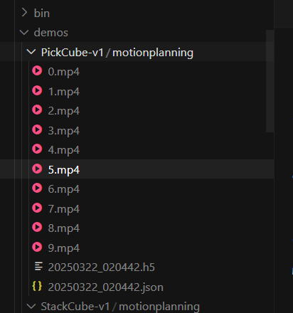

# 运动规划

ManiSkill 提供了简单的工具来使用运动规划生成机器人轨迹，主要通过开源的 [mplib](https://github.com/haosulab/MPlib) 库。 如果安装了 ManiSkill，mplib 将随之安装，因此无需额外的安装。

有关如何使用 mplib 更高级功能的深入教程，请查看他们的文档：https://motion-planning-lib.readthedocs.io/latest/。 否则，本节将介绍一些可以用来修改和生成运动规划演示的示例代码。 这里的示例代码是为 Panda 机械臂编写的，但可以修改为适用于其他机器人。

## 使用 Panda 机械臂进行运动规划

我们为一些使用 Panda 机械臂的任务提供了一些内置的运动规划解决方案，位于 https://github.com/haosulab/ManiSkill/tree/main/mani_skill/examples/motionplanning/panda。 可以运行下面的快速演示，它会将轨迹数据作为 .h5 文件保存到 `demos/motionplanning/<env_id>`，并可以选择保存视频和/或使用 GUI 进行可视化。

```bash
python -m mani_skill.examples.motionplanning.panda.run -e "PickCube-v1" --save-video # 以无头模式运行，仅保存视频
python -m mani_skill.examples.motionplanning.panda.run -e "StackCube-v1" --vis # 打开 GUI
python -m mani_skill.examples.motionplanning.panda.run -h # 打开帮助菜单，并显示哪些任务有解决方案


这些任务的解决方案通常涉及将任务分解为一系列简单的拾取、放置和移动。 提供的示例代码控制 Panda 机械臂的末端执行器移动到其工作空间中的任何姿势，以及抓取/释放。

例如，PickCube-v1 任务由以下步骤组成：

1. 将夹爪移动到红色立方体正上方，并调整夹爪方向使其与立方体方向相同
2. 向下移动夹爪，使手指环绕立方体
3. 关闭夹爪
4. 将夹爪移动到目标位置上方，使夹爪的工具中心点 (tcp) 位于目标位置

请注意，虽然运动规划可以生成和解决各种各样的任务，但其主要局限性在于它通常需要人工/工程师进行调整和编写，并且无法为更动态的任务生成解决方案。
```

(dl) kewei@sxy-gpus3090:~$ python -m mani_skill.examples.motionplanning.panda.run -e "PickCube-v1" --save-video

/home/kewei/micromamba/envs/dl/lib/python3.9/site-packages/torch/random.py:183: UserWarning: CUDA reports that you have 4 available devices, and you have used fork_rng without explicitly specifying which devices are being used. For safety, we initialize *every* CUDA device by default, which can be quite slow if you have a lot of CUDAs. If you know that you are only making use of a few CUDA devices, set the environment variable CUDA_VISIBLE_DEVICES or the 'devices' keyword argument of fork_rng with the set of devices you are actually using. For example, if you are using CPU only, set device.upper()_VISIBLE_DEVICES= or devices=[]; if you are using device 0 only, set CUDA_VISIBLE_DEVICES=0 or devices=[0].  To initialize all devices and suppress this warning, set the 'devices' keyword argument to `range(torch.cuda.device_count())`.
  warnings.warn(message)
Motion Planning Running on PickCube-v1
proc_id: 0: 100%|█| 10/10 [00:59<00:00,  5.91s/it, success_rate=1, failed_motion_pla

生成路径

~/demos/PickCube-v1/motionplanning/0.mp4



# 远程操控

ManiSkill 提供了许多远程操控系统，帮助在任务中收集演示数据。下面详细介绍了每个系统，包括如何使用、演示视频、硬件要求、可用性以及系统的局限性。

目前，有直观的点击+拖动系统，使用例如空间鼠标的系统，VR 头显系统即将推出。

## 点击+拖动系统

**要求：** 显示器、鼠标、键盘

**可用性：** 非常容易生成细粒度的演示

**局限性：** 仅限于解决动力学要求较低的任务，并且使用二指夹爪，例如拾取立方体。像扔立方体这样的任务是不可能的。

要启动系统，可以使用 `-e` 指定任务 ID，并运行：

```bash
python -m mani_skill.examples.teleoperation.interactive_panda -e "StackCube-v1"
```

然后，可以将机器人手臂的末端执行器拖动到任何位置和旋转，并按键盘上的“n”键生成到该位置的轨迹（通过运动规划完成）。每次系统还将打印有关任务是否解决的当前信息。

可以按“g”键切换夹爪的关闭或打开。

要完成一个轨迹的收集并继续下一个轨迹，只需按“c”键，这将保存最后一个轨迹。

要停止数据收集，请按“q”键退出。然后，这会将轨迹数据保存到 `demos/teleop/<env_id>` 文件夹。此外，它将在之后生成演示的视频并将它们放在同一文件夹中，可以通过按 CTRL+C 停止脚本来停止此操作。

可以随时按“h”键调出描述键盘命令的帮助菜单。

wasd和右键调视角 滚轮调远近。

## Meta Quest 3

目前正在开发中 (WIP)

## Apple Vision Pro

目前正在开发中 (WIP)
