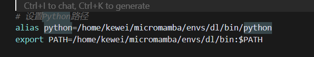

```
   # 克隆RoboGen仓库
   git clone https://github.com/Genesis-Embodied-AI/RoboGen.git

   # 设置环境
   conda env create -f environment.yaml
   conda activate robogen

   # 在gpt_4/query.py顶部设置OpenAI API密钥

   # 生成与微波炉相关的任务
   python run.py --category Microwave
   pip install openai pybullet 

   # 或者基于特定描述生成任务
   python gpt_4/prompts/prompt_from_description.py --task_description "A mobile franka arm heats the corn with the bowl and the microwave" --object "Microwave"
```


需要更改moviepy相关

```ag-0-1inqkk4k9ag-1-1inqkk4kaag-0-1inqkk4k9ag-1-1inqkk4ka
(robogen) kewei@sxy-gpus3090:~/17robo/RoboGen$ python -c "import pybullet; print('成功')"
Traceback (most recent call last):
  File "<string>", line 1, in <module>
ModuleNotFoundError: No module named 'pybullet'
(robogen) kewei@sxy-gpus3090:~/17robo/RoboGen$ which python
/home/kewei/micromamba/envs/robogen/bin/python
(robogen) kewei@sxy-gpus3090:~/17robo/RoboGen$    /home/kewei/micromamba/envs/robogen/bin/python -c "import pybullet; print('成功')"
pybullet build time: Sep  3 2024 12:55:23

A module that was compiled using NumPy 1.x cannot be run in
NumPy 2.0.2 as it may crash. To support both 1.x and 2.x
versions of NumPy, modules must be compiled with NumPy 2.0.
Some module may need to rebuild instead e.g. with 'pybind11>=2.12'.

If you are a user of the module, the easiest solution will be to
downgrade to 'numpy<2' or try to upgrade the affected module.
We expect that some modules will need time to support NumPy 2.

Traceback (most recent call last):  File "<string>", line 1, in <module>
AttributeError: _ARRAY_API not found
Traceback (most recent call last):
  File "<string>", line 1, in <module>
ImportError: numpy.core.multiarray failed to import
```

这个是因为我在bashrc中设置的问题：



图方便没在主环境安装python，哈哈哈，看来不能这样呢。

但是第二个可以暂时保留，相当于就有dl环境的nvitop和jupyter

要从源代码安装 OMPL，请运行

    ./install_ompl_1.5.2.sh --python

这将使用系统范围的 python 安装 ompl。请注意，安装脚本的第 19 行 OMPL 要求运行`sudo apt-get -y upgrade`。这可能会给系统软件包带来麻烦，因此可以在安装过程中注释此行（安装可能会失败，注释的行未经过全面测试）。然后，将安装导出到 conda 环境以与 RoboGen 一起使用：

    echo "/home/kewei/17robo/RoboGen/ompl-1.5.2/py-bindings" >> ~/micromamba/envs/robogen/lib/python3.9/site-packages/ompl.pth
    
    echo "/home/kewei/17robo/RoboGen/ompl-1.5.2/py-bindings" >> ~/miniconda3/envs/robogen/lib/python3.9/site-packages/ompl.pth

记得将路径更改为你的ompl安装路径和conda环境路径。

[dataset.zip - Google 云端硬盘](https://drive.google.com/file/d/1d-1txzcg_ke17NkHKAolXlfDnmPePFc6/view)

下载这个

解压到data/dataset

[objaverse-sentence-bert-embeddings.zip - Google 云端硬盘](https://drive.google.com/file/d/1dFDpG3tlckTUSy7VYdfkNqtfVctpn3T6/view)

objaverse_utils/data/
