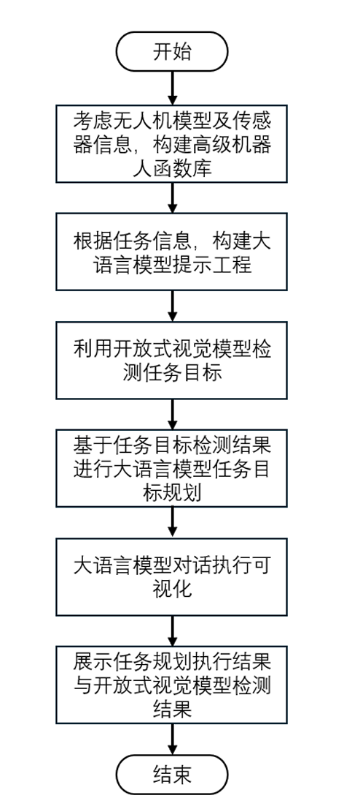
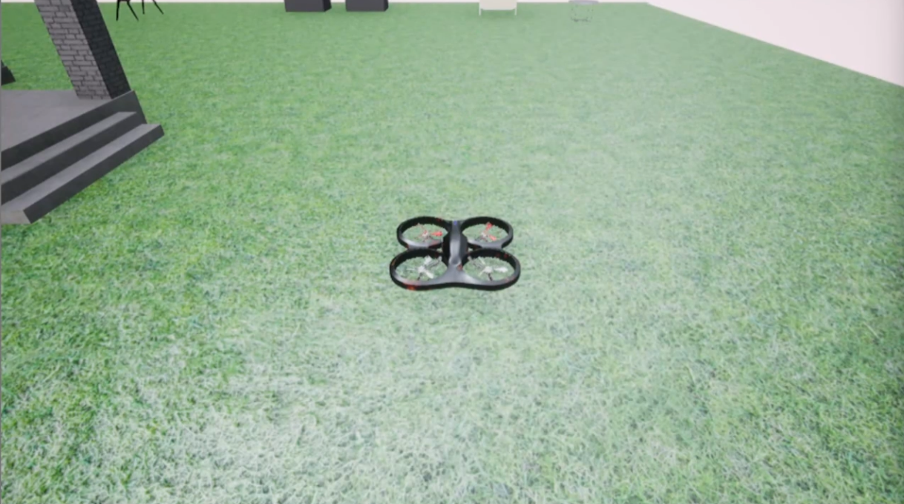
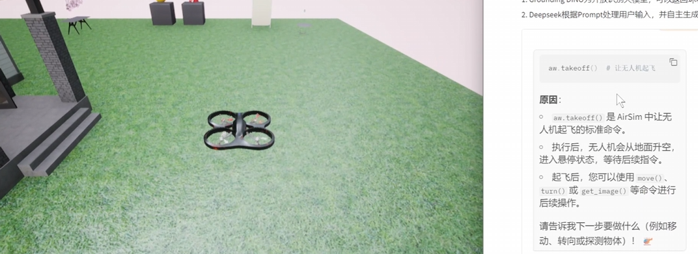
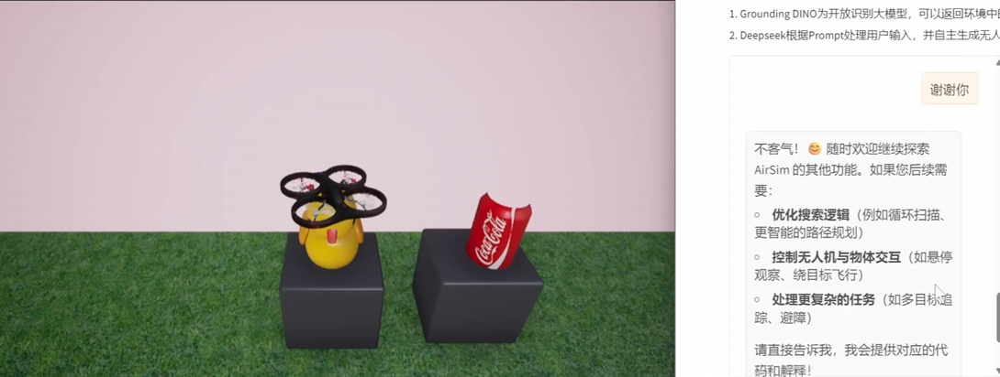

# 无人机多模态大模型与groundingdino基础实践

### 无人机多模态大语言模型利用了Deepseek大语言模型+Grounding DINO的多模态开放识别功能，形成自我感知到自主行为的闭环。主要技术如下：
1. Grounding DINO为开放识别大模型，可以返回环境中的各种物体的标签以及位置信息。
2. Deepseek根据Prompt处理用户输入，并自主生成无人机可执行的代码，完成相关任务。

教程默认熟悉python基础即可。

如是零基础，也可参考datawhale的其他教程，如happy-llm等。

## 一、所用环境和基础
### 1. Windows
### 2. python采用3.10及以上
### 3. torch
### 4. GroundingDINO

安装参考链接：https://github.com/IDEA-Research/GroundingDINO?tab=readme-ov-file

从github中克隆GroundingDINO项目

```python
git clone https://github.com/IDEA-Research/GroundingDINO.git
```

进入GroundingDINO文件夹

```python
cd GroundingDINO/
```

在这个文件夹中安装所需要的依赖
```python
pip install -e .
```

下载预训练模型权重
```python
mkdir weights
cd weights
wget -q https://github.com/IDEA-Research/GroundingDINO/releases/download/v0.1.0-alpha/groundingdino_swint_ogc.pth
cd ..
```
### 5. Airsim环境

Airsim环境直接可以运行env中的House.exe文件

下载路径https://huggingface.co/datasets/Datawhale/house_win

### 6. Gradio安装

可以直接使用pip进行安装

```python
pip install --upgrade gradio
```

## 二、项目总体框架
1. 定义了一个无人机函数库
2. 利用大语言模型的提示工程进行任务描述并控制无人机完成指定任务
3. 利用GroundingDINO进行开放式目标检测，识别任务所需物体
4. 实现大语言模型对话执行网页可视化



## 三、代码详解

```python
parser = argparse.ArgumentParser()
parser.add_argument("--prompt", type=str, default="prompts.txt")
parser.add_argument("--sysprompt", type=str, default="system_prompts.txt")
args = parser.parse_args()
```

将定义的无人机技能库与系统提示导入，用于后续导入大语言模型中作为基础提示工程。文件中定义的机器人函数如下所示：

```python
aw.takeoff()：起飞无人机。
aw.land()：无人机着陆。
aw.get_image()：从代理的前置摄像头渲染图像
aw.get_drone_position()：以与 XYZ 坐标相对应的 3 个浮点数的列表形式返回无人机的当前位置。
aw.turn(angle)：将机器人转动给定的度数，angle就是度数
aw.move(distance)：将机器人直线向前移动给定的距离（以米为单位），distance就是距离。
aw.ob_objects(obj_name_list):得到环境中观测到物体的名称，角度和距离，以[(对象名称1,距离,角度), (对象名称1,距离,角度), ...] 列表的形式返回值，从而向提供场景中的对象, 其中角度以度为单位，obj_name_list = ['yellow duck', 'coca cola','mirror','flower']。
在执行aw.ob_objects(obj_name_list)前需要先执行get_image()获取图像信息。
```

使用deepseek的API，调用deepseek大语言模型，其中的your-key替换成自己的api-keys，可以通过以下网址获得：https://platform.deepseek.com/api_keys

```python
client = OpenAI(api_key="your-key", base_url="https://api.deepseek.com", http_client=httpx.Client(verify=False))
with open(args.sysprompt, "r", encoding="utf-8") as f:
    sysprompt = f.read()
```

以下为大语言模型最关键的代码，通过上面定义的client，进行大语言模型推理和输出。其中的model="deepseek-chat"中deepseek-chat可以换成deepseek中其他的模型。

```python
def ask(prompt):
    chat_history.append(
        {
            "role": "user",
            "content": prompt,
        }
    )
    completion = client.chat.completions.create(
        model="deepseek-chat",
        messages=chat_history,
        temperature=0
    )
    chat_history.append(
        {
            "role": "assistant",
            "content": completion.choices[0].message.content,
        }
    )
    return chat_history[-1]["content"]
```

根据prompt.txt中的内容，如下所示：

```python
问题：可以向我提出一个澄清问题，只要明确指出“问题”即可。

代码：
python
    这里输出达到预期目标的代码命令。

原因：输出代码后，应该解释为什么要这样做。
```

可以看出prompt也可以用来约束大模型的输出，由于已经约束了输出，因此可以自定义处理大模型的输出，采用extract_python_code函数进行处理。

```python
def extract_python_code(content):
    code_blocks = code_block_regex.findall(content)
    if code_blocks:
        full_code = "\n".join(code_blocks)

        if full_code.startswith("python"):
            full_code = full_code[7:]

        return full_code
    else:
        return None
```

采用gradio进行大模型的可视化输出。

```python
with gr.Blocks() as demo:
    # gr.Markdown("# 无人机多模态大语言模型")
    gr.Markdown("""
                # 无人机多模态大语言模型

                无人机多模态大语言模型利用了Deepseek大语言模型+Grounding DINO的多模态开域识别功能，形成自我感知到自主行为的闭环。
                1. Grounding DINO为开放识别大模型，可以返回环境中的各种物体的标签以及位置信息。
                2. Deepseek根据Prompt处理用户输入，并自主生成无人机可执行的代码，完成相关任务。
                """)
    with gr.Row():
        with gr.Column():
            chatbot = gr.Chatbot()
            msg = gr.Textbox()
            clear = gr.ClearButton([msg, chatbot])
            def respond(message, chat_history):
                response = ask(message)
                bot_message = response
                chat_history.append((message, bot_message))
                code = extract_python_code(response)
                if code is not None:
                    print("Please wait while I run the code in AirSim...")
                    exec(extract_python_code(response))
                    print("Done!\n")
                # time.sleep(2)
                return "", chat_history
            msg.submit(respond, [msg, chatbot], [msg, chatbot])
        with gr.Column():
            img = gr.Image("datawhale.jpg")
            image_button = gr.Button("Display")
        image_button.click(display_image, inputs=img, outputs=img)

demo.launch()
```

## 四、执行流程

### 1. 运行env中的house.exe文件打开环境



### 2. 运行main_gradio.py文件
终端中可以得到如下所示链接，用浏览器打开。

```python
Running on local URL: http://127.0.0.1:7860
To create a public link,set`share=True`in launch()
```
### 3. 在终端中输入以下1)2)3)指令完成相关任务

#### 1) 请起飞
得到如下输出，并自动执行输出代码。



#### 2) 请寻找yellow duck并飞到它的面前


#### 3) 谢谢你



## 五、参考

1. 参考论文：ChatGPT for Robotics:  Design Principles and Model Abilities
2. 环境参考：AIStudio（用文心大模型飞飞机-多模态感知大模型）
