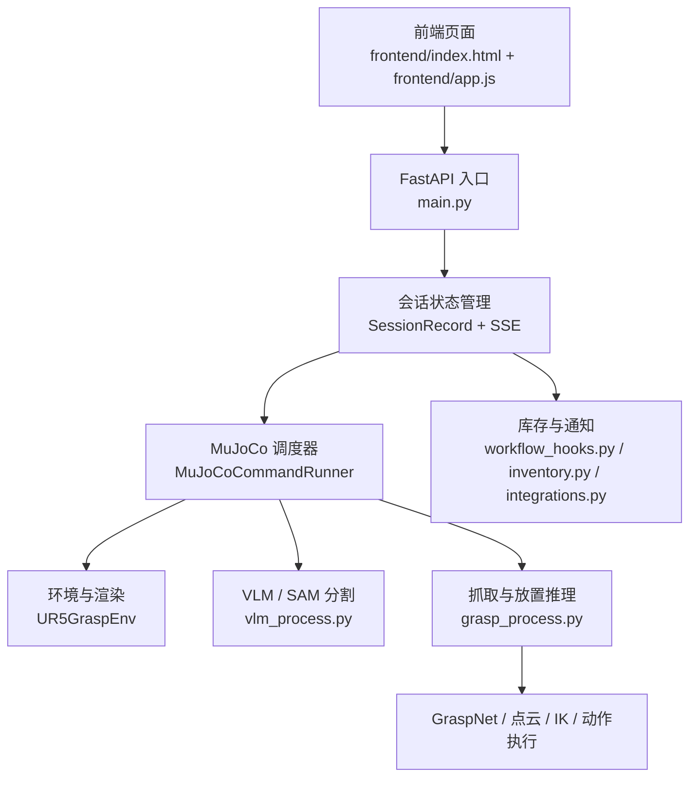

# TuntunClaw

<div align="center">
  
</div>

# 囤囤钳 TuntunClaw

囤囤钳（TuntunClaw）是一款面向真实家庭生活场景打造的全屋具身家庭小助手。项目基于 OpenClaw 人工智能操作系统构建，将自然语言交互、视觉理解、目标分割、抓取推理、MuJoCo 仿真执行与网页端实时可视化整合到同一条工作链路中，用于展示“从一句中文指令到机械臂完成家庭物资整理任务”的完整闭环。

## 1. 项目背景与定位

在快节奏的现代生活中，家庭物资的管理，例如记住琐碎物品的存放位置、时刻留意日常消耗品的余量，往往会成为人类隐形的认知负担。传统的智能家居设备虽然能够执行单点、明确的命令，却普遍缺乏主动为人类分忧的“管家意识”，也缺乏与人类自然交流、自然协作的能力。

为了将人类从繁琐的记忆与记录工作中解放出来，本项目立足于真实家庭生活赛道，依托 OpenClaw 人工智能操作系统，打造了一款名为“囤囤钳”的全屋具身家庭小助手。它不仅是一个执行物理动作的机器人系统，更是一个懂生活、能与人类自然交流的家庭伙伴。通过陪伴式的语音互动与全屋物资的智能化统筹，它致力于接管家庭中的后勤琐事，重塑温馨、便捷、自然的未来家庭生活方式。

从系统定位上看，囤囤钳并不是单一的抓取演示程序，而是一个围绕 OpenClaw 展开的家庭服务型具身智能应用原型。OpenClaw 在这里承担的是底层智能操作系统与能力底座的角色，而囤囤钳则面向真实家庭需求，围绕“找物、整理、归位、补货提醒、自然交互”这些生活化任务进行体验设计与能力编排。

## 2. 项目亮点

### 2.1 面向家庭场景的自然交互

系统支持直接输入中文自然语言任务，例如：

- `请把巧克力放到盘里`
- `将菜板上的苹果放置有苹果的架子上保存`
- `请把玻璃杯扔到地上`（我们项目支持安全交互，OpenClaw 会直接拒绝这种指令。）

用户不需要记忆复杂指令格式，只需要用接近日常表达的方式下达任务，系统就会自动完成任务解析、目标理解和动作执行。

### 2.2 OpenClaw 驱动的具身执行链路

本项目将 OpenClaw 的交互式智能操作理念延伸到家庭物资管理场景，在统一系统中串联起：

- 自然语言命令输入
- VLM 目标理解
- SAM 目标分割
- GraspNet 抓取候选推理
- MuJoCo 中的机械臂动作执行
- 网页端实时可视化反馈

这使得囤囤钳既具备“懂指令”的能力，也具备“真正去做”的能力。

### 2.3 面向演示与展示优化的前端

网页端提供完整的任务展示界面，包括：

- 中文指令输入区
- 快捷预设按钮
- 场景实时预览
- 执行时间线
- 调试输出区

因此，项目不仅适合本地开发调试，也适合面向比赛、答辩、展示和视频录制。

### 2.4 连续任务执行

系统支持连续任务工作流。后一条命令会在前一条命令执行后的场景状态上继续运行，而不是每次都重置仿真环境。

例如：

1. 先执行 `请把巧克力放到盘里`
2. 巧克力完成放置后保留在盘中
3. 再执行 `将菜板上的苹果放置有苹果的架子上保存`
4. 第二条任务会基于第一条任务完成后的场景继续执行

这一能力对于“家庭整理”类任务尤其重要，因为真实家庭中的整理过程本身就是连续的。

## 3. 系统架构

当前系统可以概括为四层：

1. 交互展示层
2. Web 服务与会话层
3. 感知理解层
4. 仿真执行层



这套架构使 OpenClaw 能力从底层执行扩展到完整的家庭服务交互闭环。

## 4. 核心能力

### 4.1 中文任务理解

系统能够将自然语言任务解析为结构化执行目标，例如：

- 源物体
- 目标容器
- 空间关系
- 是否批量执行

### 4.2 目标分割与定位

系统结合 VLM 与 SAM，在仿真相机图像中定位目标物体与放置区域，并生成中间分割结果用于调试与可视化。

### 4.3 抓取推理

系统通过 GraspNet 对目标区域点云生成抓取候选，并结合碰撞过滤、几何约束和场景先验，选择适合当前任务的抓取姿态。

### 4.4 家庭场景中的专用逻辑

项目针对家庭常见整理任务做了专门适配。例如：

- 巧克力会优先识别特定包装目标
- 苹果会区分菜板上的苹果与果篮中的苹果
- 放置位置不是简单的“架子中心”，而是更符合生活整理逻辑的容器内部有效区域

### 4.5 物资管理与提醒链路

除了机械臂动作执行，系统还引入了库存与通知能力，围绕家庭日常物资管理进行扩展。这使囤囤钳不仅能“搬运物体”，还具备了面向家庭后勤管理的服务潜力。

## 5. 项目目录

```text
tuntunclaw/
├─ frontend/                       # Web 前端
├─ manipulator_grasp/             # MuJoCo 环境、机械臂与场景资源
├─ graspnet-baseline/             # GraspNet 相关代码
├─ openclaw_like/                 # 轻量策略与交互封装
├─ main.py                        # FastAPI 与统一入口
├─ grasp_process.py               # 抓取、放置、IK、动作执行
├─ vlm_process.py                 # VLM / SAM 分割逻辑
├─ inventory.py                   # 库存状态管理
├─ integrations.py                # 外部通知与 webhook
├─ workflow_hooks.py              # 成功任务后的业务副作用
└─ 项目开发流程与系统架构说明.md    # 详细架构说明
```

## 6. 快速开始

### 6.1 环境

当前默认环境为 `vlm_grasp311`。

### 6.2 大文件资产

为了避免 Git 仓库过大，以下大文件放在 Hugging Face：

- `assets/fig.png`
- `manipulator_grasp/assets/target_basket_medium/materials/textures/texture.png`
- `manipulator_grasp/assets/libero_basket/texture.png`

首次运行前，在项目根目录执行：

```powershell
python scripts/download_large_assets.py
```

脚本会从 [Datawhale/tuntunclaw-assets](https://huggingface.co/datasets/Datawhale/tuntunclaw-assets) 下载这些文件并恢复到原始路径。如果 Hugging Face 仓库需要鉴权，请先设置 `HF_TOKEN` 或 `HUGGINGFACE_HUB_TOKEN`。

### 6.3 启动

```powershell
micromamba run -n vlm_grasp311 python C:\oc\tuntunclaw\main.py
```

启动后默认打开：

```text
http://127.0.0.1:8000/
```

### 6.4 示例任务

可以直接在网页端输入：

```text
请把巧克力放到盘里
将菜板上的苹果放置有苹果的架子上保存
请把玻璃杯扔到地上（我们项目支持安全交互，OpenClaw 会直接拒绝这种指令。）
```

## 7. 典型演示流程

一个完整的家庭整理演示可以这样进行：

1. 在网页端输入 `请把巧克力放到盘里`
2. 系统完成巧克力识别、抓取与放置
3. 再输入 `将菜板上的苹果放置有苹果的架子上保存`
4. 系统继续在当前场景中完成苹果整理
5. 前端同步展示执行过程、当前状态与调试信息

这一流程体现的不是单一物体抓取，而是“面向生活任务的连续协助”。


---

囤囤钳希望呈现的不是“机械臂完成一个动作”这么简单，而是一个更贴近家庭日常生活的具身智能愿景：让机器人真正成为家庭成员的协作伙伴，承担那些繁琐、琐碎、需要长期记忆和重复劳动的后勤工作。

在这一意义上，囤囤钳是 OpenClaw 面向家庭场景的一次具体落地尝试，也是具身智能从实验室演示走向生活服务的一步探索。

