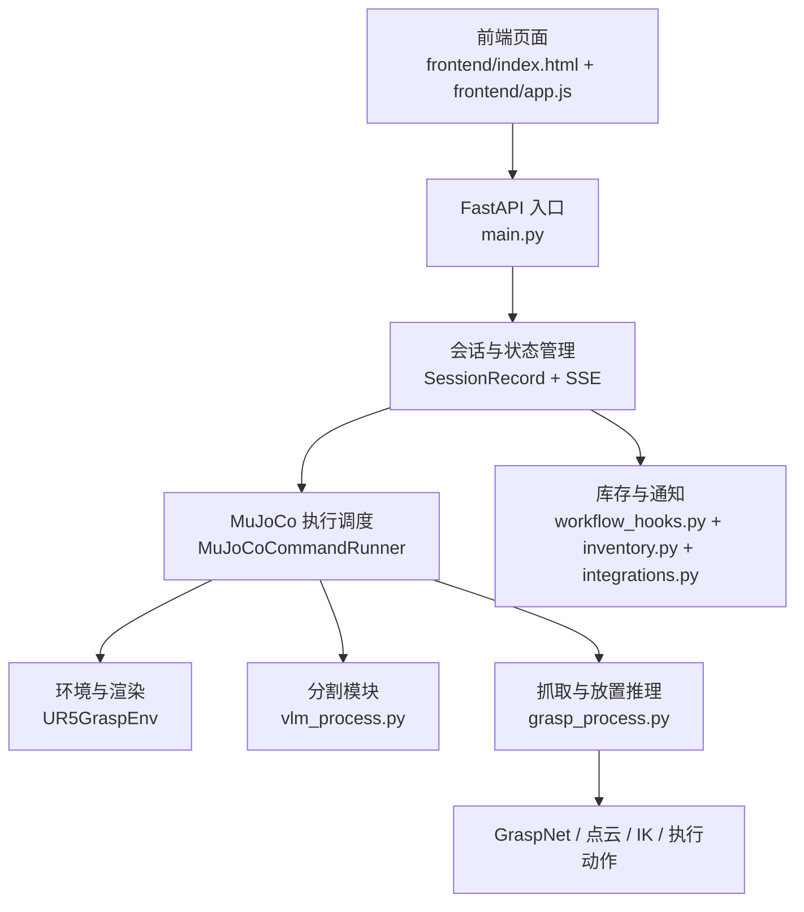

# 项目开发流程与系统架构说明

本文面向项目维护者与二次开发者，系统说明当前 `VLM_Grasp_Interactive` 的整体架构、前后端调用链、MuJoCo 仿真执行流程、连续任务机制，以及当前工程中各个关键文件的职责分工。

阅读完成后，读者应当能够：

- 理解本项目从“网页输入自然语言”到“MuJoCo 中完成抓取与放置”的完整链路。
- 明确前端、FastAPI、VLM/SAM 分割、GraspNet、运动执行和库存通知之间的关系。
- 理解为什么本项目支持“连续任务”而不是每条命令都重置环境。
- 在不破坏已有抓取任务的前提下，继续扩展新的对象、新的放置逻辑和新的业务接口。

## 1. 项目目标

本项目的目标不是单纯做一个机器人控制界面，而是构建一个“可视化、可交互、可连续执行”的仿真演示系统。系统接收自然语言任务，通过网页端展示执行过程，在后端调用视觉分割、抓取候选推理和 MuJoCo 仿真执行模块，最终完成抓取、放置、抛掷等动作。

当前工程已经重点完成了以下能力：

- 中文自然语言指令输入与快捷预设。
- Web 前端与 FastAPI 后端打通。
- MuJoCo 仿真实时画面在网页端展示。
- VLM + SAM 的目标定位与分割。
- GraspNet 抓取候选推理。
- 目标物体的专用逻辑适配，例如巧克力、苹果、海绵、盘子、果篮等。
- 连续任务执行，即第二条命令在第一条命令执行后的场景状态上继续进行。

## 2. 启动方式与运行入口

当前统一使用 `vlm_grasp311` 环境。

### 2.1 Web 前端与后端一体入口

```powershell
micromamba run -n vlm_grasp311 python C:\oc\VLM_Grasp_Interactive\main.py
```

执行后会启动 FastAPI 服务，并自动打开浏览器。默认地址为：

```text
http://127.0.0.1:8000/
```

### 2.2 场景编辑器

```powershell
micromamba run -n vlm_grasp311 python C:\oc\VLM_Grasp_Interactive\scene_layout_editor.py
```

场景编辑器用于调整 XML 场景中的物体摆放位置，以及保存默认视角。保存后的视角会被仿真端和网页端共用。

### 2.3 其他历史入口

- [main_openclaw.py](C:/oc/VLM_Grasp_Interactive/main_openclaw.py)：早期主程序入口。
- [main_vlm.py](C:/oc/VLM_Grasp_Interactive/main_vlm.py)：偏实验性质的 VLM 调用入口。

当前实际演示链路以 [main.py](C:/oc/VLM_Grasp_Interactive/main.py) 为准。

## 3. 总体架构

系统可以分成五层：

1. 前端交互层
2. Web 服务与会话管理层
3. 感知与任务理解层
4. 抓取推理与运动执行层
5. 扩展业务层

下面给出当前项目的主调用关系。



## 4. 核心目录说明

### 4.1 Web 层

- [frontend/index.html](C:/oc/VLM_Grasp_Interactive/frontend/index.html)
  页面结构、静态按钮、兜底事件脚本、预设按钮模板。

- [frontend/app.js](C:/oc/VLM_Grasp_Interactive/frontend/app.js)
  前端状态机、会话提交、SSE 订阅、预览更新、快捷预设写入文本框、调试信息展示。

- [frontend/styles.css](C:/oc/VLM_Grasp_Interactive/frontend/styles.css)
  页面样式、面板悬停发光效果、预览区布局与整体视觉主题。

### 4.2 Web 后端与主控制层

- [main.py](C:/oc/VLM_Grasp_Interactive/main.py)
  当前系统主入口。负责：
  - 启动 FastAPI。
  - 挂载前端静态文件。
  - 接收 `/api/command` 指令。
  - 创建与维护会话。
  - 将任务交给 MuJoCo 执行器。
  - 通过 `/api/session/{id}` 与 `/api/session/{id}/events` 向前端推送状态。
  - 通过 `/api/session/{id}/frame` 向前端输出实时预览帧。

### 4.3 感知与执行层

- [vlm_process.py](C:/oc/VLM_Grasp_Interactive/vlm_process.py)
  VLM 与图像分割模块。负责：
  - 调用多模态模型理解用户命令和图像。
  - 输出目标自然语言描述与图像框。
  - 调用本地或远端 SAM 分割。
  - 生成 `mask_source`、`mask_destination` 以及调试叠层图。

- [grasp_process.py](C:/oc/VLM_Grasp_Interactive/grasp_process.py)
  抓取与放置推理核心模块。负责：
  - 根据深度图和 mask 构建点云。
  - 调用 GraspNet 生成抓取候选。
  - 根据目标物体几何信息估算抓取点、放置点。
  - 求解 IK。
  - 控制机械臂在 MuJoCo 中完成抓取、抬升、移动、放置、回位。
  - 提供对象级专用逻辑，例如巧克力、苹果、海绵架、苹果果篮的特殊映射。

- [manipulator_grasp/env/ur5_grasp_env.py](C:/oc/VLM_Grasp_Interactive/manipulator_grasp/env/ur5_grasp_env.py)
  MuJoCo 环境封装。负责：
  - 加载 XML 场景。
  - 初始化机械臂与夹爪。
  - 管理离屏渲染和被动 viewer。
  - 统一网页端与仿真端的视角。
  - 在渲染异常时只重建渲染后端，不重置世界状态。

### 4.4 场景编辑与视角配置

- [scene_layout_editor.py](C:/oc/VLM_Grasp_Interactive/scene_layout_editor.py)
  用于调整场景物体位置和保存相机视角。

- [SCENE_LAYOUT_EDITOR_README.md](C:/oc/VLM_Grasp_Interactive/SCENE_LAYOUT_EDITOR_README.md)
  场景编辑器的使用说明。

- [scene_robocasa_layout51_style34.xml](C:/oc/VLM_Grasp_Interactive/manipulator_grasp/assets/scenes/scene_robocasa_layout51_style34.xml)
  当前实际使用的主场景文件。

- `scene_robocasa_layout51_style34.view.json`
  当前主场景的默认视角配置文件。网页端和 MuJoCo viewer 统一读取这份视角。

### 4.5 业务扩展层

- [workflow_hooks.py](C:/oc/VLM_Grasp_Interactive/workflow_hooks.py)
  成功任务后的副作用处理，例如库存变更、低库存通知、向外部系统同步。

- [inventory.py](C:/oc/VLM_Grasp_Interactive/inventory.py)
  文件持久化的库存系统，记录某些任务完成后物资数量变化。

- [integrations.py](C:/oc/VLM_Grasp_Interactive/integrations.py)
  外部 webhook 与飞书通知接口。

## 5. 前端工作流程

前端的核心职责不是执行机器人动作，而是把用户命令、后端会话状态和仿真画面组织成一个可演示、可调试的交互界面。

### 5.1 页面组成

网页端主要由三个面板组成：

- 左侧：指令输入区
- 中间：场景预览区
- 右侧：执行时间线与调试输出区

左侧用于输入自然语言命令，并通过快捷预设按钮快速写入文本框。中间区域显示当前 MuJoCo 实时画面或占位图。右侧显示当前会话的状态推进，例如语言解析、目标分割、抓取推理、IK 求解、动作执行和最终结果。

### 5.2 指令提交

当前前端支持两种提交方式：

- 点击“执行指令”按钮
- 在输入框中按 `Enter`

对应逻辑位于 [frontend/app.js](C:/oc/VLM_Grasp_Interactive/frontend/app.js)。前端会将命令发送到：

```text
POST /api/command
```

提交后，前端进入“running”状态，并开始订阅该会话的 SSE 流。

### 5.3 会话状态更新

前端通过以下接口获得任务执行进度：

- `GET /api/session/{session_id}`
- `GET /api/session/{session_id}/events`
- `GET /api/session/{session_id}/frame`

其中：

- `events` 负责推送 trace、日志、阶段名、结果等结构化状态。
- `frame` 负责提供当前最新的 PNG 预览帧。

这意味着前端并不直接访问 MuJoCo，也不参与执行规划，而是完全通过 FastAPI 会话状态进行驱动。

## 6. 后端会话与调度流程

### 6.1 会话对象

在 [main.py](C:/oc/VLM_Grasp_Interactive/main.py) 中，每条命令对应一个 `SessionRecord`。它保存以下核心信息：

- `session_id`
- 当前命令字符串
- 解析后的任务结构
- 当前 trace 列表
- 当前状态，例如 `running`、`success`、`failure`
- 当前结果文案
- 预览图 URL
- 调试日志
- 库存快照

前端每次提交命令后，后端会生成新会话或继续使用指定会话，然后启动后台线程执行真正的 MuJoCo 任务。

### 6.2 命令解析

命令解析在 [main.py](C:/oc/VLM_Grasp_Interactive/main.py) 内完成，主要由以下函数负责：

- `_normalize_text`
- `_extract_objects`
- `_infer_relation`
- `_parse_task`

解析结果会统一规约成结构化任务：

```python
{
    "type": "pick_place",
    "source": "apple",
    "destination": "apple_rack",
    "relation": "in",
    "all_items": False,
}
```

这一步是整个系统的任务入口，也是后续专用逻辑分流的基础。

### 6.3 通用任务与专用任务

当前后端不是完全依赖统一泛化逻辑，而是采用“通用框架 + 专用对象适配”的方式。

例如：

- 巧克力任务会优先锁定 `SNICKERS` 对应的场景实体。
- 苹果任务会区分菜板上的苹果和果篮中的苹果。
- 海绵任务会区分桌上的海绵与海绵架中的海绵。
- 果篮和海绵架的放置位置不是简单的“架子中心”，而是专门计算的有效槽位。

这样做的原因很直接：纯依赖泛化文本理解和纯分割在复杂场景里不够稳定，容易出现识别到错误同类物体或放置到不合理位置的情况。当前工程用对象级规则把这些高频失败点收敛掉。

## 7. MuJoCo 执行主链路

真实执行的主体位于 `MuJoCoCommandRunner` 中。

其单次抓取放置主流程可以概括为：

1. 保证环境已初始化
2. 采集 RGB 与深度
3. 对源物体执行分割
4. 估算抓取目标世界坐标
5. 对目标放置区域执行分割或直接使用专用放置槽位
6. 构建点云并运行 GraspNet
7. 求解抓取、抬升、移动、放置、回位的 IK
8. 在 MuJoCo 中逐段执行动作
9. 将实时帧和阶段状态持续推送给前端

### 7.1 RGB-D 采集

采集逻辑位于：

- [main.py](C:/oc/VLM_Grasp_Interactive/main.py) 中的 `_capture_rgbd`
- [ur5_grasp_env.py](C:/oc/VLM_Grasp_Interactive/manipulator_grasp/env/ur5_grasp_env.py) 中的 `render`

这里后端拿到的是：

- `img`：当前相机 RGB 图像
- `depth`：同一视角下的深度图

后续所有分割、点云和抓取推理都建立在这对同步的 RGB-D 数据上。

### 7.2 源目标分割

源目标分割使用 [vlm_process.py](C:/oc/VLM_Grasp_Interactive/vlm_process.py) 中的 `segment_image` 及其相关逻辑完成。

这一步支持三种输入方式：

- 纯命令文本
- 文本 + 场景 bbox 提示
- 文本 + 显式标签覆盖

在当前项目中，很多稳定性修复都依赖这一层。例如：

- 巧克力会附加“包装上写着 SNICKERS”的提示。
- 海绵会附加“优先选择红圈标出的海绵”的提示。
- 苹果架会走专用目标，不再仅仅依赖“架子”这个泛化词。

### 7.3 点云与 GraspNet

抓取候选推理位于 [grasp_process.py](C:/oc/VLM_Grasp_Interactive/grasp_process.py)。

核心处理链路如下：

1. 根据 RGB、深度、mask 构建有组织点云。
2. 根据深度阈值过滤无效点。
3. 调用 GraspNet 生成抓取候选。
4. 进行碰撞过滤。
5. 结合目标中心、抓取方向和距离进行排序。
6. 选出最终抓取姿态。

如果这里报错：

```text
No valid masked point cloud points after depth filtering
```

一般不是 IK 问题，而是更前面的输入出了问题，常见原因包括：

- mask 落到了错误物体上
- 深度图失效
- 离屏渲染出现异常

### 7.4 IK 与动作执行

动作执行同样位于 [grasp_process.py](C:/oc/VLM_Grasp_Interactive/grasp_process.py)。

当前执行顺序为：

- `home`
- `hub`
- `hover_pick`
- `pregrasp`
- `grasp`
- `grasp_close`
- `lift`
- `hover_place`
- `preplace`
- `place`
- `release`
- `retreat`
- `hub_return`
- `reset`

每个阶段都会通过回调写回前端，前端据此显示当前阶段名和最新画面。

## 8. 连续任务机制

这是本项目当前最关键的工程设计之一。

### 8.1 设计目标

本项目要求第二条任务在第一条任务执行完成后的世界状态上继续运行，而不是每次都把 MuJoCo 场景恢复到初始状态。

例如：

1. 先执行“请把巧克力放到盘里”
2. 巧克力放到盘中
3. 再执行“将菜板上的苹果放置有苹果的架子上保存”
4. 这时仿真中巧克力仍应保留在盘里

### 8.2 当前实现

环境管理位于 [main.py](C:/oc/VLM_Grasp_Interactive/main.py) 的 `MuJoCoCommandRunner` 中。

其原则是：

- `UR5GraspEnv` 只在首次使用时 `reset()`
- 后续任务复用同一个 `self._env`
- 因此 `mj_model` 和 `mj_data` 会保留上一个任务执行后的状态

### 8.3 渲染异常的修复策略

在连续任务过程中，曾经出现过离屏渲染后端损坏，导致网页端出现：

- 预览黑屏
- 深度图恒定为一个大常数
- 后续点云构建失败

为解决这个问题，当前在 [ur5_grasp_env.py](C:/oc/VLM_Grasp_Interactive/manipulator_grasp/env/ur5_grasp_env.py) 中加入了以下机制：

- 当检测到渲染输出无效时，不重置整个 MuJoCo 场景
- 只重建离屏渲染资源，例如 renderer、GLFW window、offscreen context
- 保留 `mj_model` 与 `mj_data`

因此，当前系统同时满足两点：

- 世界状态连续
- 渲染异常可恢复

## 9. 相机视角与场景编辑器

### 9.1 统一视角来源

网页端和 MuJoCo viewer 的默认视角统一来源于场景视角文件：

```text
scene_robocasa_layout51_style34.view.json
```

读取逻辑位于：

- [ur5_grasp_env.py](C:/oc/VLM_Grasp_Interactive/manipulator_grasp/env/ur5_grasp_env.py)

### 9.2 场景编辑器中的保存方法

在 [scene_layout_editor.py](C:/oc/VLM_Grasp_Interactive/scene_layout_editor.py) 中调整到满意视角后，按 `F12` 保存当前视角。之后：

- 仿真器 viewer 会使用这套视角
- 网页端离屏渲染也会使用这套视角

这保证了“前端看到的相机”和“本地 MuJoCo 调试器看到的相机”保持一致。

## 10. 调试产物与中间文件

当前项目会将大量中间结果写入 `temp/`，便于问题定位。

### 10.1 图像与分割结果

常见输出目录：

```text
C:\oc\VLM_Grasp_Interactive\temp\images\
```

其中包括：

- `*_mask_source.png`
- `*_mask_destination.png`
- `*_mask_source_overlay.png`
- `*_mask_destination_overlay.png`

这些文件可以直接用来判断：

- VLM/SAM 是否识别到了正确目标
- bbox 是否落在正确物体上
- 叠层与真实图像是否一致

### 10.2 库存状态

库存状态会持久化在：

```text
temp/inventory/
```

这是演示业务侧逻辑的基础数据目录。

## 11. 业务扩展：库存、下单与飞书通知

当前项目除了抓取演示，还接入了一个轻量业务闭环。

### 11.1 库存扣减

在某些成功任务后，会调用 [workflow_hooks.py](C:/oc/VLM_Grasp_Interactive/workflow_hooks.py) 中的：

```python
record_task_success_effects(...)
```

该函数会：

- 更新本地库存
- 判断是否低库存
- 向外部 webhook 通知
- 必要时向飞书发送提醒

### 11.2 对外集成

[integrations.py](C:/oc/VLM_Grasp_Interactive/integrations.py) 负责：

- 机器人外部 webhook
- 飞书通知
- 读取本地配置文件

这一层不参与抓取控制，只负责将仿真成功事件同步到其他系统。

## 12. 当前对象级专用逻辑

目前工程中已经为若干对象做了专用适配，这一点是系统稳定运行的重要原因。

### 12.1 巧克力

- 使用 `SNICKERS` 语义提示锁定正确巧克力。
- 避免将巧克力误识别到同场景的其他小物体。

### 12.2 苹果

- `apple` 默认映射到菜板上的苹果。
- `apple_rack` 映射到果篮。
- 苹果的放置点不是整个架子中心，而是果篮内的专用位置。

### 12.3 海绵

- 支持海绵与海绵架分离建模。
- 支持批量整理逻辑。
- 放置点使用海绵架内的专用槽位，而不是泛化的“架子中心”。

## 13. 当前开发流程建议

如果后续继续开发，建议遵循下面的顺序。

### 13.1 新对象接入流程

1. 在场景 XML 中确认目标 body 名称。
2. 在 [main.py](C:/oc/VLM_Grasp_Interactive/main.py) 中补充中文命令别名。
3. 在 [grasp_process.py](C:/oc/VLM_Grasp_Interactive/grasp_process.py) 中补充 `SCENE_BODY_NAMES` 映射。
4. 如有必要，为放置区编写专用世界坐标函数。
5. 用网页端连续执行两条任务，检查状态是否能正确保留。

### 13.2 调试顺序

遇到问题时，建议按以下顺序排查：

1. 网页端日志是否显示进入真实 MuJoCo 执行
2. `temp/images` 中的源 mask 和目标 mask 是否正确
3. 网页端预览是否黑屏或偏色
4. 深度图是否异常
5. `grasp_process.py` 的源物体和目标物体映射是否正确
6. 放置点是否用了泛化逻辑而不是专用逻辑

## 14. 常见故障与恢复方法

### 14.1 网页端黑屏

优先怀疑离屏渲染后端失效，而不是前端代码本身。当前系统已支持自动重建渲染资源，但如果旧进程已经异常，最直接的恢复方法仍然是重启 [main.py](C:/oc/VLM_Grasp_Interactive/main.py)。

### 14.2 深度过滤后没有点云

错误形式通常为：

```text
No valid masked point cloud points after depth filtering
```

优先检查：

- 分割目标是否正确
- 深度是否正常
- 当前视角下目标是否在相机可视范围内

### 14.3 物体抓错或放错

优先检查：

- 该对象是否已有专用映射
- 是否仍在走 `shelf` 这类泛化目标
- 目标放置点是不是整个大容器中心，而不是容器内部有效落点

## 15. 建议的后续维护方向

从当前代码状态出发，后续建议优先做以下三类工作：

### 15.1 稳定性

- 将更多高频对象接入专用映射。
- 为更多容器类目标建立“容器内部有效槽位”逻辑。
- 将渲染异常检测继续标准化。

### 15.2 可维护性

- 将对象别名、场景实体名、放置策略统一整理成配置文件。
- 将当前散落在 `main.py` 与 `grasp_process.py` 中的对象规则抽离成单独模块。

### 15.3 演示能力

- 扩展更多连续任务脚本。
- 增加环境重置按钮，让“连续执行”和“手动回到初始状态”两种模式共存。
- 在前端展示更多中间状态，例如分割叠层、抓取候选数量、当前目标实体名。

## 16. 本文关联的关键文件

- [main.py](C:/oc/VLM_Grasp_Interactive/main.py)
- [grasp_process.py](C:/oc/VLM_Grasp_Interactive/grasp_process.py)
- [vlm_process.py](C:/oc/VLM_Grasp_Interactive/vlm_process.py)
- [manipulator_grasp/env/ur5_grasp_env.py](C:/oc/VLM_Grasp_Interactive/manipulator_grasp/env/ur5_grasp_env.py)
- [scene_layout_editor.py](C:/oc/VLM_Grasp_Interactive/scene_layout_editor.py)
- [workflow_hooks.py](C:/oc/VLM_Grasp_Interactive/workflow_hooks.py)
- [inventory.py](C:/oc/VLM_Grasp_Interactive/inventory.py)
- [integrations.py](C:/oc/VLM_Grasp_Interactive/integrations.py)
- [frontend/index.html](C:/oc/VLM_Grasp_Interactive/frontend/index.html)
- [frontend/app.js](C:/oc/VLM_Grasp_Interactive/frontend/app.js)
- [frontend/styles.css](C:/oc/VLM_Grasp_Interactive/frontend/styles.css)

如果本文后续需要继续拆分，建议拆成三份：

- 面向演示使用者的运行手册
- 面向开发者的系统架构说明
- 面向调试者的故障排查手册
