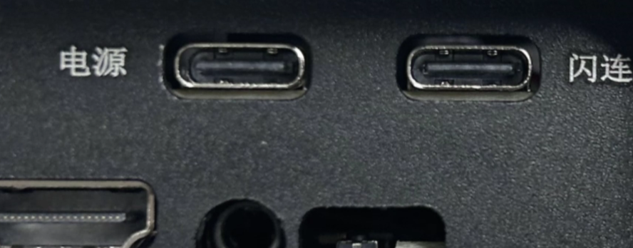
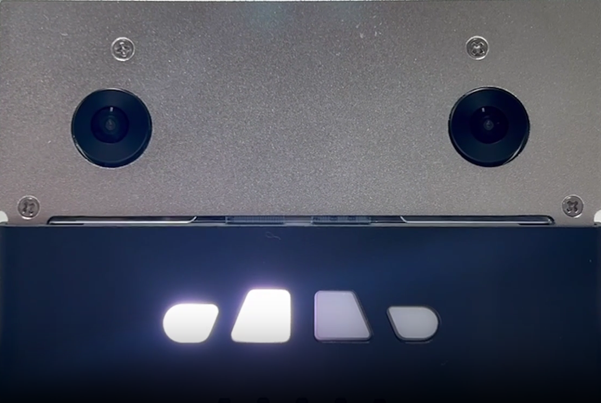
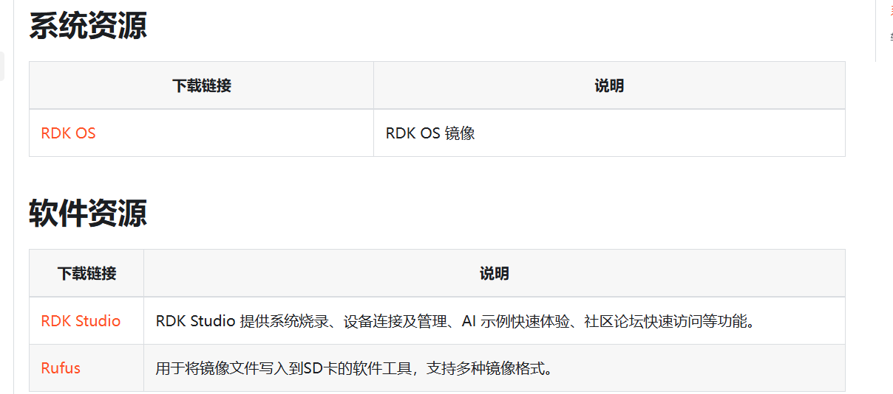
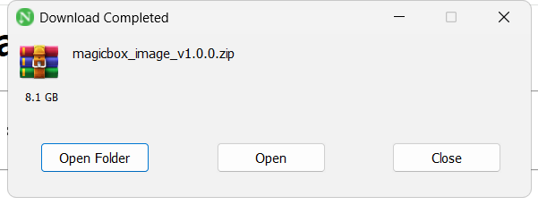
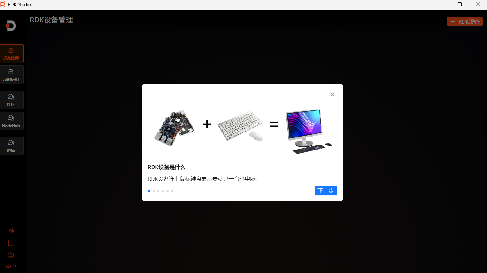
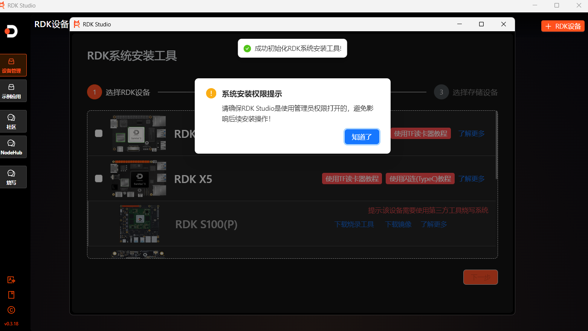
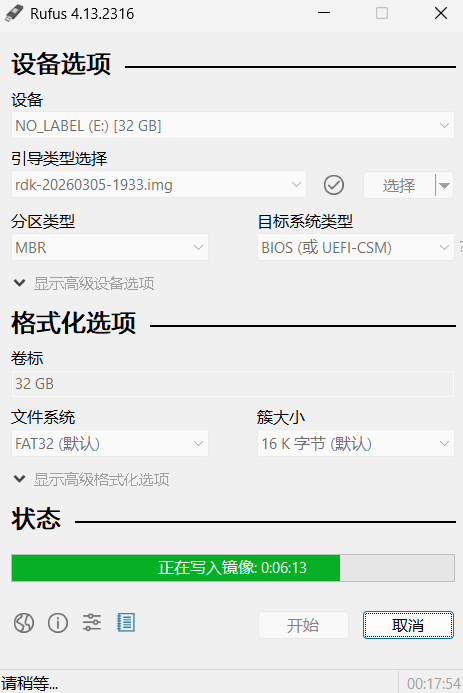
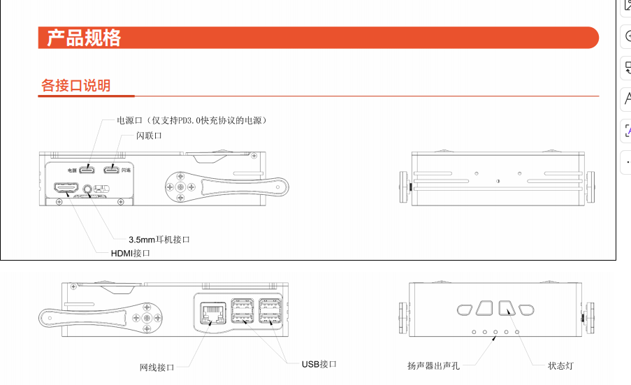

# README 01：环境准备与刷机

本章的任务不是“把镜像烧进去”这么简单，而是把 Magicbox 从一台刚开箱的硬件，稳定地带到可继续开发的起点。只要这一章处理得足够扎实，后面的有线连接、按钮体验、基础外设、语音链路和算法调试都会顺很多。

## 一、本章所用资料

本项目已经把相关官方页面和下载入口归档到了本地，后续即使官网页面调整，本章仍然可以单独阅读。

建议优先参考以下本地文件：

`./assets/official_pages/resource-download.html`  
`./assets/official_pages/rdk_x5_magicbox_images_index.html`

原始在线地址如下：

`https://d-robotics.github.io/magicbox_doc/resource-download`  
`https://archive.d-robotics.cc/downloads/rdk_x5_magicbox/images/`

本地已经保存的安装文件位于：

`./相关文件下载/`

其中包括镜像、RDK Studio 和 Rufus。

## 二、开机前先确认硬件状态

第一次操作 Magicbox 时，建议先只做最小连线。也就是电源、必要的数据线和存储卡，不要同时外挂过多外设。这样做的目的，是先确认板子本身没有供电和启动问题，避免后面把“线材问题”“镜像问题”“外设兼容问题”混在一起。

本机电源接口采用 Type-C 供电，建议使用稳定的 PD 供电头。接电以后，灯带会有依次亮起的过程，随后会听到提示音。如果出现灯光异常、长时间无提示音或者反复重启，不建议马上开始烧录和联网，而应该先排查电源和线材。

## 三、为什么仍然建议先把镜像准备完整

虽然有些设备出厂自带系统，但如果后续要写教程，最好不要完全依赖“出厂刚好可用”的状态。原因有三个。

第一，出厂镜像的版本不一定和当前官方文档完全一致。第二，后续教程需要复现，必须让镜像版本、烧录路径和工具版本尽量可追溯。第三，一旦后面调试出现异常，重新烧录一张“已知状态”的镜像，往往比继续猜配置更省时间。

因此，本章的标准做法是：先保留官方镜像、烧录工具和说明页面，再进行系统准备。你们目录中的 `相关文件下载` 已经做了这一步，这个习惯是对的。

## 四、镜像、工具与下载入口

官方资源下载页已经保存到本地：

`./assets/official_pages/resource-download.html`

你们实际保存的关键文件如下：

`./相关文件下载/magicbox_image_v1.0.0.zip`  
`./相关文件下载/rdk-20260305-1933.img`  
`./相关文件下载/RDKStudio_signed_Setup.exe`  
`./相关文件下载/rufus-4.13.exe`

从实操角度看，烧录路径可以分成两类。

第一类是使用 `RDK Studio` 对设备进行烧写。这种方式更偏官方工具链，适合完整体验地瓜生态，也便于后续连接更多示例应用。  
第二类是直接用 `Rufus` 把镜像写入 SD 卡。对于长期做教程、重复烧卡、频繁恢复环境的场景，这通常更直接，也更稳定。

如果只是为了快速做出一套可复现教程，我更建议把 `Rufus + SD 卡烧录` 作为主线写法，把 `RDK Studio` 保留为备选方案。这样读者更容易复现，你们后续维护文档也更轻。

## 五、使用 RDK Studio 烧录时需要注意什么

如果走 `RDK Studio` 方案，关键不是“点了哪个按钮”，而是要理解进入烧录模式的动作顺序。你们记录的这一段是正确的，可以整理成下面这段标准表述：

先让开发板断电，插入 SD 卡后，用 `USB 2.0 Type-C` 把设备连接到电脑。然后长按 `Sleep` 按键，再给开发板上电，持续等待约五秒，使设备进入烧录模式。只有在这个模式下，PC 端的烧录工具才能稳定识别设备。

教程里建议明确提醒一句：`RDK Studio` 最好使用管理员权限启动。否则即使软件打开了，也可能在识别设备或写入阶段出现权限类异常。

## 六、为什么更推荐把 Rufus 作为主线

从做教程的角度，`Rufus` 的优势非常明确。它对“只想把镜像写到卡里”的目标更聚焦，流程短，失败点少，后续也容易解释。如果读者电脑里已经有读卡器，或者 SD 卡本来就是单独准备的，那么用 `Rufus` 把 `.img` 直接写入 SD 卡，通常是最省事的方案。

因此，本章建议把流程写成这样：

第一步，确认镜像文件完整。  
第二步，使用 `Rufus` 选择 `.img` 镜像。  
第三步，确认目标设备是待烧录的 SD 卡。  
第四步，开始写入并等待完成。  
第五步，把卡装回开发板并开机。

这样足够清晰，也更贴近长期维护教程的需要。

## 七、首次上电后的正确检查顺序

第一次重新烧录并上电以后，不要一开机就急着跑算法、装仓库或改系统。更稳妥的顺序如下。

先确认设备能正常启动。  
再确认灯带和提示音是否正常。  
然后确认后续准备采用闪连还是有线网口。  
最后再开始进行登录、联网和应用体验。

本项目后续主线已经明确采用有线网口方式，因此这里不再把网络地址写成“`192.168.128.10 或 192.168.127.10`”这种不确定表述。对于本教程而言，应当直接分开处理：

闪连模式使用 `192.168.128.10`。  
有线网口直连模式使用 `192.168.127.10`。

后续具体登录过程请直接看：

`./README_02_有线网口连接与登录.md`

## 八、接口与安全事项

Magicbox 这类设备比较容易在“能亮能动”之后被用户下意识地频繁掰动、抬起或压住。真正容易出问题的，通常不是程序，而是相机翻折机构、支撑脚和存储卡插装方式。因此，教程里最好保留安全说明，不要全部删掉。

下面这些内容属于应当保留的教材式提醒。

设备应放在稳固、平坦且不导电的表面。  
支撑脚不要用手强行拨动，非动作演示时尽量保持与外壳平行。  
相机翻折结构不要强拧，也不要超过官方允许角度。  
安装 SD 卡时，应注意卡槽位置，不要误塞进外壳缝隙。  
外设接入前，应尽量确认供电和接口标准兼容。

## 九、本章结束时应达到的状态

完成本章以后，理想状态不是“我已经看过下载页”，而应该是下面这四项都成立：

第一，你手里已经有一套可复用的镜像与工具文件。  
第二，开发板已经完成一次成功开机。  
第三，你已经明确后续采用有线网口直连，而不是闪连。  
第四，你已经准备好进入下一章，开始给电脑网卡设置正确的有线直连地址，并登录板子。

如果这四项里有一项还不稳，建议不要急着继续写后面的体验和算法章节。因为从教材质量来看，第一章最重要的价值，就是为整套教程打下一个可重复复现的起点。
