# README 03：快速入门与基础外设

这一章承接前两章，目标是把 Magicbox 预置好的“开机即可体验”的三项功能和底层基础外设串起来讲清楚。读者在这一章里不仅要知道按钮怎么按、网页怎么看，还要理解这些现象背后分别对应哪一类程序、哪一条 ROS 链路、哪一组硬件控制代码。

为了避免写成“只会照着官网点按钮”的记录文，下面的内容按照教材式结构展开。先讲现象，再讲命令，再讲目录结构，最后讲源码脉络和 U 盘部署建议。

## 一、本章所用本地资料

官方页面的本地归档如下：

`./assets/official_pages/magicbox.html`  
`./assets/official_pages/quickstart.html`  
`./assets/official_pages/basic-peripherals.html`

本章引用的官方外链图片也已经下载到本地：

`./assets/official_images/Depth-Estimation.png`  
`./assets/official_images/Gesture.png`  
`./assets/official_images/audio-io.png`  
`./assets/official_images/Steering-Gear.png`  
`./assets/official_images/light.png`

此外，本项目中还有一份非常重要的补充材料：

`./README_03_快速入门与基础外设补充材料.md`

这份补充材料保存了板端 `basic_function_demo` 目录下几个 Python 脚本的原始内容，对理解外设控制非常有帮助。

## 二、先理解“快速启动”到底在做什么

官方快速入门最大的特点，是让用户几乎不需要先写代码，只要按下不同按钮，就可以在设备上切换不同演示模式。从使用体验上看，它像是“三个按钮对应三个 demo”。但从系统结构上看，它更像是一个已经配置好的应用调度入口。

官方页面给出的开机自启动控制命令是：

```shell
systemctl enable magicbox-start
systemctl disable magicbox-start
```

这说明板端预置了一个 systemd 服务，服务名为 `magicbox-start`。根据你们已经在设备上看到的目录结构，相关入口位于：

```text
/userdata/magicbox/launch/start.py
/userdata/magicbox/launch/start.sh
```

现在这条链路已经在设备上核实过了，不再只是目录层面的猜测。原厂启动逻辑是：`magicbox-start` 拉起 `start.sh`，`start.sh` 负责设置 ROS2 环境和工作区，再由 `start.py` 监听按键并切换不同模式。因此，本章后面提到的左键、中键和右键模式，已经可以和原厂启动文件一一对应。

## 三、三种按钮功能的正确使用方式

在下面的描述里，按钮的左右方向都以“灯带面向用户时的视角”为准。

### 1. 左侧按钮：双目深度估计

按下最左侧按钮后，灯光会切换为红色。此时浏览器访问设备的 `8000` 页面，可以看到双目深度估计相关的显示入口。

如果使用闪连模式，地址是：

```text
http://192.168.128.10:8000
```

如果使用有线直连模式，地址是：

```text
http://192.168.127.10:8000
```

你们当前采用的是有线方式，因此应优先访问第二个地址。

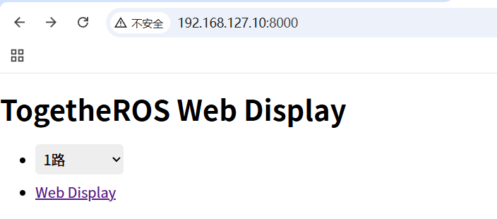

网页中选择可用的数据流后，点击 `Web display` 即可查看显示结果。

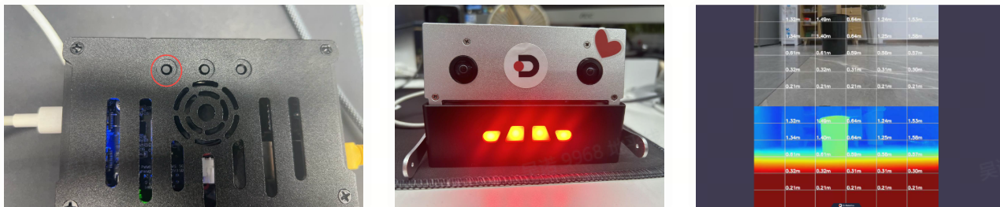

双目深度功能背后的核心算法仓库，是本地已经克隆下来的：

`./repos/hobot_stereonet`

其中一个非常典型的 X5 启动入口是：

`./repos/hobot_stereonet/launch/x5/stereonet_model_web_visual_v2.4_int16.launch.py`

这个启动文件本身并不负责所有细节，它做的事情其实很克制：先指定模型文件 `DStereoV2.4_int16.bin`，再包含更通用的 `stereonet_model_web_visual.launch.py`。但对 Magicbox 成品形态来说，左键真正走的还不是“用户手工敲这一条 launch”，而是原厂按钮链路：

```text
magicbox-start
-> /userdata/magicbox/launch/start.sh
-> /userdata/magicbox/launch/start.py
-> app/ros_ws/src/magicbox/hobot_stereonet/script/run_stereo.sh
```

`run_stereo.sh` 再继续调用 `hobot_stereonet` 的通用 launch 文件。也就是说，左键模式本质上是“原厂环境准备 + 双目算法 + Web 可视化”的整条应用链，而不是单独一个网页程序。

换句话说，左侧按钮触发的并不是一个简单前端，而是一整条“相机输入、深度推理、结果发布、网页展示”的应用链。

### 2. 中间按钮：手势交互

按下中间按钮后，灯光变为绿色，系统进入手势交互模式。这个模式同样会带起 `mipi_cam`、`hobot_codec_republish` 和 `websocket`，因此浏览器访问 `8000` 页面时，也可以观察到交互界面与识别渲染结果。

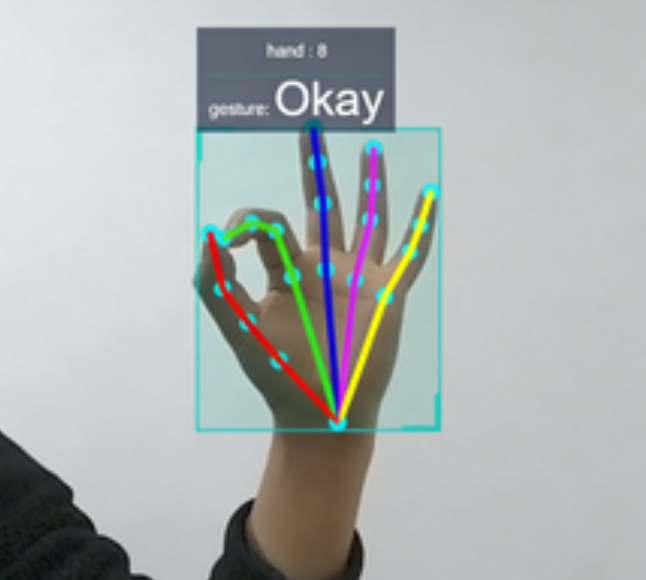

手势与动作之间的关系如下：

| 手势 | 含义 | 触发动作 |
| --- | --- | --- |
| ThumbUp | 竖起大拇指 | 耳朵摇晃 |
| Victory | V 手势 | 双脚撑起 |
| ThumbLeft | 大拇指向左 | 举起左手 |
| ThumbRight | 大拇指向右 | 举起右手 |
| Okay | OK 手势 | 灯光闪烁 |

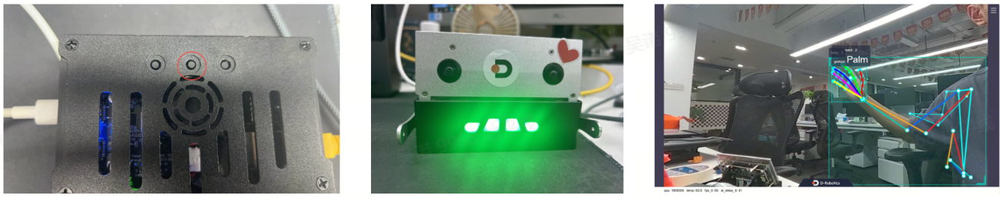

这一部分的源码依据最扎实，因为对应仓库已经在本地：

`./repos/magicbox_gesture_interaction`

其中需要重点看的文件有三类。

第一类是程序入口：

`./repos/magicbox_gesture_interaction/src/main.cpp`

这个文件很简单，只负责初始化 ROS2，创建 `GestureControlNode`，然后进入 `spin`。这说明整个手势逻辑的核心都集中在节点类本身。

第二类是手势识别结果到动作映射的主逻辑：

`./repos/magicbox_gesture_interaction/src/gesture_control_node.cpp`

这个文件做了三件关键事情。第一，它订阅 `ai_msgs::msg::PerceptionTargets` 类型的感知消息。第二，它从消息中抽取手势数值，并用一个队列做简单平滑，避免单帧抖动直接触发误动作。第三，它把最终手势编号映射为动作控制类型，例如 `ThumbLeft` 对应抬左腿，`Victory` 对应双脚撑起，`Okay` 对应闪灯。

第三类是动作执行层：

`./repos/magicbox_gesture_interaction/src/actuators_control.cpp`

这个文件真正控制的是舵机和灯光。比如：

`standStraight()` 负责双脚撑起。  
`shakeEars()` 负责通过左右舵机快速摆动模拟耳朵晃动。  
`flashingLight()` 负责清灯、等待，再点亮绿色灯效。

此外，原厂中键模式的启动链路也已经核实过了。它不是去调用一个独立的 `run_gesture.sh`，而是：

```text
magicbox-start
-> /userdata/magicbox/launch/start.sh
-> /userdata/magicbox/launch/start.py
-> ros2 launch gesture_interaction gesture_interaction.launch.py
```

因此，中间按钮的本质并不是“网页识别手势”，而是“原厂环境准备完成后，视觉感知结果继续驱动舵机与灯光动作”。网页只是展示入口，真正的互动感来自动作执行这一层。

### 3. 右侧按钮：语音交互

按下最右侧按钮后，灯光切换为蓝色，设备会发出提示语“你好，请问有什么可以帮助你的吗”，随后进入对话状态。

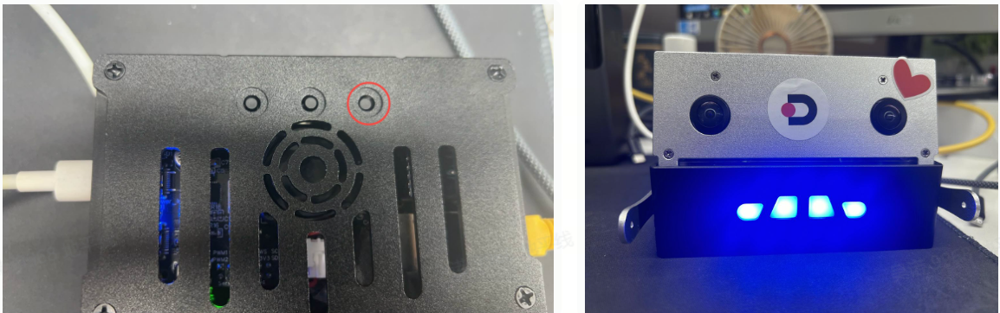

官方使用说明提到两个重要的语音指令：

其一，“结束对话”会让系统进入休眠或待机状态。  
其二，“你好地瓜”用于再次唤醒系统。

这条链路在源码层面至少涉及两个仓库。

语音前端和 TTS/KWS/ASR 相关逻辑位于：

`./repos/magicbox_audio_io`

其启动入口文件是：

`./repos/magicbox_audio_io/launch/audio_io.launch.py`

从这个启动文件可以直接读出几件很重要的事实。

默认麦克风设备是 `plughw:0,0`。  
ASR 结果发布到 `/prompt_text`。  
TTS 所需文本通过订阅话题接收。  
TTS 模型默认目录是 `/userdata/magicbox/dep/matcha-icefall-zh-baker`。  
KWS 模型默认目录在 `/userdata/magicbox/dep/sherpa-onnx/...`。  
ASR 模型默认路径是 `/userdata/magicbox/config/sense-voice-small-fp16.gguf`。

更底层的线程和话题逻辑则位于：

`./repos/magicbox_audio_io/src/hb_audio_io.cpp`

这个文件表明，音频节点内部至少同时维护了麦克风采集线程、TTS 线程和扬声器播放线程。它会把识别结果发布出去，再等待下游组件返回需要播报的文本。

而对话推理部分则对应：

`./repos/magicbox_qwen_llm`

它的 README 明确写出默认文本输入话题为 `/prompt_text`，文本输出话题为 `/tts_text`，这正好和 `audio_io` 的设计拼起来，形成“语音识别 -> 大模型推理 -> 语音播报”的闭环。

因此，右侧按钮对应的预置演示，从源码角度看，很可能不是单独一个语音程序，而是至少组合了：

`audio_io + qwen_llm`

这一点虽然还需要直接读取板端 `start.py` 才能完全坐实，但从官方现象、预置目录结构、launch 参数默认值和仓库设计上看，这个判断是高度一致的。

## 四、为什么用完后建议关闭自启动

快速体验模式非常适合首次上手，但不一定适合长期开发状态一直开着。原因并不复杂。双目、手势和语音这三类功能都不是纯静态页面，而是会占用相机、麦克风、扬声器、ROS2 资源以及一部分 CPU/BPU/NPU 或内存资源。如果后面你准备编译工程、跑自定义脚本、调试串联逻辑，那么保持这些预置服务一直开着，往往只会增加变量。

因此，体验完成以后，建议先关闭自启动：

```shell
sudo systemctl disable magicbox-start
```

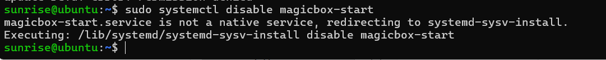

## 五、资源监控页面为什么值得保留

即使不继续跑预置 demo，`7999` 这个资源监控入口依然很值得保留，因为它能帮助你快速判断一件事：当前系统到底是“程序没启动”，还是“程序启动了但资源已经打满”。

如果使用闪连模式，访问：

```text
http://192.168.128.10:7999
```

如果使用有线模式，访问：

```text
http://192.168.127.10:7999
```

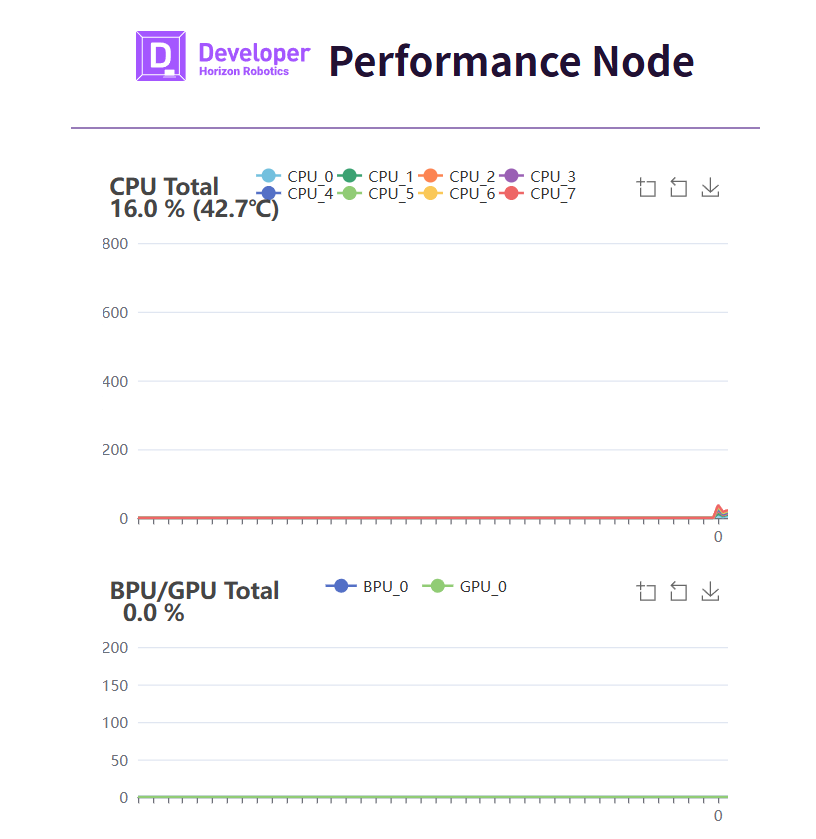

对于后续教程写作而言，这个页面非常适合放在“排障思路”里，因为它比单纯贴日志更直观。

## 六、板端目录结构应该如何理解

你们已经记录下了一个非常有价值的目录树，这部分建议保留，而且应当进一步讲清楚每个目录在教程中的角色。

```text
/userdata/magicbox
├── app
│   ├── ros_ws
│   └── Web_RDK_Performance_Node
├── basic_function_demo
│   ├── button.py
│   ├── imu.py
│   ├── servo.py
│   └── ws2812b.py
├── config
├── dep
│   ├── llama.cpp
│   ├── matcha-icefall-zh-baker
│   └── sherpa-onnx
├── launch
│   ├── lamp
│   ├── start.py
│   └── start.sh
├── log
└── voice
```

这个结构说明 Magicbox 的系统设计并不是把所有东西都丢进一个 ROS2 包，而是分成了几层。

`basic_function_demo` 是单文件脚本层，适合快速验证硬件。  
`app/ros_ws` 是应用工作区，承载更完整的 ROS2 功能。  
`dep` 存放模型和第三方依赖。  
`launch` 负责把多个功能组织成可启动、可切换的应用。  
`voice` 和 `log` 则分别承担媒体资源和运行日志的角色。

理解这一点之后，后面安排 U 盘放什么、系统盘留什么，就会清楚很多。

## 七、基础外设脚本不是花架子，而是最好的硬件入口

这一部分对应已经保存的补充材料：

`./README_03_快速入门与基础外设补充材料.md`

### 1. 舵机脚本 `servo.py`

运行命令：

```python
python3 /userdata/magicbox/basic_function_demo/servo.py
```

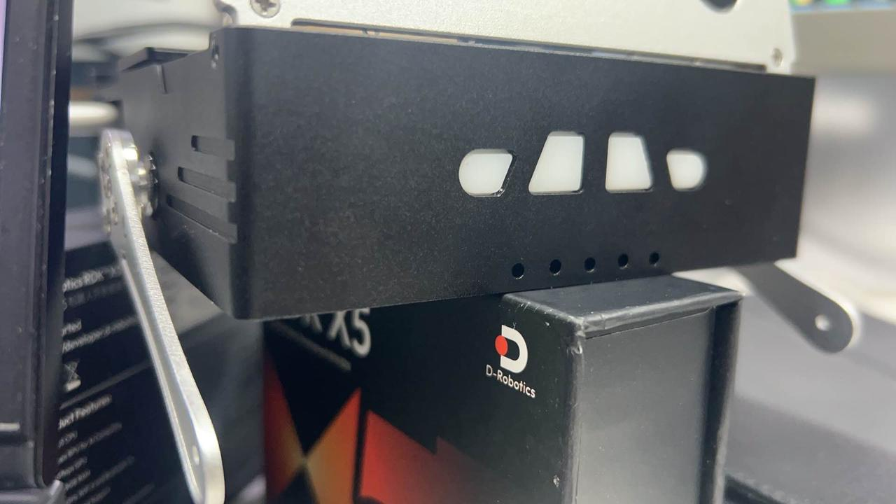

从补充材料中的源码可以看出，这个脚本使用 `Hobot.GPIO` 的 PWM 能力，操作的是 `BOARD` 编号下的 `32` 和 `33` 两个引脚，频率是 `50Hz`。脚本把两个通道占空比分别设为 `5` 和 `11`，等待约两秒后停止并清理 GPIO。

也就是说，这个脚本并不是“让舵机一直工作”，而是一个最小动作测试。它的价值在于验证两件事：PWM 通道是否正常，支撑脚是否能按预期运动。

### 2. 灯带脚本 `ws2812b.py`

运行命令：

```python
python3 /userdata/magicbox/basic_function_demo/ws2812b.py
```

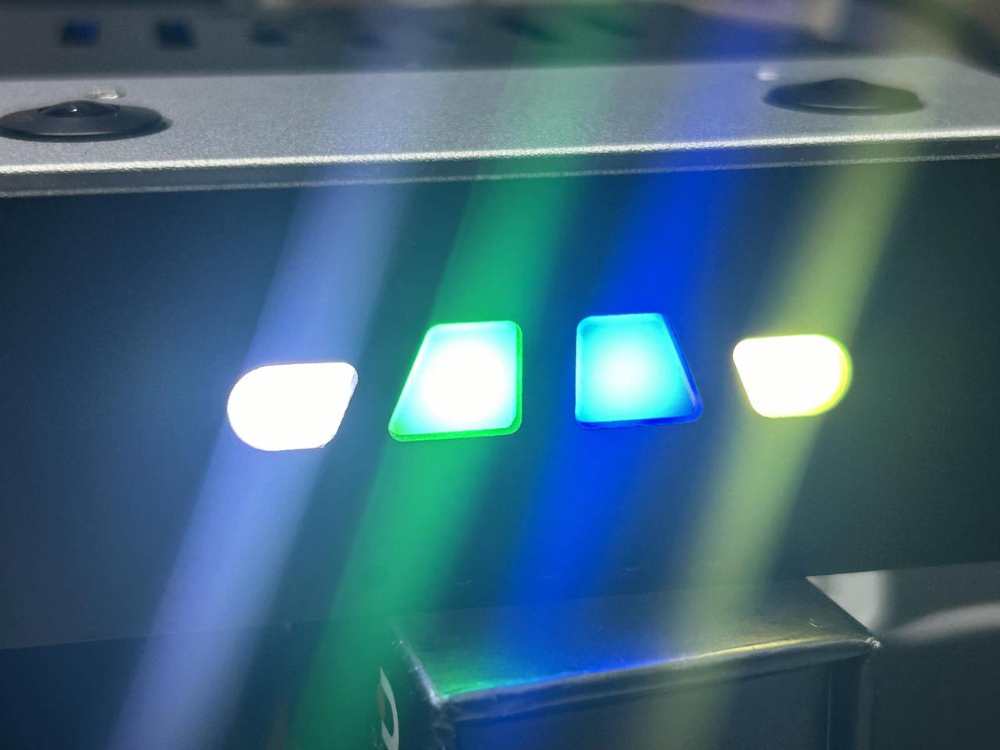

这个脚本比表面看起来更值得讲。它不是简单调用一个现成彩灯库，而是自己把 WS2812B 的位编码转换成 SPI 比特流，再通过 `spidev` 输出。脚本中明确写出了 WS2812B 的 `0` 和 `1` 对应的 SPI 三比特模式，还处理了 `GRB` 顺序和最终字节拼接。对于读者来说，这类代码非常适合拿来解释“为什么一个看似 RGB 灯条，底层仍然可以用 SPI 驱动”。

### 3. IMU 脚本 `imu.py`

运行命令：

```python
python3 /userdata/magicbox/basic_function_demo/imu.py
```

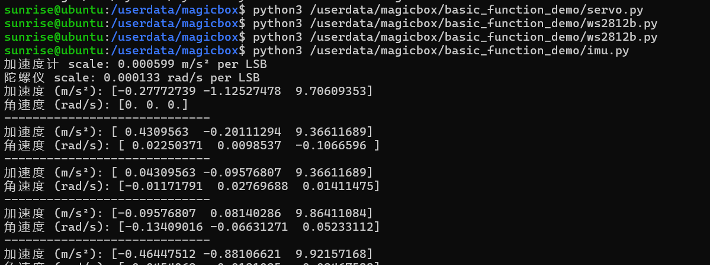

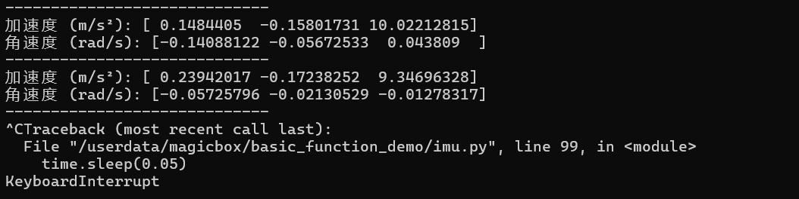

补充材料中的 `imu.py` 使用 `smbus2` 访问 ICM20948，设备地址是 `0x68`，总线号是 `5`。脚本先切换寄存器 bank，再读取加速度计和陀螺仪配置，计算量程缩放系数，最后不断输出转换后的加速度和角速度。

这段代码的教学价值在于，它把“IMU 数据不是直接有单位的”这件事说明白了。原始寄存器值必须结合量程配置换算，才能得到 m/s² 和 rad/s 这类真正可用的数据。

### 4. 按钮脚本 `button.py`

运行命令：

```python
python3 /userdata/magicbox/basic_function_demo/button.py
```

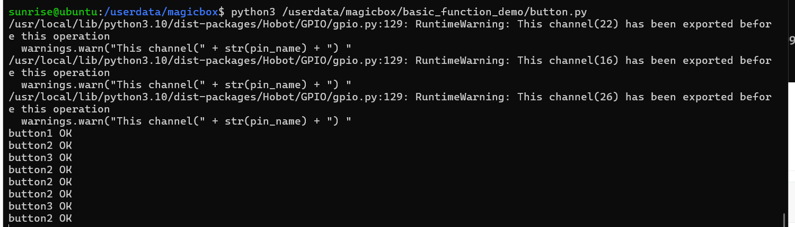

这个脚本监听的是 BCM 编号下的 `22`、`16` 和 `26` 三个按键引脚。脚本的行为很简单：等待下降沿，触发后打印 `button1 OK`、`button2 OK`、`button3 OK`。这说明它是一个底层输入验证脚本，而不是完整的应用调度脚本。

这一点恰好能帮助我们理解快速体验模式的结构：`button.py` 负责证明按键硬件可用；而真正把“按键”映射到“启动深度、手势、语音模式”的那层逻辑，应当在 `launch/start.py` 一类更上层的脚本中。

## 八、按钮三连功能的源码脉络应该怎样写

如果把这一章写成一份真正成熟的教材，最值得加入的一节，恰恰不是“怎么按按钮”，而是“按钮背后的程序链路”。推荐你们按下面这个结构写。

第一，系统启动后由 `magicbox-start` 这个 systemd 服务把预置应用入口拉起来。  
第二，`launch/start.sh` 和 `launch/start.py` 负责处理应用切换逻辑。  
第三，三个按钮并不是直接控制网页，而是切换不同的应用模式。  
第四，不同模式再分别调用双目、手势、语音对应的底层程序。

结合当前已经掌握的材料，可以得到如下较稳妥的源码脉络：

左键模式对应双目深度估计，其算法核心与 `hobot_stereonet` 一致。  
中键模式对应手势交互，其动作映射可由 `magicbox_gesture_interaction` 直接解释。  
右键模式对应语音交互，其音频和播报逻辑来自 `magicbox_audio_io`，大模型对话逻辑来自 `magicbox_qwen_llm`。

这部分目前仍缺最后一块拼图，也就是板端 `start.py` 的实际内容。由于当前 SSH 认证尚未打通，我还没有直接把这个文件拉下来。因此，上面关于“start.py 如何调度三种模式”的描述属于有依据的推断，而不是已经逐行核对的结论。你们后面一旦补齐 SSH 凭据，建议第一时间把 `start.py` 和对应的 systemd service 文件补抓下来，这样这套讲解就可以完全闭环。

## 九、U 盘应该放什么，系统盘应该留什么

你们在设备上执行过 `df -h`，结果显示系统根分区大约只有 `29G`，已用 `18G`，剩余约 `9.1G`；而 U 盘已经自动挂载到：

```text
/media/6745-2301
```

而且空间约为 `118G`。这说明后续的部署策略不应再围绕“系统盘够不够装”，而应围绕“什么必须留在系统盘、什么应尽快迁移到 U 盘”来设计。

建议保留在系统盘上的内容包括：

预置的 `/userdata/magicbox/launch` 目录。  
`basic_function_demo` 这类体积小、和硬件紧耦合的脚本。  
systemd 服务文件和必须本地存在的基础配置。  
当前系统已经在使用的最小运行入口。

建议优先迁移到 U 盘上的内容包括：

镜像包、安装包和下载缓存。  
你们克隆的源码仓库。  
自建工作区的 `build`、`install`、`log`。  
语音模型、第三方依赖目录和大文件资源。  
教程截图、录屏、实验日志和导出结果。

如果按当前路径习惯来安排，更具体一些，可以把下面这些内容优先考虑放到 U 盘：

`/userdata/magicbox/dep/matcha-icefall-zh-baker`  
`/userdata/magicbox/dep/sherpa-onnx`  
`/userdata/magicbox/config/sense-voice-small-fp16.gguf`  
你们自己的源码工作区和编译产物

对于 `qwen_llm` 默认使用的模型路径 `/dev/shm/qwen2.5-1.5b-instruct-q5_k_m.gguf`，更合理的做法不是长期把模型保存在系统盘，而是把持久化模型文件放在 U 盘上，在启动前复制到 `/dev/shm`。这样既兼顾启动速度，也不会长期占用系统盘。

## 十、这一章结束后，你应该真正掌握了什么

完成这一章后，读者不应只记住几个按钮对应哪一种灯光，而应真正建立起对整台设备的运行认识。更具体地说，读者需要知道 `magicbox-start` 是系统预置演示的统一入口，知道左键、中键、右键分别调起双目、手势、语音三条能力链，知道这些能力分别落在哪些本地仓库与底层硬件上，也知道为什么基础外设脚本并不是可有可无的“测试文件”，而是理解整机控制方式的第一手材料。

与此同时，读者还应形成一个很重要的工程判断：系统盘空间有限，后续新增的仓库、模型、日志和实验结果不适合继续堆在系统盘上，而应优先迁移到 U 盘这样的外部存储中。这一判断会直接影响后续的语音模型部署、OpenClaw 接入和长期维护方式。
